# 🐦‍⬛ Grackle

<p align="center">
  
</p>

<p align="center">
  <a href="https://www.npmjs.com/package/@grackle-ai/cli"></a>
  <a href="https://github.com/nick-pape/grackle/actions/workflows/ci.yml"></a>
  <a href="https://opensource.org/licenses/MIT"></a>
</p>

> [!WARNING]
> Grackle is pre-1.0 and still experimental. It may have unresolved security issues, annoying bugs, and broken workflows. Not recommended for use in production systems.

**Run any AI coding agent on any remote environment. Orchestration optional.**

You're running Claude Code on a devbox. Or Codex in a container. Or Copilot over SSH. You wrote a janky script to set it up, it breaks every week, and you can't share it with your team.

Grackle gives you a single platform to run any coding agent on any environment — Docker, SSH, Codespaces, whatever. It handles provisioning, credentials, transport, and lifecycle. You get a CLI, web UI, and MCP server out of the box.

Want agents to share knowledge? There's a knowledge graph. Want one agent to spawn others? There's an MCP for that. Want task trees with dependencies and review gates? Same primitives. But you don't have to use any of that. **Start with one session on one box.**

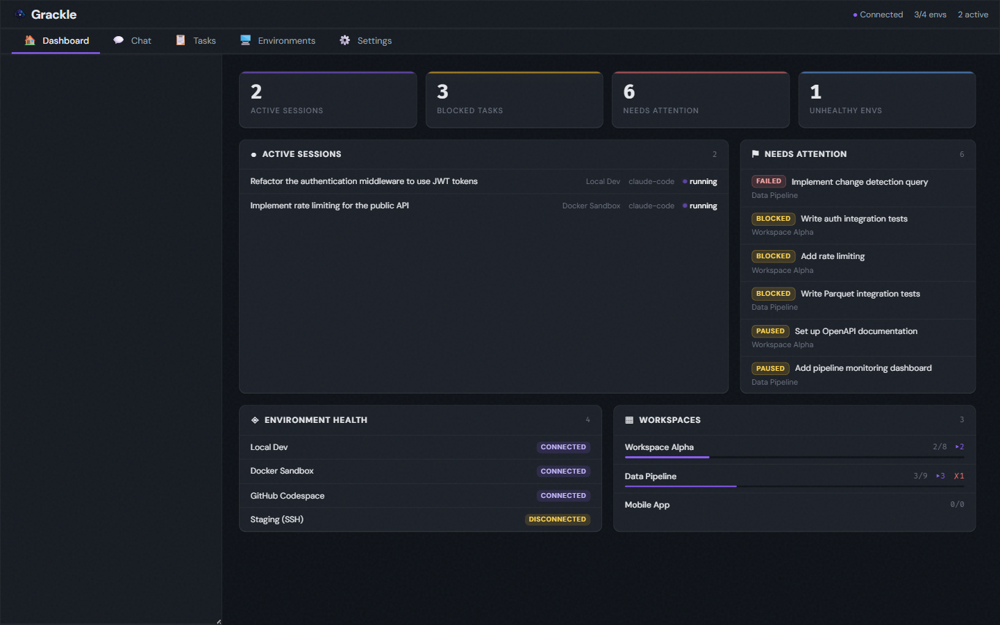

## 💡 Philosophy

### 🔌 Environments are just compute

Docker, local, SSH, and GitHub Codespaces — it shouldn't matter where an agent runs. Grackle treats environments as interchangeable compute behind a single protocol. Same interface, same results, regardless of where the work happens.

### 🔄 Runtime agnostic by design

The agent loop landscape is wildly unstable. [Claude Code](https://docs.anthropic.com/en/docs/agents-and-tools/claude-code/overview), [Copilot](https://github.com/features/copilot), [Codex](https://openai.com/index/codex/), [Goose](https://block.github.io/goose/), [GenAIScript](https://microsoft.github.io/genaiscript/) — whatever ships next month. Grackle wraps them all behind a standard interface so you can swap runtimes without changing your workflow. Your tooling shouldn't be coupled to whichever vendor is winning this quarter.

### 🧰 Primitives, not opinions

Grackle doesn't tell you how to orchestrate your agents. It gives you the building blocks — sessions, tasks, findings, personas, an MCP control plane — and lets you compose them however you want. A single remote REPL session uses one primitive. A supervised swarm uses all of them. Same platform, same CLI, same MCP.

### 📈 Scales from remote control to swarms

Most tools force a choice: run one agent manually, or build a bespoke swarm framework from scratch. Grackle covers the whole spectrum — start simple, scale up.

#### 🎮 Remote Control

Manage a single agent in a remote environment. No task tree, no orchestration. Just a session.

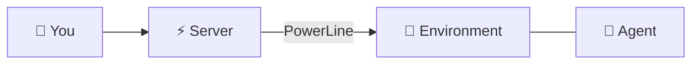

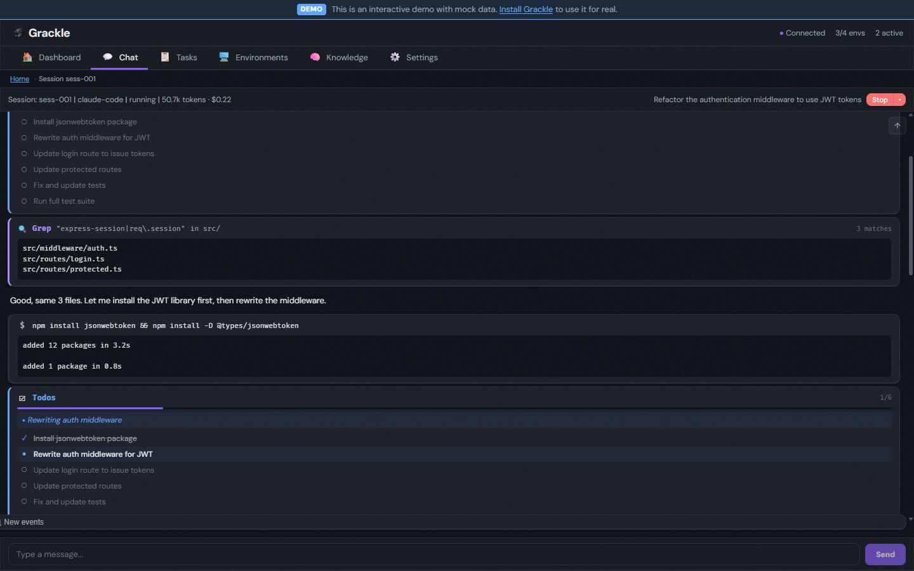

#### ⛓️ Workflow

Decompose work into task trees with parent/child hierarchy. Chain siblings with dependencies. Review artifacts at each step.

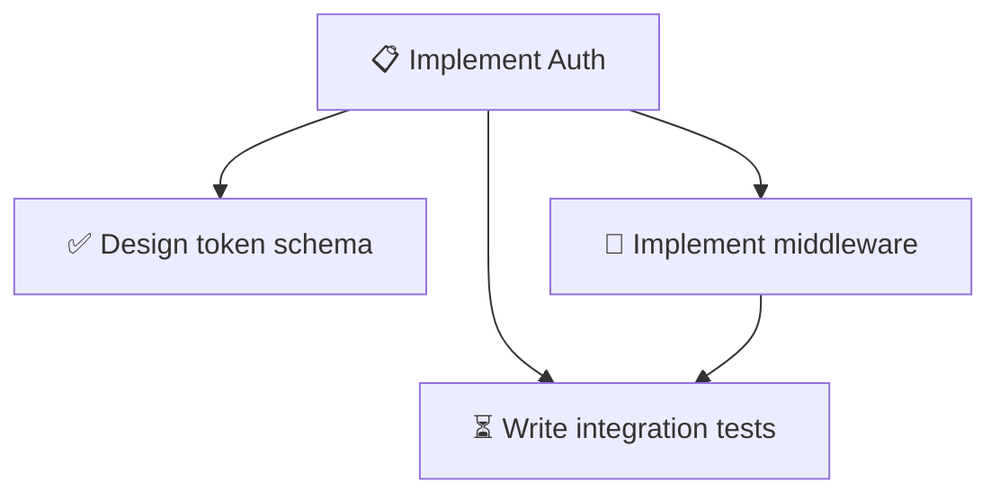

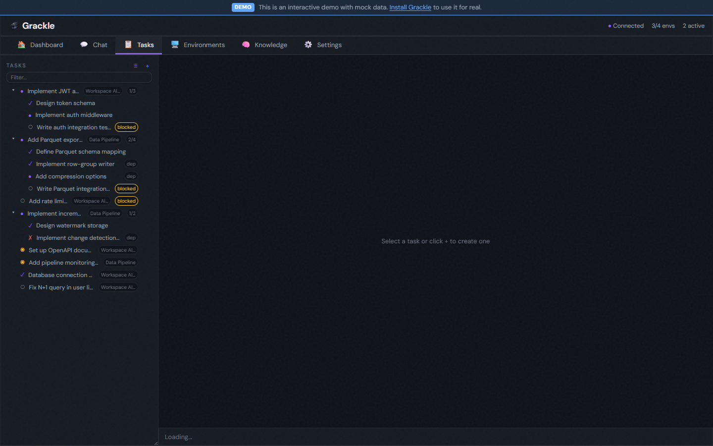

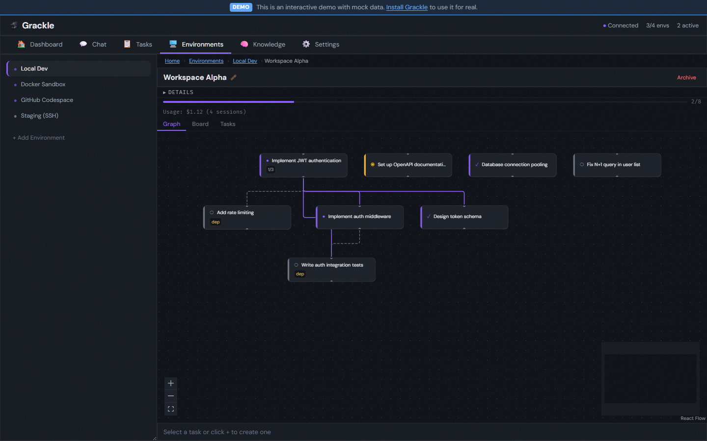

#### 👥 Team

Multiple agents working in parallel on a shared workspace, coordinating through the knowledge graph and IPC pipes.

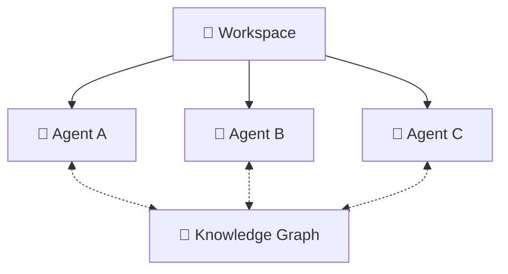

#### 🐝 Swarm

Autonomous task decomposition, agent recruitment, knowledge sharing.

```mermaid
graph TD
    G["🎯 Goal"] --> D["Decompose"]
    D --> T1["🤖"] & T2["🤖"] & T3["🤖"] & T4["🤖"]
    T1 & T2 & T3 & T4 --> K["🧠 Knowledge Graph"]
    K --> N["🤖 ...more agents"]
    N -.-> D
    style N fill:#333,stroke:#666,stroke-dasharray: 5 5
```

### 🔍 Workspaces and workpads

A **workspace** is a place inside an environment where work gets done — typically a git repo clone. Each task in a workspace gets its own git worktree, so agents never step on each other's branches. The full conversation thread is stored in the central server database — every tool call, every decision, fully auditable. If you can read a diff, you can audit a swarm.

**Workpads** (coming soon) are structured context surfaces attached to tasks — the artifacts, notes, and handoff data that one session produces and the next session picks up. Think of them as the structured memory for a task across multiple agent attempts.

### 🧠 Agents that actually coordinate

Agents coordinate through kernel primitives — pipes, file descriptors, and structured IPC — not just by sharing a database. A parent session can spawn child sessions with bidirectional pipes, wait for structured results, and react to lifecycle signals. Tasks move through a defined lifecycle with review gates at each transition. See the [Task Lifecycle epic](https://github.com/nick-pape/grackle/issues/462) and [Signals & Process Control epic](https://github.com/nick-pape/grackle/issues/468) for the full roadmap.

Grackle deploys a **knowledge graph** backed by semantic search — agents write findings to it, and other agents query it by concept, not just keyword. One agent's architectural insight becomes another agent's context automatically. The knowledge graph UI explorer is [in progress](https://github.com/nick-pape/grackle/issues/764); the backend is shipped ([Epic #692](https://github.com/nick-pape/grackle/issues/692)).

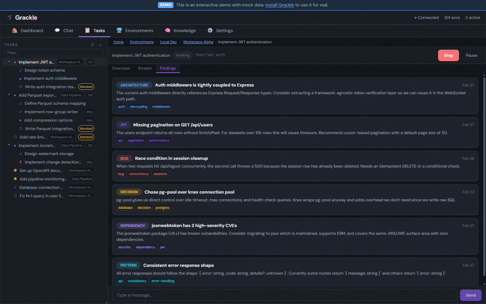

### 🎭 Personas

Personas are Grackle's version of what other platforms call "agents" — a named configuration that bundles a system prompt, runtime, model, tool allowlists, and MCP server connections. Assign a "Software Architect" persona to decompose work, a "Code Reviewer" to audit diffs read-only, or a "QA Engineer" to write tests.

**Script personas** use [GenAIScript](https://microsoft.github.io/genaiscript/) — a lightweight TypeScript API from Microsoft for programmatic AI workflows. Unlike agent loops that rely on an LLM to figure out what to do, GenAIScript lets you *script* deterministic steps: run a linter, analyze the output with an LLM, and post a findings summary. Grackle exposes these scripts under the same session and task primitives as any agent loop — same lifecycle, same streaming, same MCP tools — but the work is scripted, not hoped for.

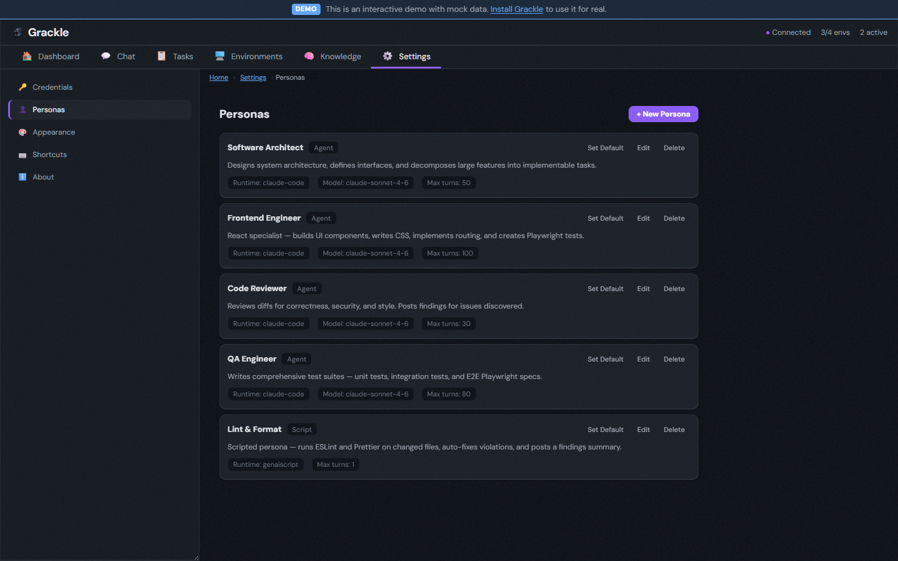

### 🎨 Themeable

10 built-in themes — dark, light, and everything in between. Grackle, Grackle Light, Glassmorphism, Matrix, Neubrutalism, Monokai, Ubuntu, Sandstone, Verdigris, and Primer. Switch in Settings or match your system preference.

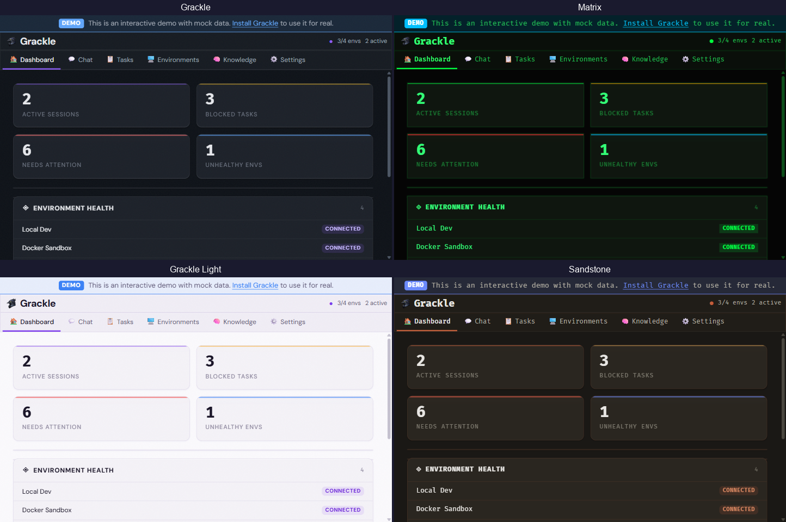

## 🏗️ Example Topology

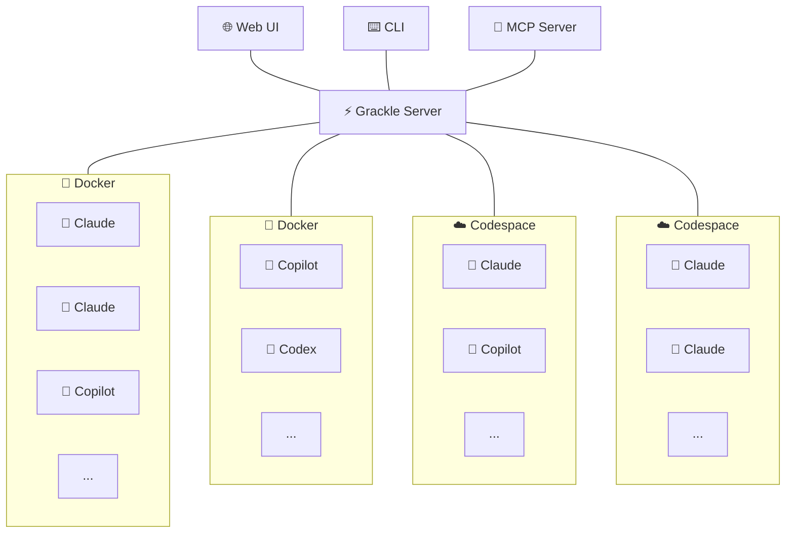


## ✨ Features

| | Feature | Description |
|---|---|---|
| 📡 | **Real-time streaming** | Watch agent tool calls and output as they happen, bridged from gRPC to WebSocket |
| 🌳 | **Git worktree isolation** | Every task gets its own branch in its own worktree — zero interference between agents |
| 🧠 | **Knowledge graph** | Semantic search over session transcripts, findings, and task context — agents build shared understanding across sessions |
| 🔄 | **Multi-runtime support** | [Claude Code](https://docs.anthropic.com/en/docs/agents-and-tools/claude-code/overview), [Copilot](https://github.com/features/copilot), [Codex](https://openai.com/index/codex/), [Goose](https://block.github.io/goose/), and [GenAIScript](https://microsoft.github.io/genaiscript/) — swap runtimes per persona or per task |
| 🌲 | **Task tree hierarchy** | Decompose tasks into parent/child subtrees up to 5 levels deep — with recursive tree view, expand/collapse, and progress badges |
| 🔗 | **Task dependencies** | Dependency gating — blocked tasks wait for their dependencies to complete |
| 🎭 | **Personas** | Named agent configurations with system prompts, runtime/model, and tool allowlists. Script personas run [GenAIScript](https://microsoft.github.io/genaiscript/) programs for deterministic workflows |
| 🔁 | **Session history** | Every task tracks its full session history — retry failed runs and compare attempts side by side |
| ✅ | **Task review & approval** | Approve or reject completed tasks, with review notes for rejections that feed back into the next attempt |
| 🔌 | **MCP server** | Expose Grackle's full capabilities as MCP tools — any agent with the MCP connected can create tasks, spawn sessions, query the knowledge graph, and orchestrate work |
| 💬 | **Chat tab** | Talk to the root orchestrator directly — it has access to every MCP tool in Grackle. The fastest way to plan work, create tasks, and kick off agents |
| 💰 | **Usage tracking** | Token counts and cost per session, task, or workspace — see spend at a glance in the dashboard, CLI, and task overview |
| 🔄 | **Session suspend & recovery** | Environments auto-reconnect on disconnect. Suspended sessions resume where they left off — no lost work |
| 🔀 | **IPC pipes** | Parent sessions spawn children with bidirectional pipes for structured communication — no polling, no shared files |

## 🌍 Environments

Each agent runs inside an isolated environment. Connect one or many:

| Adapter | Status | Command |
|---------|--------|---------|
| 🐳 **Docker** | ✅ Available | `grackle env add my-env --docker` |
| 💻 **Local** | ✅ Available | `grackle env add my-env --local` |
| 🔒 **SSH** | ✅ Available | `grackle env add my-env --ssh --host ...` |
| ☁️ **Codespace** | ✅ Available | `grackle env add my-env --codespace --codespace-name <name>` |

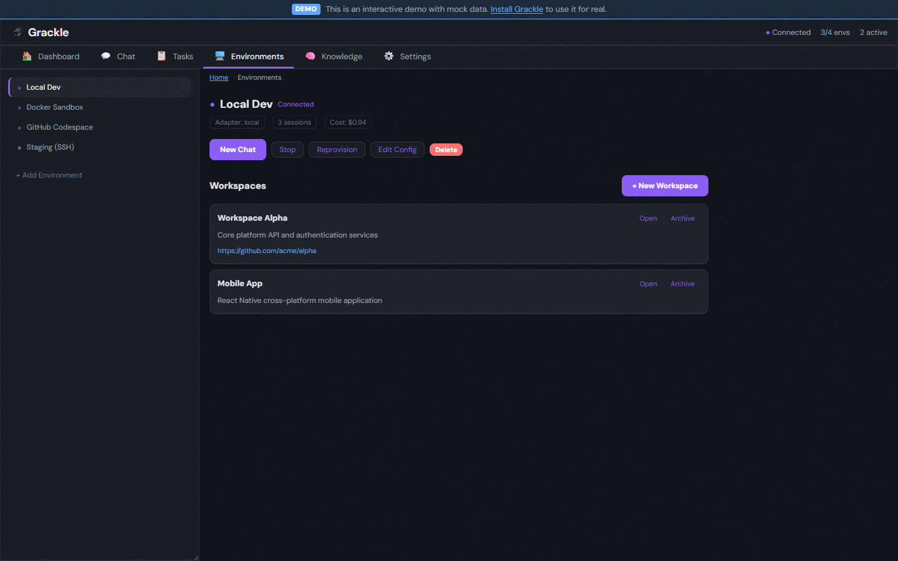

Docker spins up a container with PowerLine pre-installed. Local connects to a PowerLine instance already running on your machine. SSH connects to any remote host via OpenSSH. Codespace connects to an existing GitHub Codespace by name (use `gh codespace list` to find it).

## 🚀 Quick Start

```bash
# 1. Install the CLI
npm install -g @grackle-ai/cli

# 2. Start the server (gRPC + Web UI + WebSocket — all in one)
grackle serve

# 3. Open the dashboard at http://localhost:3000

# 4. Add a Docker environment and start working
grackle env add my-env --docker
```

Or skip the global install entirely — prefix every command with `npx`:

```bash
npx @grackle-ai/cli serve
npx @grackle-ai/cli env add my-env --docker
```

> **Docker image**: A pre-built Docker image is [coming soon](https://github.com/nick-pape/grackle/issues/792). In the meantime, you can use `docker compose up` from the `docker/` directory in this repo.

> **pnpm users**: pnpm v8+ blocks package install scripts by default. If `grackle serve` crashes with a `Could not locate the bindings file` error, run `pnpm approve-builds` after installing and then reinstall, or add the following to your `package.json` before installing:
>
> ```json
> { "pnpm": { "onlyBuiltDependencies": ["better-sqlite3"] } }
> ```

<details>
<summary>Building from source</summary>

```bash
npm install -g @microsoft/rush
rush update && rush build
node packages/cli/dist/index.js serve
```
</details>

## 📋 Requirements

- Node.js >= 22
- Docker (for containerized environments)

## 📄 License

MIT

---

_See the [Agent Kernel RFC](https://github.com/nick-pape/grackle/issues/480) for the long-term roadmap._
