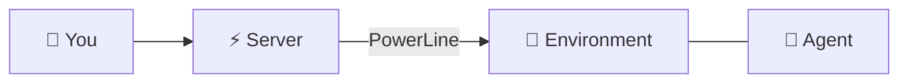
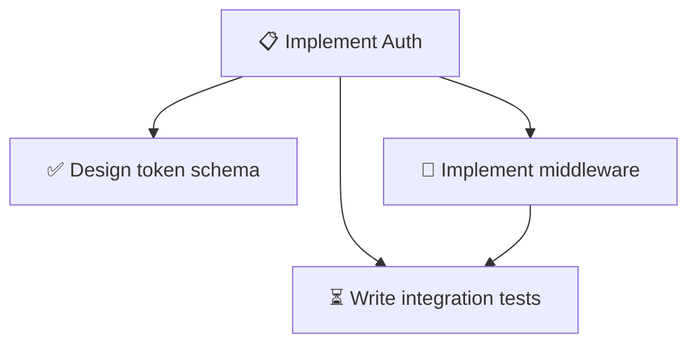
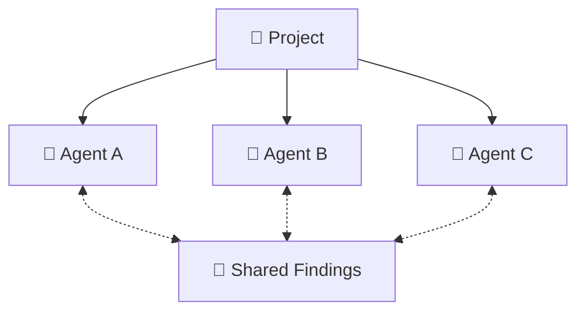
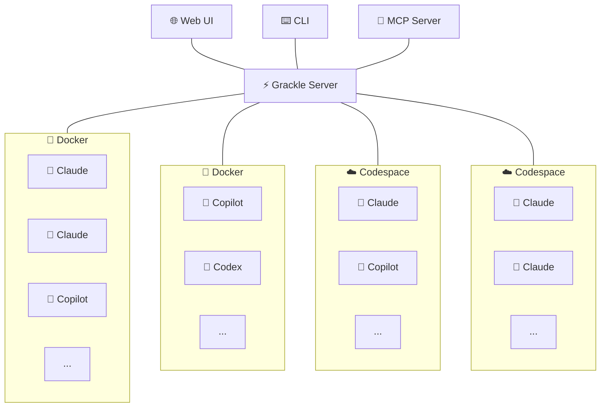

# 🐦‍⬛ Grackle

> [!WARNING]
> Grackle is pre-1.0 and still experimental. It may have unresolved security issues, annoying bugs, and broken workflows. Not recommended for use in production systems.

**Run any AI coding agent on any remote environment. Orchestration optional.**

You're running Claude Code on a devbox. Or Codex in a container. Or Copilot over SSH. You wrote a janky script to set it up, it breaks every week, and you can't share it with your team.

Grackle gives you a single platform to run any coding agent on any environment — Docker, SSH, Codespaces, whatever. It handles provisioning, credentials, transport, and lifecycle. You get a CLI, web UI, and MCP server out of the box.

Want agents to share knowledge? There's a findings system. Want one agent to spawn others? There's an MCP for that. Want task trees with dependencies and review gates? Same primitives. But you don't have to use any of that. **Start with one session on one box.**


## 💡 Philosophy

### 🔌 Environments are just compute

Docker, local, SSH, and GitHub Codespaces — it shouldn't matter where an agent runs. Grackle treats environments as interchangeable compute behind a single protocol. Same interface, same results, regardless of where the work happens.

### 🔄 Runtime agnostic by design

The agent loop landscape is wildly unstable. Claude Code, Copilot, Codex, Goose [⭐#29](https://github.com/nick-pape/grackle/issues/29) — whatever ships next month. Grackle wraps them all behind a standard interface so you can swap runtimes without changing your workflow. Your tooling shouldn't be coupled to whichever vendor is winning this quarter.

### 🧰 Primitives, not opinions

Grackle doesn't tell you how to orchestrate your agents. It gives you the building blocks — sessions, tasks, findings, personas, an MCP control plane — and lets you compose them however you want. A single remote REPL session uses one primitive. A supervised swarm uses all of them. Same platform, same CLI, same MCP.

### 📈 Scales from remote control to swarms

Most tools force a choice: run one agent manually, or build a bespoke swarm framework from scratch. Grackle covers the whole spectrum — start simple, scale up.

#### 🎮 Remote Control

Manage a single agent in a remote environment. No task tree, no orchestration. Just a session.



#### ⛓️ Workflow

Decompose work into task trees with parent/child hierarchy. Chain siblings with dependencies. Review artifacts at each step.




#### 👥 Team [⭐#37](https://github.com/nick-pape/grackle/issues/37)

Multiple agents working in parallel on a shared project, coordinating through findings.



#### 🐝 Swarm [⭐#38](https://github.com/nick-pape/grackle/issues/38)

Autonomous task decomposition, agent recruitment, knowledge sharing.

```mermaid
graph TD
    G["🎯 Goal"] --> D["Decompose"]
    D --> T1["🤖"] & T2["🤖"] & T3["🤖"] & T4["🤖"]
    T1 & T2 & T3 & T4 --> K["🧠 Knowledge Graph"]
    K --> N["🤖 ...more agents"]
    N -.-> D
    style N fill:#333,stroke:#666,stroke-dasharray: 5 5
```



### 🔍 Auditable artifacts, not magic

Every agent produces real, reviewable output: git branches, markdown reports, PR comments, findings. The full conversation thread is stored in the central server database — every tool call, every decision, fully auditable. Nothing happens in a black box. Git branches and tags provide natural coordination points — not a proprietary state machine. If you can read a diff, you can audit a swarm.

Workpads and workspaces are coming as a unified mechanism for structured agent handoff — a single surface where agents produce artifacts, humans review them, and the next agent picks up where the last one left off.

### 🧠 Agents that actually coordinate

Agents don't just run in parallel — they share knowledge. One agent's architectural insight becomes another agent's context through findings and the knowledge graph [⭐#13](https://github.com/nick-pape/grackle/issues/13). Agent personas with focused system prompts and tool allowlists [⭐#11](https://github.com/nick-pape/grackle/issues/11) keep specialists on task. The coordination primitives are the ones engineers already use: git, branches, code review.


## 🏗️ Example Topology




## ✨ Features

| | Feature | Description |
|---|---|---|
| 📡 | **Real-time streaming** | Watch agent tool calls and output as they happen, bridged from gRPC to WebSocket |
| 🌳 | **Git worktree isolation** | Every task gets its own branch in its own worktree — zero interference between agents |
| 💬 | **Findings & knowledge sharing** | Agents post discoveries that become context for other agents |
| 🔄 | **Multi-runtime support** | Claude Code, Copilot, and Codex — with more on the roadmap |
| 🌲 | **Task tree hierarchy** | Decompose tasks into parent/child subtrees up to 5 levels deep — with recursive tree view, expand/collapse, and progress badges |
| 🔗 | **Task dependencies** | Dependency gating — blocked tasks wait for their dependencies to complete |
| 🎭 | **Agent personas** | Specialized agents with focused system prompts, configurable runtime/model, and tool allowlists [⭐#11](https://github.com/nick-pape/grackle/issues/11) |
| 🔁 | **Session history** | Every task tracks its full session history — retry failed runs and compare attempts side by side |
| ✅ | **Task review & approval** | Approve or reject completed tasks, with review notes for rejections that feed back into the next attempt |
| 🔌 | **MCP server** | Expose Grackle's capabilities as MCP tools — any Claude session with the MCP connected can create tasks, spawn sessions, read findings, and orchestrate work |
| 🧠 | **Knowledge graph** [⭐#13](https://github.com/nick-pape/grackle/issues/13) | Structured knowledge sharing across agents — beyond flat findings |

## 🌍 Environments

Each agent runs inside an isolated environment. Connect one or many:

| Adapter | Status | Command |
|---------|--------|---------|
| 🐳 **Docker** | ✅ Available | `grackle env add my-env --docker` |
| 💻 **Local** | ✅ Available | `grackle env add my-env --local` |
| 🔒 **SSH** | ✅ Available | `grackle env add my-env --ssh --host ...` |
| ☁️ **Codespace** | ✅ Available | `grackle env add my-env --codespace --codespace-name <name>` |


Docker spins up a container with PowerLine pre-installed. Local connects to a PowerLine instance already running on your machine. SSH connects to any remote host via OpenSSH. Codespace connects to an existing GitHub Codespace by name (use `gh codespace list` to find it).

## 🚀 Quick Start

```bash
# 1. Install the CLI
npm install -g @grackle-ai/cli

# 2. Start the server (gRPC + Web UI + WebSocket — all in one)
grackle serve

# 3. Open the dashboard at http://localhost:3000

# 4. Add a Docker environment and start working
grackle env add my-env --docker
```

Or skip the global install entirely — prefix every command with `npx`:

```bash
npx @grackle-ai/cli serve
npx @grackle-ai/cli env add my-env --docker
```

> **pnpm users**: pnpm v8+ blocks package install scripts by default. If `grackle serve` crashes with a `Could not locate the bindings file` error, run `pnpm approve-builds` after installing and then reinstall, or add the following to your `package.json` before installing:
>
> ```json
> { "pnpm": { "onlyBuiltDependencies": ["better-sqlite3"] } }
> ```

<details>
<summary>Building from source</summary>

```bash
npm install -g @microsoft/rush
rush update && rush build
node packages/cli/dist/index.js serve
```
</details>

## 📋 Requirements

- Node.js >= 22
- Docker (for containerized environments)

## 📄 License

MIT

---

_🔜 = **Planned for [v1.0.0](https://github.com/nick-pape/grackle/milestone/1)** · ⭐ = **Post v1.0**_
