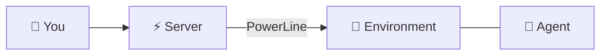
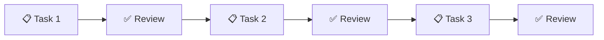
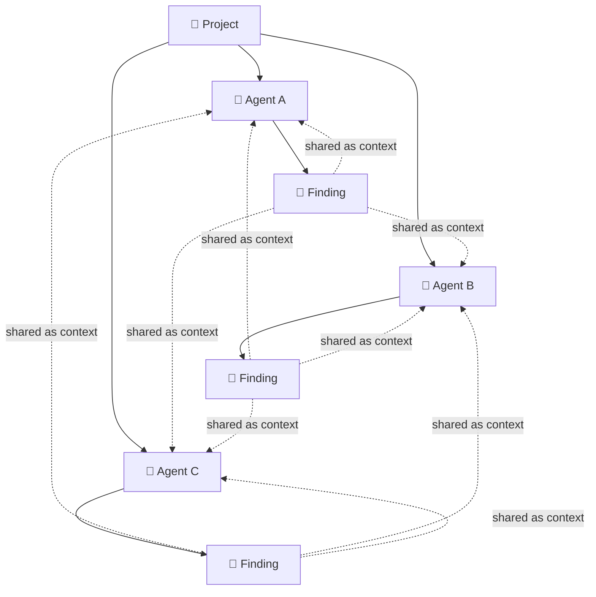

# 🐦‍⬛ Grackle

**Orchestrate AI coding agents across any environment, with any runtime, at any scale.**

Grackle is a multi-agent coordination platform. Break a project into tasks, dispatch each to an agent running in its own isolated environment, and watch them work in real time. Review real diffs, share knowledge between agents, and scale from one agent to a swarm — without rewriting your setup.

## 💡 Philosophy

### 🔌 Environments are just compute

Docker and local today, SSH ⭐[#30](https://github.com/nick-pape/grackle/issues/30) and Codespaces [#31](https://github.com/nick-pape/grackle/issues/31) on the roadmap — it shouldn't matter where an agent runs. Grackle treats environments as interchangeable compute behind a single protocol. Same interface, same results, regardless of where the work happens.

### 🔄 Runtime agnostic by design

The agent loop landscape is wildly unstable. Claude Code, Copilot [#26](https://github.com/nick-pape/grackle/issues/26), Codex ⭐[#27](https://github.com/nick-pape/grackle/issues/27), Goose ⭐[#29](https://github.com/nick-pape/grackle/issues/29) — whatever ships next month. Grackle wraps them all behind a standard interface so you can swap runtimes without changing your workflow. Your orchestration layer shouldn't be coupled to whichever vendor is winning this quarter.

### 📈 Scales from remote control to swarms

Most tools force a choice: run one agent manually, or build a bespoke swarm framework from scratch. Grackle covers the whole spectrum. No other tool gives you this gradient — start simple, scale up.

#### 🎮 Remote Control

Manage a single agent in a remote environment.



#### ⛓️ Workflow

Chain tasks with dependencies. Review artifacts at each step.



#### 👥 Team ⭐[#37](https://github.com/nick-pape/grackle/issues/37)

Multiple agents working in parallel on a shared project, coordinating through findings.



#### 🐝 Swarm ⭐[#38](https://github.com/nick-pape/grackle/issues/38)

Autonomous task decomposition, agent recruitment, knowledge sharing.

```mermaid
graph TD
    G["🎯 Goal"] --> D["Decompose"]
    D --> T1["🤖"] & T2["🤖"] & T3["🤖"] & T4["🤖"]
    T1 & T2 & T3 & T4 --> K["🧠 Knowledge Graph"]
    K --> N["🤖 ...more agents"]
    style N fill:#333,stroke:#666,stroke-dasharray: 5 5
```



### 🔍 Auditable artifacts, not magic ⭐

Every agent produces real, reviewable output: git diffs, markdown reports, PR comments, findings. The full conversation thread is stored in the central server database — every tool call, every decision, fully auditable. Nothing happens in a black box. Git branches and tags provide natural coordination points — not a proprietary state machine. If you can read a diff, you can audit a swarm.

### 🧠 Agents that actually coordinate

Agents don't just run in parallel — they share knowledge. One agent's architectural insight becomes another agent's context through findings and the knowledge graph ⭐[#13](https://github.com/nick-pape/grackle/issues/13). Agent personas ⭐[#11](https://github.com/nick-pape/grackle/issues/11) with tool allowlists keep specialists focused. The coordination primitives are the ones engineers already use: git, diffs, code review.

## 🏗️ Architecture

```mermaid
graph LR
    UI["🌐 Web UI :3000"]
    CLI["⌨️ CLI"]
    Server["⚡ Server :7434"]

    UI -- WebSocket --> Server
    CLI -- gRPC --> Server

    subgraph "Environments"
        Docker["🐳 Docker"]
        SSH["🔒 SSH"]
        CS["☁️ Codespace"]
    end

    Server -- gRPC --> Docker
    Server -. gRPC .-> SSH & CS

    subgraph "Inside each environment"
        PL["⚡ PowerLine"]
        PL --> CC["Claude Code"]
        PL --> More["..."]
    end

    Docker --- PL
    SSH -.- PL
    CS -.- PL
    style More fill:#333,stroke:#666,stroke-dasharray: 5 5
    style SSH fill:#333,stroke:#666,stroke-dasharray: 5 5
    style CS fill:#333,stroke:#666,stroke-dasharray: 5 5
```




## ✨ Features

| | Feature | Description |
|---|---|---|
| 📡 | **Real-time streaming** | Watch agent tool calls and output as they happen, bridged from gRPC to WebSocket |
| 🌳 | **Git worktree isolation** | Every task gets its own branch in its own worktree — zero interference between agents |
| 💬 | **Findings & knowledge sharing** | Agents post discoveries that become context for other agents |
| 🔄 | **Multi-runtime support** | Claude Code today, Copilot [#26](https://github.com/nick-pape/grackle/issues/26) and others on the roadmap |
| 🔗 | **Task dependencies** | Dependency gating — blocked tasks wait for their dependencies to complete |
| ✅ | **Diff review** | See exactly what each agent changed, approve or reject per-task |
| 🧠 | **Knowledge graph** ⭐[#13](https://github.com/nick-pape/grackle/issues/13) | Structured knowledge sharing across agents — beyond flat findings |
| 🎭 | **Agent personas** ⭐[#11](https://github.com/nick-pape/grackle/issues/11) | Specialized agents with tool allowlists and focused system prompts |

## 🌍 Environments

Each agent runs inside an isolated environment. Connect one or many:

| Adapter | Status | Command |
|---------|--------|---------|
| 🐳 **Docker** | ✅ Available | `grackle env add my-env --docker` |
| 💻 **Local** | ✅ Available | `grackle env add my-env --local` |
| 🔒 **SSH** | ⭐ Post v1.0 [#30](https://github.com/nick-pape/grackle/issues/30) | `grackle env add my-env --ssh --host ...` |
| ☁️ **Codespace** | 🔜 Planned [#31](https://github.com/nick-pape/grackle/issues/31) | `grackle env add my-env --codespace --repo ...` |

Docker spins up a container with PowerLine pre-installed. Local connects to a PowerLine instance already running on your machine.

## 🚀 Quick Start

```bash
# 1. Install and build
npm install -g @microsoft/rush
rush update && rush build

# 2. Start the server (gRPC + Web UI + WebSocket)
node packages/server/dist/index.js

# 3. Open the dashboard at http://localhost:3000

# 4. Add a Docker environment and start working
node packages/cli/dist/index.js env add my-env --docker
```

## 📋 Requirements

- Node.js >= 22
- pnpm 10+
- Docker (for containerized environments)

## 📄 License

MIT

---

_🔜 = **Planned for [v1.0.0](https://github.com/nick-pape/grackle/milestone/1)** · ⭐ = **Post v1.0**_
