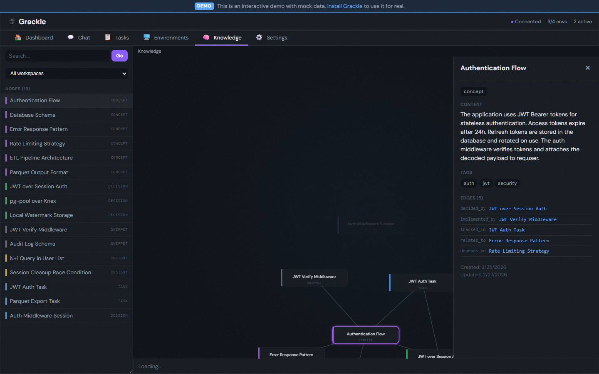

# Grackle

<p align="center">
  <a href="https://www.npmjs.com/package/@grackle-ai/cli"></a>
  <a href="https://github.com/nick-pape/grackle/actions/workflows/ci.yml"></a>
  <a href="https://opensource.org/licenses/MIT"></a>
</p>

> [!WARNING]
> Grackle is pre-1.0 and still experimental. It may have unresolved security issues, annoying bugs, and broken workflows. Not recommended for use in production systems.

<p align="center">
  
</p>

## Stop babysitting your AI agents

You have 6 agents running across 4 machines. You're tab-switching between terminals, copy-pasting context from one agent's output into another's prompt, and restarting dead sessions at 2 AM. Every agent has its own CLI, its own auth flow, its own way of crashing silently.

Grackle is the control plane for AI coding agents. **Configure once, supervise by exception.**

One platform to run [Claude Code](https://docs.anthropic.com/en/docs/agents-and-tools/claude-code/overview), [Copilot](https://github.com/features/copilot), [Codex](https://openai.com/index/codex/), [Goose](https://block.github.io/goose/), or [GenAIScript](https://microsoft.github.io/genaiscript/) on any environment — Docker, SSH, Codespaces, local. It handles provisioning, credentials, transport, and lifecycle. You get a CLI, web UI, and MCP server out of the box.


## What makes Grackle different

**Agent IPC** — Parent sessions spawn children with bidirectional pipes. Structured communication between agents — no polling, no shared files, no prompt-stuffing.

**Knowledge persistence** — A semantic knowledge graph backed by Neo4j. One agent's architectural insight becomes another agent's context automatically. Search by concept, not keyword.

**Session resilience** — Environments auto-reconnect on disconnect. Suspended sessions resume where they left off. Events buffer during outages and drain on reconnect. No lost work.

**Scoped security** — Each agent gets a scoped MCP token with an allowlist of tools. A "Code Reviewer" persona can read code and post findings but can't write files or spawn sessions. Credentials are forwarded per-environment, never stored in prompts.

**Multi-vendor, one interface** — Swap runtimes per persona or per task. Your orchestration doesn't break when you switch from Claude to Codex or add Copilot as a second opinion.

**Script personas** — Not everything needs an LLM loop. [GenAIScript](https://microsoft.github.io/genaiscript/) personas run deterministic TypeScript workflows — linters, formatters, analyzers — under the same session and task primitives as any agent.

## See it in action

### Live agent stream

Watch tool calls, code output, and reasoning as they happen. Specialized cards for each tool type — file edits show diffs, grep results show matches, bash commands show output, and todo lists track progress.


### Task trees and dependencies

Decompose work into parent/child hierarchies. Chain tasks with dependency gates. Every task gets its own git worktree — agents never step on each other's branches.


### DAG visualization

Interactive dependency graph showing hierarchy and blocking relationships. Click any node to see its stream, findings, or overview.


### Knowledge graph

Agents write findings to a semantic knowledge graph. Other agents query it by concept. The UI explorer shows nodes (concepts, decisions, snippets, insights) and their relationships.



### Findings

Categorized discoveries shared across agents within a workspace — architecture decisions, bugs, API patterns, dependency issues. Tagged and searchable.


### Personas

Named agent configurations that bundle a system prompt, runtime, model, tool allowlists, and MCP permissions. Assign a "Software Architect" to decompose work, a "Code Reviewer" to audit diffs read-only, or a "Lint & Format" script persona for deterministic workflows.


### Environments

Each agent runs inside an isolated environment. Connect one or many:

| Adapter | Command |
|---------|---------|
| 🐳 **Docker** | `grackle env add my-env --docker` |
| 💻 **Local** | `grackle env add my-env --local` |
| 🔒 **SSH** | `grackle env add my-env --ssh --host ...` |
| ☁️ **Codespace** | `grackle env add my-env --codespace --codespace-name <name>` |


### Themes

10 built-in themes — Grackle, Grackle Light, Glassmorphism, Matrix, Neubrutalism, Monokai, Ubuntu, Sandstone, Verdigris, and Primer.


## Features

| | Feature | Description |
|---|---|---|
| 📡 | **Real-time streaming** | Watch agent tool calls and output as they happen — specialized cards for each tool type |
| 🌳 | **Git worktree isolation** | Every task gets its own branch in its own worktree — zero interference between agents |
| 🧠 | **Knowledge graph** | Semantic search over findings and task context — agents build shared understanding across sessions |
| 🔄 | **Multi-runtime support** | Claude Code, Copilot, Codex, Goose, and GenAIScript — swap runtimes per persona or per task |
| 🌲 | **Task tree hierarchy** | Parent/child subtrees with recursive tree view, expand/collapse, and progress badges |
| 🔗 | **Task dependencies** | Dependency gating — blocked tasks wait for their dependencies to complete |
| 🎭 | **Personas** | Named agent configs with system prompts, runtime/model, and scoped MCP tool allowlists |
| 🔁 | **Session history** | Every task tracks its full session history — retry failed runs and compare attempts |
| ✅ | **Task review & approval** | Approve or reject completed tasks with feedback that feeds into the next attempt |
| 🔌 | **MCP server** | 50+ tools — any agent with MCP connected can create tasks, spawn sessions, query knowledge, and orchestrate work |
| 💬 | **Chat** | Talk to the orchestrator directly — it has access to every MCP tool in Grackle |
| 💰 | **Usage tracking** | Token counts and cost per session, task, or workspace |
| 🔄 | **Session recovery** | Environments auto-reconnect. Suspended sessions resume where they left off |
| 🔀 | **IPC pipes** | Parent sessions spawn children with bidirectional pipes for structured communication |
| ⏰ | **Scheduled triggers** | Cron expressions and interval shortcuts for recurring task creation |
| ⌨️ | **Keyboard shortcuts** | Global shortcuts for navigation and common actions |

## Quick Start

### Docker (recommended)

One command — includes the server, web UI, knowledge graph (Neo4j), and a local agent environment:

```bash
docker run -d --name grackle -p 3000:3000 -v grackle-data:/data ghcr.io/nick-pape/grackle:latest
```

Open **http://localhost:3000**, pair with the code from `docker logs grackle`, and start working.

To mount your Claude Code credentials so agents can authenticate:

```bash
docker run -d --name grackle -p 3000:3000 -v grackle-data:/data \
  -v "${HOME}/.claude:/home/node/.claude:ro" \
  ghcr.io/nick-pape/grackle:latest
```

> **Windows note**: The Claude Desktop app stores OAuth tokens in Windows Credential Manager (DPAPI), not `~/.claude/`. Use `-e ANTHROPIC_API_KEY=sk-...` instead of the volume mount. Same for `GH_TOKEN` — pass `-e GH_TOKEN=$(gh auth token)`.

<details>
<summary>Mount credentials for all runtimes</summary>

```bash
docker run -d --name grackle -p 3000:3000 -v grackle-data:/data \
  -v "${HOME}/.claude:/home/node/.claude:ro" \
  -v "${HOME}/.copilot:/home/node/.copilot" \
  -v "${HOME}/.codex:/home/node/.codex" \
  -e GH_TOKEN=$(gh auth token) \
  ghcr.io/nick-pape/grackle:latest
```

- **Claude**: mounted read-only (redirected via `CLAUDE_CONFIG_DIR`)
- **Copilot / Codex**: mounted writable (their CLIs write session state with no config dir override)
- **GH_TOKEN**: enables the GitHub CLI and Codespace adapter inside the container
- Use `${HOME}` (not `~`) — tilde expansion doesn't work in Docker on Windows

</details>

<details>
<summary>Docker Compose</summary>

For a more complete setup with Docker adapter integration, credential mounts, and networking:

```bash
cp deploy/docker-compose.yml deploy/.env.example .
cp .env.example .env  # edit as needed
docker compose up -d
```

See [`deploy/docker-compose.yml`](deploy/docker-compose.yml) for the full configuration.

</details>

### npm

```bash
# 1. Install the CLI
npm install -g @grackle-ai/cli

# 2. Start the server (gRPC + Web UI — all in one)
grackle serve

# 3. Open the dashboard at http://localhost:3000

# 4. Add a Docker environment and start working
grackle env add my-env --docker
```

Or skip the global install entirely — prefix every command with `npx`:

```bash
npx @grackle-ai/cli serve
npx @grackle-ai/cli env add my-env --docker
```

> **pnpm users**: pnpm v8+ blocks package install scripts by default. If `grackle serve` crashes with a `Could not locate the bindings file` error, run `pnpm approve-builds` after installing and then reinstall, or add the following to your `package.json` before installing:
>
> ```json
> { "pnpm": { "onlyBuiltDependencies": ["better-sqlite3"] } }
> ```

<details>
<summary>Building from source</summary>

```bash
npm install -g @microsoft/rush
rush update && rush build
node packages/cli/dist/index.js serve
```
</details>

## Progressive complexity

Grackle covers the whole spectrum — start simple, scale up.

**One agent, one box** — Manage a single agent in a remote environment. No task tree, no orchestration. Just `grackle spawn`.

**Task trees** — Decompose work into parent/child hierarchies. Chain siblings with dependencies. Review artifacts at each step.

**Multi-agent** — Multiple agents working in parallel on a shared workspace, coordinating through the knowledge graph and IPC pipes.

**Autonomous swarms** — Task decomposition, agent recruitment, and knowledge sharing — all through the same primitives.

## Requirements

- Docker (recommended — the Grackle app and its dependencies are bundled in the image)
- Node.js >= 22 (for npm install)

> You still need to provide your own model credentials (via environment variables or mounted config files). Some features like the Docker adapter require access to the host Docker socket.

## License

MIT
