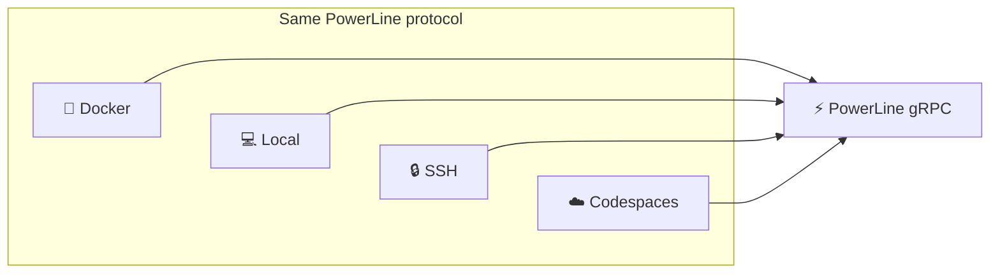
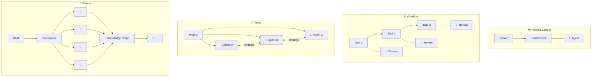
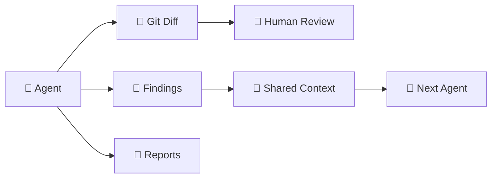
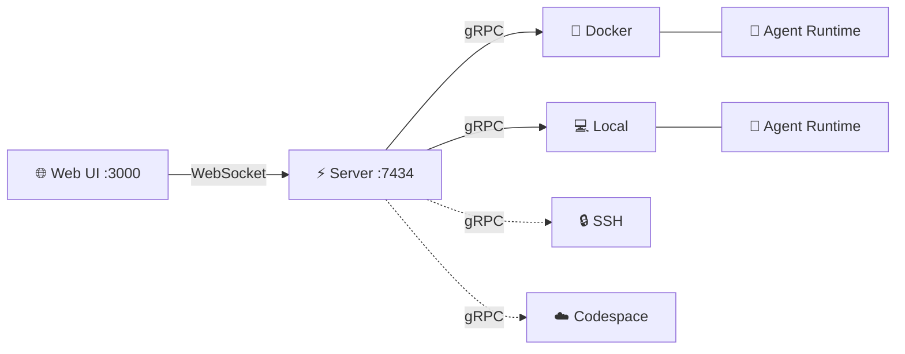

# 🐦‍⬛ Grackle

**Orchestrate AI coding agents across any environment, with any runtime, at any scale.**

Grackle is a multi-agent coordination platform. Break a project into tasks, dispatch each to an agent running in its own isolated environment, and watch them work in real time. Review real diffs, share knowledge between agents, and scale from one agent to a swarm — without rewriting your setup.

## 💡 Philosophy

### 🔌 Environments are just compute

Docker, Codespaces, SSH, local — it shouldn't matter where an agent runs. Grackle treats environments as interchangeable compute behind a single protocol. Same interface, same results, regardless of where the work happens.



### 🔄 Runtime agnostic by design

The agent loop landscape is wildly unstable. Claude Code, Copilot, Codex, Goose — whatever ships next month. Grackle wraps them all behind a standard interface so you can swap runtimes without changing your workflow. Your orchestration layer shouldn't be coupled to whichever vendor is winning this quarter.

```mermaid
graph LR
    PL["⚡ PowerLine"]
    PL --> CC["Claude Code"]
    PL --> CP["GitHub Copilot"]
    PL --> CX["OpenAI Codex"]
    PL --> G["Goose"]
    PL --> Q["???"]
    style Q fill:#333,stroke:#666,stroke-dasharray: 5 5
```



### 📈 Scales from remote control to swarms

Most tools force a choice: run one agent manually, or build a bespoke swarm framework from scratch. Grackle covers the whole spectrum:



No other tool gives you this gradient. Start simple, scale up.

### 🔍 Auditable artifacts, not magic

Every agent produces real, reviewable output: git diffs, markdown reports, PR comments, findings. Nothing happens in a black box. Git branches and tags provide natural coordination points — not a proprietary state machine. If you can read a diff, you can audit a swarm.



### 🧠 Agents that actually coordinate

Agents don't just run in parallel — they share knowledge. One agent's architectural insight becomes another agent's context through findings and the knowledge graph. Agent personas with tool allowlists keep specialists focused. The coordination primitives are the ones engineers already use: git, diffs, code review.

## 🏗️ Architecture



| Component | Description |
|-----------|-------------|
| **Server** | Central hub. Projects, tasks, environments, sessions. SQLite with WAL mode. Bridges gRPC streams to WebSocket so the UI stays live. |
| **PowerLine** | Runs inside each environment. Spawns agent runtimes, streams events to the server, isolates work in git worktrees. Same gRPC interface whether it's in a container or on bare metal. |
| **Web UI** | Real-time dashboard. Stream agent output, review diffs, browse findings, manage tasks. Dark-themed, keyboard-friendly. |
| **CLI** | Thin gRPC client. Everything the UI does, you can script from the terminal. |

## ✨ Features

| | Feature | Description |
|---|---|---|
| 📡 | **Real-time streaming** | Watch agent tool calls and output as they happen, bridged from gRPC to WebSocket |
| 🌳 | **Git worktree isolation** | Every task gets its own branch in its own worktree — zero interference between agents |
| 💬 | **Findings & knowledge sharing** | Agents post discoveries that become context for other agents |
| 🔄 | **Multi-runtime support** | Claude Code today, Copilot and others on the roadmap |
| 🔗 | **Task dependencies** | DAG-based task ordering — blocked tasks wait for their dependencies |
| ✅ | **Diff review** | See exactly what each agent changed, approve or reject per-task |

## 🌍 Environments

Each agent runs inside an isolated environment. Connect one or many:

| Adapter | Status | Command |
|---------|--------|---------|
| 🐳 **Docker** | ✅ Available | `grackle env add my-env --docker` |
| 💻 **Local** | ✅ Available | `grackle env add my-env --local` |
| 🔒 **SSH** | 🔜 Planned | `grackle env add my-env --ssh --host ...` |
| ☁️ **Codespace** | 🔜 Planned | `grackle env add my-env --codespace --repo ...` |

## 🚀 Quick Start

```bash
# 1. Install and build
npm install -g @microsoft/rush
rush update && rush build

# 2. Start the server (gRPC + Web UI + WebSocket)
node packages/server/dist/index.js

# 3. Open the dashboard at http://localhost:3000

# 4. Add a Docker environment and start working
node packages/cli/dist/index.js env add my-env --docker
```

## 📋 Requirements

- Node.js >= 22
- pnpm 10+
- Docker (for containerized environments)

## 📄 License

MIT
