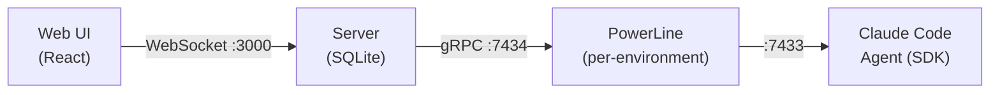

# Grackle

Orchestrate multiple AI coding agents across isolated environments from a single dashboard.

Grackle lets you break a project into tasks, dispatch each to a Claude Code agent running in its own Docker container (or local worktree), and watch them all work in real time. When a task finishes, you review the diff, approve or reject, and move on. Findings from one agent are shared with the others so work doesn't get duplicated.

## Architecture



**Server** — Central hub. Manages projects, tasks, environments, and sessions. Persists state in SQLite. Bridges gRPC and WebSocket so the UI stays live.

**PowerLine** — Runs inside each environment (Docker container or local). Spawns Claude Code agents, streams events back to the server, and isolates work in git worktrees.

**Web UI** — Real-time dashboard. Stream agent output, review diffs, browse findings. Dark-themed, keyboard-friendly.

**CLI** — Thin gRPC client. Everything you can do in the UI you can script from the terminal.

## Quick Start

```bash
# 1. Install and build
npm install -g @microsoft/rush
rush update && rush build

# 2. Start the server (gRPC + Web UI + WebSocket)
node packages/server/dist/index.js

# 3. Open the dashboard at http://localhost:3000

# 4. Add a Docker environment and start working
node packages/cli/dist/index.js env add my-env --docker
```

## Requirements

- Node.js >= 22
- pnpm 10+
- Docker (for containerized environments)
