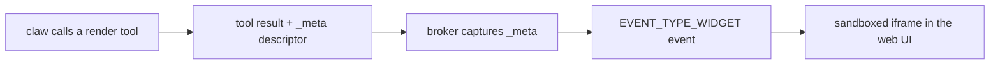

# MCP Apps

A tool result usually carries text. MCP Apps lets it carry a user interface.

MCP Apps is the Model Context Protocol's UI extension: a standard for a tool to
return interactive HTML alongside its data, and for a host to render it. Grackle
implements it as the substrate under generative widgets — the agent authors the
panel, Grackle shows it. The agent-facing tools live in
[Widgets](../features/widgets); this page is the wire underneath.

## The descriptor

A render tool does not draw anything. It returns a normal tool result and tucks a
render descriptor into the result's `_meta`, under the key
`io.grackle/widget-render`. The descriptor is self-contained — body, props,
renderer kind, and the CSP flags that decide what the body is allowed to do:

| Field                | Carries                                               |
| -------------------- | ----------------------------------------------------- |
| `rendererKind`       | which renderer interprets the body                    |
| `body`               | the agent-authored HTML or JSX                        |
| `props`              | render-time data handed to the body                   |
| `allowInlineScripts` | inline `<script>` permitted in the sandbox CSP        |
| `allowUnsafeEval`    | `eval` / `new Function` permitted (the React runtime) |

Self-contained is the point. The descriptor holds everything needed to render, so
nothing downstream has to call back to the agent or the MCP server to draw the
panel.

## Render path

1. A claw running in a session calls a render tool. The handler builds the
   descriptor and returns it on the result's `_meta`
   (`packages/mcp/src/tools/component.ts:31`, `:110`).
2. The broker — Grackle's own MCP server, acting as the UI-capable host — reads
   `_meta` in-process. It never trusts the agent SDK to round-trip the field; the
   handler runs in the same process and the capture reads the descriptor straight
   off the result (`packages/mcp/src/mcp-server.ts:255`).
3. The broker emits a widget event into that session's stream:
   `EVENT_TYPE_WIDGET` (`grackle_types.proto:38`), published by
   `publishWidgetEvent` (`packages/core/src/event-processor.ts:84`). The event is
   persisted to the session log, so it replays on reload, and broadcast live.
4. The web UI renders the event in a sandboxed iframe.

## Isolation

The body is HTML an agent wrote. Treat it as hostile.

Grackle renders it in a double-iframe sandbox served from a **separate origin** —
a different port (`DEFAULT_SANDBOX_PORT`, `7436`, configurable via
`GRACKLE_SANDBOX_PORT`) or an explicit `GRACKLE_SANDBOX_ORIGIN` behind a proxy.
The separate origin is load-bearing: it puts `window.top` out of the widget's
reach. The renderer refuses to mount if the sandbox shares the host's origin
(`packages/web-components/src/components/display/McpAppWidget.tsx:171`).

The iframe is sandboxed `allow-scripts allow-same-origin allow-forms`
(`McpAppWidget.tsx:108`) and constrained by a Content-Security-Policy carried on
the event: no `unsafe-inline`, a restricted `connect-src` so a widget cannot
exfiltrate. The host and widget speak only over the `ext-apps` `AppBridge`
postMessage protocol, and the host validates inbound messages against the proxy
window and its expected origin before acting on them. Links the widget asks the
host to open are gated to `http`/`https` — never `javascript:` or `data:`.

## Two renderers

Picked per render via `rendererKind`:

- **`mcp-app-html`** — the body is raw HTML; inline `<script>`/`<style>` allowed
  (`allowInlineScripts`).
- **`grackle-react`** — the body is JSX evaluated against Grackle's React runtime
  and component library (`allowUnsafeEval`). Default.

Both end up as the same descriptor on the same wire, and both render in the same
sandbox. The renderer kind only decides how the body is interpreted inside it.

## See also

- [Widgets](../features/widgets) — the render tools and the component registry.
- [MCP](./mcp) — the tool surface MCP Apps rides on.
- [Web UI](../features/web-ui) — where widgets land.
