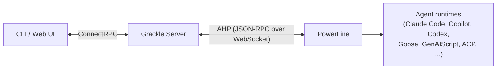

# PowerLine & AHP

Every environment has a wire. **PowerLine** is that wire — the host process where a claw actually perches and runs. The server never touches a runtime directly. It speaks to PowerLine, and PowerLine speaks to the agent.

PowerLine speaks one protocol on the wire: **AHP**, the Agent Host Protocol. This page covers both — the wire, then the language it speaks.

Two hops, two protocols. The CLI and web UI reach the server over [ConnectRPC](https://connectrpc.com/). The server reaches each PowerLine over AHP. Outside callers never see the wire.

## PowerLine — the wire

PowerLine runs inside the environment, bound to `127.0.0.1`. It listens for AHP over a WebSocket at `/ahp` and does four things:

1. Loads the requested runtime — Claude Code, Copilot, Codex, Goose, GenAIScript, ACP-based agents.
2. Sets up the working directory, optionally cutting a git worktree per task branch.
3. Starts the agent with your prompt.
4. Streams every event back to the server as it happens.

It also handles input mid-turn, resumption of a suspended claw, and termination.

### How it gets there

You never install the wire by hand. The [adapter](./kernel) strings it up when the environment is provisioned:

| Adapter   | How PowerLine arrives                           |
| --------- | ----------------------------------------------- |
| Docker    | Baked into the image, or installed at bootstrap |
| SSH       | Installed over SSH via npm                      |
| Codespace | Same as SSH, over `gh codespace ssh`            |
| Local     | A child process of the server                   |

The wire binds to localhost. The adapter handles the crossing — port mapping for Docker, an SSH tunnel for SSH and Codespace, a direct loopback for Local. PowerLine doesn't know the topology. It listens; the adapter routes.

### Credential supply

A runtime needs credentials. PowerLine doesn't hold them — it asks. When a runtime needs a secret, PowerLine sends an AHP `authenticate` request to the server, one per token. The server looks up what it has stored and hands back the delivery instructions: an environment variable to set, or a file to write inside the environment.

Pull, not push. Credentials are fetched the moment they're needed, never staged ahead of the spawn. You manage them once. See [Credentials](../features/credentials).

### Git worktrees

When a workspace runs with worktree isolation, PowerLine cuts a [git worktree](https://git-scm.com/docs/git-worktree) per task branch before the agent starts. Each claw works its own copy of the repo, so a mob can swarm one repo without clawing each other. When the session ends, the server tears the worktree down through PowerLine's `disposeSession` and worktree-cleanup path. More on the shape of an environment in [Environments & Workspaces](../building-blocks/environments-workspaces).

### Health checks

The server pings every 30 seconds. Miss one, and the environment is marked disconnected. Provision again to reconnect. A separate unauthenticated `/healthz` probe answers liveness checks without touching the AHP wire.

## AHP — the protocol

**AHP** is the Agent Host Protocol — Microsoft's open standard for talking to an agent host. PowerLine vendors the canonical types and reducers and serves the protocol at `ws://host:port/ahp`. In effect, PowerLine is an AHP reference host.

The server connects as an AHP client. Every message is JSON-RPC.

### Turn framing

Work is framed as turns. The server dispatches a turn; the host runs it and streams the result back as a series of `action` notifications, each folding into derived session state through the vendored reducers.

| Action                                 | Meaning                                            |
| -------------------------------------- | -------------------------------------------------- |
| `SessionTurnStarted`                   | A turn begins — the server's input, or the host's. |
| `SessionDelta` / `SessionResponsePart` | Streamed output as the claw works.                 |
| `SessionToolCall*`                     | Tool calls open, stream, and resolve.              |
| `SessionInputRequested`                | The claw needs input before it can continue.       |
| `SessionTurnComplete`                  | The turn is done.                                  |
| `SessionError`                         | The turn failed.                                   |

### The session flow

A session lives on a channel — one AHP channel per Grackle session. The shape is the same every time:

| Grackle action | AHP wire                                                            |
| -------------- | ------------------------------------------------------------------- |
| spawn          | `createSession` + `subscribe`                                       |
| reanimate      | `createSession` with `resumeFromRuntimeSessionId`, then `subscribe` |
| send input     | `dispatchAction` carrying a `SessionTurnStarted`                    |
| credentials    | `authenticate` (one call per token)                                 |
| list           | `listSessions`                                                      |
| kill           | `disposeSession`                                                    |

After `subscribe` resolves, the host replays any parked events down the same stream, then streams live `action` notifications as the claw works. One channel, one stream — no second drain call.

The server never decodes runtime-specific event shapes. The reducers do that, the same way every AHP host does. The wire stays uniform; the claw on the far end can be anything.

## Related

- [Kernel & adapters](./kernel) — how environments are provisioned.
- [MCP](./mcp) — tools the claw can reach.
- [ACP](./acp) — a runtime family PowerLine hosts over stdio.
- [Environments & Workspaces](../building-blocks/environments-workspaces) — where the wire lives.
- [Credentials](../features/credentials) — what `authenticate` hands back.
