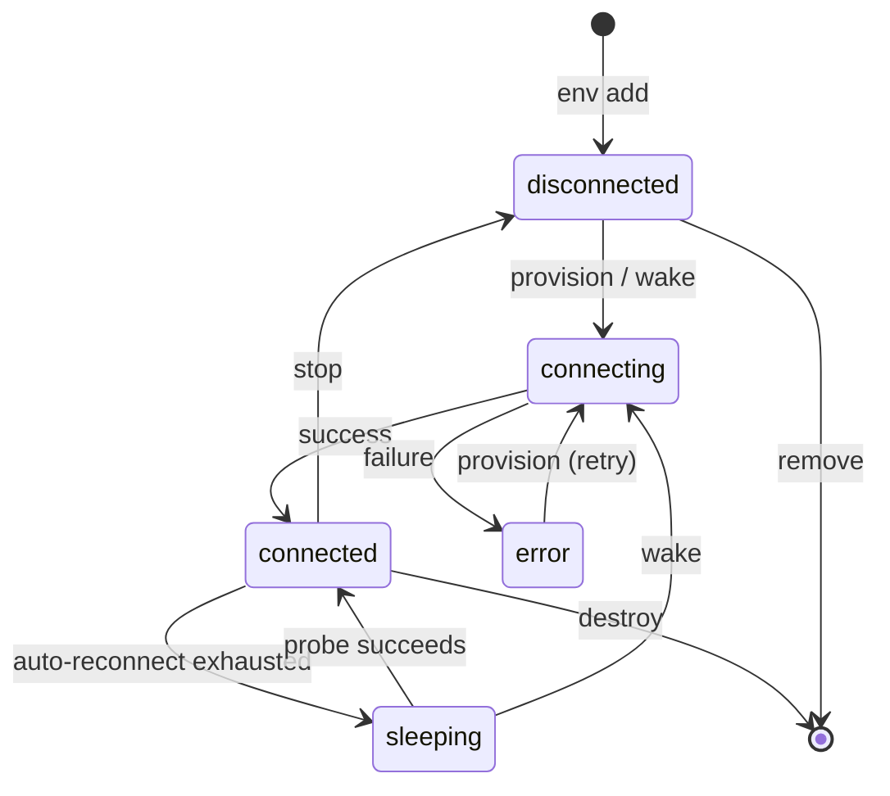

# Environments & Workspaces

An **environment** is a place for a claw to perch. A **workspace** is the scope of the work it does there.

## Environments

An environment is a compute target where agents run. A Docker container on your laptop. A remote SSH box. A GitHub Codespace. Your local machine. Grackle treats them all the same once [PowerLine](../architecture/powerline-ahp) — the wire — is reachable inside them.

Each environment is driven by an **adapter**: the thing that knows how to provision, connect, and tear down that kind of compute.

### Docker

Spins up a container with PowerLine pre-installed. Isolation and reproducibility.

```bash
grackle env add my-docker --docker
grackle env add my-docker --docker --image node:22 --repo https://github.com/org/repo
grackle env add my-docker --docker --volume /host/path:/container/path --gpu
```

| Option     | What it does                                                   |
| ---------- | -------------------------------------------------------------- |
| `--image`  | Docker image (default: auto-built `grackle-powerline`)         |
| `--repo`   | Git repo to clone into the container                           |
| `--volume` | Mount host directories (repeatable, `host:container[:ro]`)     |
| `--gpu`    | GPU passthrough                                                |
| `--attach` | Attach to an already-running container instead of creating one |

#### Attach to an existing container

When something else owns the container — say a [Coder](https://github.com/coder/coder) dev-environment — use `--attach`. Grackle bootstraps PowerLine inside it and perches claws there. It **never creates, stops, or removes** the container.

```bash
# Someone else made `my-workspace`; Grackle only attaches.
grackle env add my-box --docker --attach my-workspace
grackle env provision my-box
```

`stop`/`destroy` only kill the in-container PowerLine and clean up Grackle's own connectivity helper. The container keeps running. Connectivity is automatic: a shared Docker network when one is configured, the container IP when the host can route to it, or a small `socat` sidecar otherwise (works on Docker Desktop too). In the web UI, pick **Attach to existing container** under the Docker adapter.

#### Docker-outside-of-Docker (DooD) networking

When Grackle itself runs inside a container — a Compose deployment mounting the host Docker socket — the spawned containers need a route back to the server. Optional, advanced:

- `GRACKLE_DOCKER_NETWORK` — Docker network for DooD. Containers reach the server by network name instead of host port mapping.
- `GRACKLE_DOCKER_HOST` — DooD host address. Wildcard binds (`0.0.0.0`, `::`) resolve to this so containers can reach the server.
- `GRACKLE_DOCKER_SOCAT_IMAGE` — Image for the attach-mode connectivity sidecar, started when the host can't reach an attached container directly (default: `alpine/socat`).

### SSH

Any machine you can SSH into. PowerLine is bootstrapped over the connection.

```bash
grackle env add my-server --ssh --host 10.0.0.5
grackle env add my-server --ssh --host dev.example.com --user deploy --identity-file ~/.ssh/id_ed25519
```

| Option            | What it does              |
| ----------------- | ------------------------- |
| `--host`          | Hostname or IP (required) |
| `--user`          | SSH user                  |
| `--ssh-port`      | SSH port (default: 22)    |
| `--identity-file` | Path to private key       |

### GitHub Codespace

Connects to an existing Codespace by name, over `gh codespace ssh`.

```bash
# Find your codespace name
gh codespace list

grackle env add my-cs --codespace --codespace-name friendly-space-lamp
```

| Option             | What it does                                                |
| ------------------ | ----------------------------------------------------------- |
| `--codespace-name` | Codespace name (from `gh codespace list`)                   |
| `--github-account` | GitHub account label for `gh` operations (codespace/docker) |

### Local

Runs agents on your machine. One local environment is created when the server starts; add more if you need them.

```bash
grackle env add another-local --local
grackle env add another-local --local --port 7600
```

| Option   | What it does                         |
| -------- | ------------------------------------ |
| `--port` | PowerLine port for the local adapter |

## Lifecycle

Every environment moves through the same states.



A **sleeping** environment is one Grackle has stopped chasing — a Codespace that shut down, say. After auto-reconnect burns through its retries, the environment goes `sleeping`. Grackle keeps probing it in the background; when a probe lands, it wakes itself back to `connected`. You can also force the issue with `env wake`.

| Command         | What it does                                                            |
| --------------- | ----------------------------------------------------------------------- |
| `env add`       | Registers the environment. No connection yet.                           |
| `env provision` | Bootstraps and connects: installs PowerLine, starts it, opens a tunnel. |
| `env wake`      | Reconnects a `sleeping` environment. Same flow as provision.            |
| `env stop`      | Disconnects gracefully.                                                 |
| `env destroy`   | Stops and tears down resources (deletes the Docker container, etc.).    |
| `env remove`    | Unregisters the environment.                                            |

### Provisioning

When you provision, the adapter:

1. Checks Node.js >= 22 and git are present
2. Installs the PowerLine package
3. Starts PowerLine as a background process
4. Wires up git credential helpers
5. Opens a tunnel (SSH port forward, Docker port mapping, etc.)
6. Pushes any stored tokens and [credentials](../features/credentials) into the environment

Progress streams to your terminal or the web UI as it happens.

### Listing

```bash
grackle env list
```

The status column tells you where each one stands.

| Status         | Meaning                                                                      |
| -------------- | ---------------------------------------------------------------------------- |
| `connected`    | Ready. PowerLine is reachable.                                               |
| `connecting`   | Provisioning or reconnecting.                                                |
| `disconnected` | Stopped, or never provisioned.                                               |
| `sleeping`     | Auto-reconnect gave up; Grackle probes periodically. `env wake` to force it. |
| `error`        | Provisioning failed.                                                         |

See [Connect an environment](../getting-started/connect-environment) to add your first one.

## Workspaces

A workspace is the scope of a unit of work. It links one or more environments, carries budgets, and sets the defaults every task inside it inherits:

- **Linked environments** — Where its tasks can run. A workspace is created against an initial environment (auto-linked); link more later.
- **Default persona** — Which agent configuration the claws wear.
- **Repository URL** — The git repo agents work on.
- **Worktree isolation** — Whether each task gets its own git branch. On by default.

```bash
grackle workspace create "Auth Rewrite" \
  --env my-docker \
  --repo https://github.com/org/repo \
  --desc "Migrate from session tokens to JWT"
```

### Many environments, not one

A workspace can link **multiple environments** — not just the one it was born against. A plague of claws can perch across all of them. Manage the set:

```bash
grackle workspace link-env <workspace-id> --env another-env
grackle workspace unlink-env <workspace-id> --env another-env
```

### Budgets

A workspace can carry an aggregate **token budget** and **cost budget** (in millicents) that apply across all its tasks. Both default to `0` — unlimited. Tasks can set their own on top.

Caps exist for a reason. An agent that loops at 3 AM spends real money. See [Usage budgets](../features/usage-budgets).

### Worktree isolation

With **worktrees** enabled (the default), each task gets its own git branch:

```
workspace-slug/task-slug          # root task
workspace-slug/task-slug/subtask  # child task
```

Agents work in isolated [git worktrees](https://git-scm.com/docs/git-worktree). A mob can hit the same repo at once without trampling each other — every claw sees its own branch and its own working tree.

The working directory defaults to the repo root. Override it per-workspace:

```bash
grackle workspace create "My Workspace" --env my-docker --working-directory /workspaces/my-repo
```

Tasks are how you put a workspace to work. See [Tasks & Sessions](./tasks-sessions).
