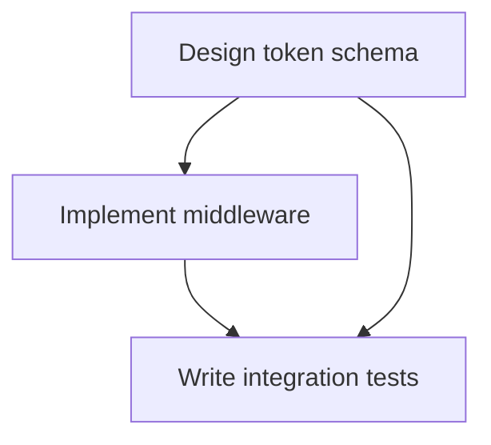
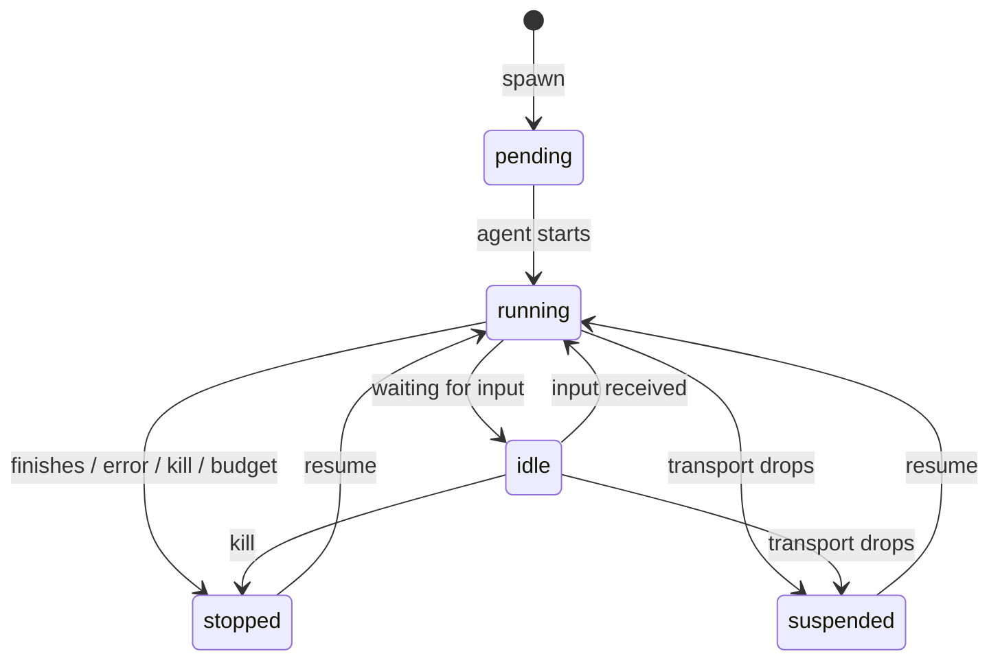

# Tasks & Sessions

A **task** is the unit of work. A **session** is one run of an agent against a task.

Tasks form a tree. Sessions come and go beneath them. A task outlives its sessions; it holds the work, the history, the budget. An agent runs, works, stops. Spawn another when you need it.

## Tasks

A task is a single piece of work — a title, a description, and the state that survives every session that touches it.

```bash
grackle task create "Implement JWT middleware" \
  --workspace auth-rewrite \
  --desc "Replace session-based auth with JWT. RS256 signing."
```

Start it and Grackle spawns a session: the title becomes the prompt, the description the context.

```bash
grackle task start <task-id>
```

Beyond title and description, a task carries:

- **Workpad** — Persistent structured context (a JSON document) that survives across the task's sessions. Successive sessions share state through it.
- **Knowledge injection** — Whether knowledge-graph context is injected when a session spawns (`inject_knowledge`, on by default).
- **Schedule origin** — Tasks born from a [scheduled trigger](../features/orchestration) carry that schedule's `schedule_id`. Hand-made tasks leave it empty.

### Status

A task moves through five states:

| Status        | Meaning                                      |
| ------------- | -------------------------------------------- |
| `not_started` | Created, not yet run                         |
| `working`     | A session is running against it              |
| `paused`      | Work suspended — session interrupted or idle |
| `complete`    | Marked done, ready for review                |
| `failed`      | The session failed                           |

When a task completes, review the work:

```bash
grackle task complete <task-id>
```

If it's wrong, set it back to `failed` with notes and start it again. The next session gets the feedback.

### Budgets

A task can cap its own spend — a **token budget** and a **cost budget** (in millicents), independent of its workspace. Both default to `0`: unlimited. They cap total input + output tokens and total spend across the task's sessions. See [Usage & budgets](../features/usage-budgets).

### The tree

Tasks have children. Decompose the work and the structure holds it.

```
Implement Auth (root)
├── Design token schema
├── Implement middleware
│   ├── Write JWT validator
│   └── Add refresh token logic
└── Write integration tests
```

Children attach with `--parent`. A task that may grow its own subtasks needs `--can-decompose` — off by default for children, so nesting can't run away.

```bash
grackle task create "Write JWT validator" --workspace auth-rewrite --parent <parent-task-id>

# Let a task spawn its own subtasks (orchestrator pattern)
grackle task create "Implement auth" --workspace auth-rewrite --can-decompose
```

The root sits at depth 0. Tasks nest up to **8 levels** below it. The limit is enforced server-side.

### Dependencies

A task can wait on others. A blocked task won't start until every dependency is `complete`.

```bash
grackle task create "Write integration tests" \
  --workspace auth-rewrite \
  --depends-on <middleware-task-id>
```

When a dependency completes, Grackle unblocks whatever was waiting.



The web UI draws these as a DAG in the **Graph** tab and a kanban in the **Board** tab.

## Sessions

A session is one run of an agent against a task. Spawn it, watch it work, kill it when it strays.

```bash
grackle spawn my-env "Refactor the auth module to use JWT"
```

From the web UI: **New Chat**, pick an environment, type the prompt.

Options:

- `--max-turns` — Cap how many turns the agent takes
- `--persona` — Run a specific [persona](./personas-runtimes) instead of the default
- `--workspace` — Bind the session to a workspace, enabling workspace-scoped MCP tools

### Lifecycle

A session always holds one of **five** statuses. There is no `completed` or `failed` status — those are _end reasons_, recorded once a session reaches `stopped`.



| Status      | Meaning                                    |
| ----------- | ------------------------------------------ |
| `pending`   | Session created, agent starting up         |
| `running`   | The agent is working                       |
| `idle`      | Waiting for input                          |
| `stopped`   | Ended — the reason lives in `end_reason`   |
| `suspended` | Parked on the server, consuming no compute |

`stopped` is the only terminal status. When a session stops, an **end reason** says why:

| End reason        | Meaning                                        |
| ----------------- | ---------------------------------------------- |
| `completed`       | Finished its work normally                     |
| `killed`          | Hard kill (`SIGKILL`) — terminated immediately |
| `interrupted`     | Graceful kill (`SIGTERM`) — asked to wind down |
| `terminated`      | Stopped by the runtime or environment          |
| `budget_exceeded` | Hit a configured limit (e.g. max turns)        |

### Streaming events

Once spawned, the session streams its events in real time. Each carries a type:

| Event           | Description                                             |
| --------------- | ------------------------------------------------------- |
| `text`          | Agent response text                                     |
| `tool_use`      | Agent invoked a tool (name and input)                   |
| `tool_result`   | Tool execution result                                   |
| `status`        | Status change (`pending`, `running`, `idle`, `stopped`) |
| `error`         | Error message                                           |
| `system`        | Internal messages (setup, worktree creation)            |
| `user_input`    | Input from a user or parent task                        |
| `usage`         | Token and cost accounting for the turn                  |
| `signal`        | Control signal delivered to the agent (e.g. `SIGTERM`)  |
| `widget`        | Agent-rendered UI widget (MCP App)                      |
| `turn_started`  | A turn opened (carries the user message)                |
| `turn_complete` | A turn finished (session went idle)                     |
| `input_needed`  | A turn blocked, awaiting user input                     |

The CLI color-codes them; the web UI renders a transcript. The list is illustrative — the `EventType` enum in `grackle_types.proto` is the authoritative set.

### Tokens and cost

`usage` events feed per-session accounting. Each session tracks cumulative `input_tokens`, `output_tokens`, and `cost_millicents`, visible in `grackle status` and the web UI. Budgets read from this. See [Usage & budgets](../features/usage-budgets).

### Sending input

When a session is `idle`, hand it text:

```bash
grackle send-input <session-id> "Yes, apply that change"
```

Or type in the input field the web UI surfaces when the session is waiting.

### Attaching

Detached, or watching one someone else started:

```bash
grackle attach <session-id>
```

Streams every event and gives you a prompt when the session waits for input. `Ctrl+C` detaches — it does not kill.

### Killing

```bash
grackle kill <session-id>
```

Hard kill by default (`SIGKILL`): the session moves to `stopped`, end reason `killed`. Ask it to wind down instead with `-g`/`--graceful` — a `SIGTERM`, ending `stopped` / `interrupted`:

```bash
grackle kill <session-id> --graceful
```

### Suspension and recovery

Wires drop. When the transport between PowerLine and the server breaks, the session goes `suspended` — parked, consuming no compute, full history held on the server.

```bash
grackle resume <session-id>
```

Suspended sessions:

- Keep their full conversation and context on the server
- Usually auto-recover when their original environment reconnects; resume manually with `grackle resume`
- Resume on their original environment, never a different one

### Resuming

A `stopped` session — whatever its end reason — or a `suspended` one can be resumed:

```bash
grackle resume <session-id>
```

The session picks up where it left off, full history intact, back to `running`. Useful for iterating: review the work, resume with feedback. Live sessions (`pending`, `running`, `idle`) can't be resumed — they're already running.

### Logs

Every session's events persist to a JSONL log. Read them after the fact:

```bash
grackle logs <session-id>              # raw event log
grackle logs <session-id> --transcript # markdown transcript
grackle logs <session-id> --tail       # follow live
```

Session IDs match on prefix — no full UUID required.

## Next

- [Create a task](../getting-started/create-task)
- [Run an orchestration](../getting-started/create-orchestration)
- [Environments & workspaces](./environments-workspaces) — where agents run
- [Personas & runtimes](./personas-runtimes) — what an agent is made of
- [Orchestration](../features/orchestration) and [coordination](../features/coordination) — many agents, one problem
