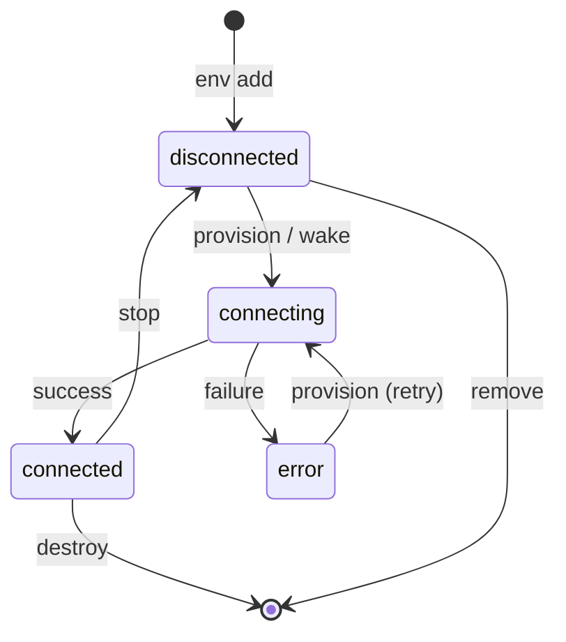

# Environments & Adapters

An **environment** is a compute target where agents run. It could be a Docker container on your laptop, a remote SSH server, a GitHub Codespace, or just your local machine. Grackle doesn't care — they all look the same once connected.

## Adapter types

Each environment uses an **adapter** that knows how to provision, connect, and manage that type of compute.

### Docker

Spins up a container with PowerLine pre-installed. Best for isolation and reproducibility.

```bash
grackle env add my-docker --docker
grackle env add my-docker --docker --image node:22 --repo https://github.com/org/repo
grackle env add my-docker --docker --volume /host/path:/container/path --gpu
```

Options:
- `--image` — Docker image (default: auto-built `grackle-powerline` image)
- `--repo` — Git repo to clone into the container
- `--volume` — Mount host directories (repeatable, format: `host:container[:ro]`)
- `--gpu` — Enable GPU passthrough

### SSH

Connects to any machine you can SSH into. PowerLine is bootstrapped over SSH automatically.

```bash
grackle env add my-server --ssh --host 10.0.0.5
grackle env add my-server --ssh --host dev.example.com --user deploy --identity-file ~/.ssh/id_ed25519
```

Options:
- `--host` — Hostname or IP (required)
- `--user` — SSH user
- `--ssh-port` — SSH port (default: 22)
- `--identity-file` — Path to private key

### GitHub Codespace

Connects to an existing Codespace by name. Uses `gh codespace ssh` under the hood.

```bash
# Find your codespace name
gh codespace list

grackle env add my-cs --codespace --codespace-name friendly-space-lamp
```

### Local

Runs agents directly on your machine. A local environment is created automatically when you start the server, but you can add more.

```bash
grackle env add another-local --local
```

## Lifecycle

Every environment goes through a simple lifecycle:



| Command | What it does |
|---------|-------------|
| `env add` | Registers the environment (no connection yet) |
| `env provision` | Bootstraps and connects (installs PowerLine, starts it, establishes tunnel) |
| `env wake` | Same as provision — reconnects a stopped environment |
| `env stop` | Gracefully disconnects |
| `env destroy` | Stops and tears down resources (deletes Docker container, etc.) |
| `env remove` | Unregisters the environment from Grackle |

## Provisioning

When you provision an environment, the adapter:

1. Checks that Node.js >= 22 and git are available
2. Installs the PowerLine package
3. Starts PowerLine as a background process
4. Sets up git credential helpers
5. Establishes a tunnel (SSH port forward, Docker port mapping, etc.)
6. Pushes any stored tokens/credentials to the environment

Progress is streamed to your terminal (or the web UI) as it happens.

## Listing environments

```bash
grackle env list
```

The status column shows the current state: **connected** (ready), **disconnected** (stopped), or **error** (provisioning failed).
