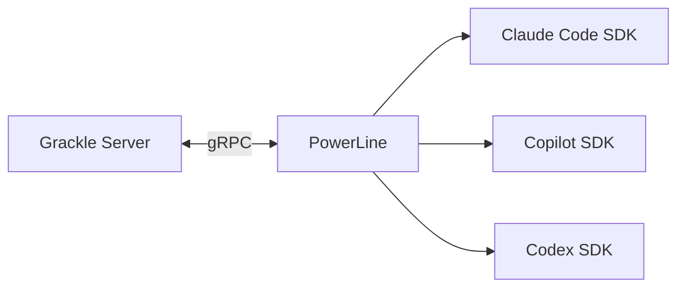

# PowerLine

**PowerLine** is the agent runtime host that runs inside every environment. It's the bridge between the Grackle server and the actual AI agent.

## What it does

When you spawn a session, the Grackle server tells PowerLine (running inside the environment) to start an agent. PowerLine:

1. Loads the requested runtime (Claude Code, Copilot, Codex)
2. Sets up the working directory (optionally creating a git worktree)
3. Starts the agent with your prompt
4. Streams events back to the server in real time
5. Handles input, resumption, and termination

## How it gets there

You don't install PowerLine manually. When you provision an environment, the adapter handles everything:

- **Docker** — PowerLine is baked into the container image or installed during bootstrap
- **SSH** — PowerLine is installed over SSH via npm
- **Codespace** — Same as SSH, using `gh codespace ssh`
- **Local** — PowerLine starts as a child process of the server

## Token injection

Before spawning an agent, the server pushes stored credentials to PowerLine. Tokens can be injected as:

- **Environment variables** — Set in the agent's process (e.g., `ANTHROPIC_API_KEY`)
- **Files** — Written to disk inside the environment (e.g., `~/.config/some-tool/credentials`)

This means you manage credentials once in Grackle, and they're automatically available in every environment.

## Git worktrees

When a project has worktree isolation enabled, PowerLine creates a [git worktree](https://git-scm.com/docs/git-worktree) for each task branch before starting the agent. The agent works in its own isolated copy of the repository, so multiple agents can work on the same repo simultaneously without stepping on each other.

After the session, the server can clean up the worktree via PowerLine's `CleanupWorktree` RPC.

## Diff generation

PowerLine can compute the git diff of an agent's changes against the base branch. This is used by the web UI to show what the agent changed, and by the review/approval workflow.

## Health checks

The server pings PowerLine every 30 seconds. If a health check fails, the environment is marked as disconnected. Provisioning again reconnects.

## Network model

PowerLine always binds to `127.0.0.1` inside the environment. The adapter layer handles networking:

- **Docker** — Port mapping from host to container
- **SSH** — SSH tunnel (port forward)
- **Local** — Direct localhost connection

PowerLine doesn't need to know about the network topology — it just listens on localhost and the adapter handles the rest.
