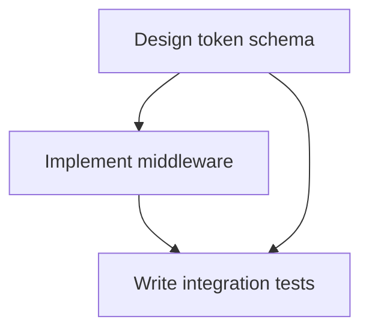

# Projects & Tasks

**Projects** group related work. **Tasks** are individual units of work within a project. Together they give you structured, trackable agent workflows — from a simple to-do list to a full dependency graph.

## Projects

A project is a container for tasks. It defines defaults that all its tasks inherit:

- **Default environment** — Where tasks run unless overridden
- **Default persona** — Which agent configuration to use
- **Repository URL** — The git repo agents work on
- **Worktree isolation** — Whether each task gets its own git branch (enabled by default)

```bash
grackle project create "Auth Rewrite" \
  --repo https://github.com/org/repo \
  --env my-docker \
  --desc "Migrate from session tokens to JWT"
```

## Tasks

A task represents a single piece of work. When you start a task, Grackle spawns an agent session with the task's title as the prompt and its description as context.

```bash
grackle task create "Implement JWT middleware" \
  --project auth-rewrite \
  --desc "Replace the existing session-based auth with JWT tokens. Use RS256 signing."
```

### Task status

Tasks move through a lifecycle:

| Status | Meaning |
|--------|---------|
| `not_started` | Created but not yet started |
| `working` | An agent session is actively running |
| `paused` | Work is paused (session interrupted or idle) |
| `complete` | Marked complete (ready for review or done) |
| `failed` | Agent session failed |

### Starting a task

```bash
grackle task start <task-id>
```

This spawns an agent session in the project's default environment (or a specified one). The agent receives:
- The task title as its prompt
- The task description as system context
- Recent findings from the project (so it knows what other agents discovered)

You can also specify a persona and pass notes (useful for retries):

```bash
grackle task start <task-id> --persona senior-reviewer --notes "Focus on error handling this time"
```

### Review and approval

When a task completes, you can review the agent's work and mark it done:

```bash
grackle task complete <task-id>
```

If the work isn't right, set it back to `failed` with notes and start it again — the agent gets the feedback in its next attempt.

## Task hierarchy

Tasks can have **children**. This lets you decompose complex work:

```
Implement Auth (root)
├── Design token schema
├── Implement middleware
│   ├── Write JWT validator
│   └── Add refresh token logic
└── Write integration tests
```

Child tasks are created with `--parent`:

```bash
grackle task create "Write JWT validator" --project auth-rewrite --parent <parent-task-id>
```

Tasks can be nested up to 10 levels deep. By default, root tasks can decompose (create children) but child tasks cannot — this prevents runaway nesting. You can override this per-task for orchestrator patterns.

## Task dependencies

Tasks can depend on other tasks. A blocked task cannot start until all its dependencies are complete.

```bash
grackle task create "Write integration tests" \
  --project auth-rewrite \
  --depends-on <middleware-task-id>
```

When a dependency completes, Grackle automatically unblocks any tasks that were waiting on it.



The web UI shows these dependencies as a DAG (directed acyclic graph) in the project's **Graph** tab, and as a kanban board in the **Board** tab.

## Branch isolation

When **worktrees** are enabled (the default), each task gets its own git branch:

```
project-slug/task-slug          # root task
project-slug/task-slug/subtask  # child task
```

Agents work in isolated [git worktrees](https://git-scm.com/docs/git-worktree), so multiple agents can work on the same repo simultaneously without conflicting. Each agent sees its own branch with its own working tree.

The worktree base path defaults to `../.grackle-worktrees/` relative to the repo, but you can customize it per-project:

```bash
grackle project create "My Project" --worktree-base-path /workspaces/my-repo
```

## Importing from GitHub

You can bulk-import GitHub issues as tasks:

```bash
grackle task import-github <project-id> --repo owner/repo --label "agent-work"
```

This creates one task per issue, preserving titles, descriptions, and comments. Issue cross-references (`#123`) are converted to task dependencies.
