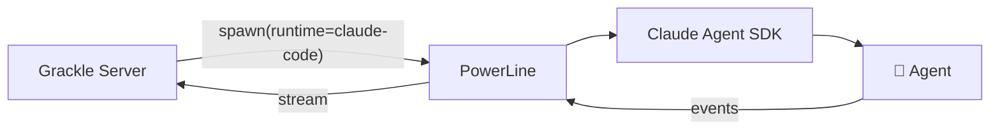

# Agent Runtimes

A **runtime** is the AI agent engine that actually does the work inside a session. Grackle is runtime-agnostic — you can swap between runtimes without changing anything else about your setup.

## Supported runtimes

| Runtime | ID | Default Model | SDK |
|---------|-----|--------------|-----|
| **Claude Code** | `claude-code` | `sonnet` | Anthropic Claude Agent SDK |
| **GitHub Copilot** | `copilot` | `gpt-4o` | GitHub Copilot SDK |
| **OpenAI Codex** | `codex` | `o3` | OpenAI Codex SDK |
| **Goose** | `goose` | *(provider-dependent)* | ACP (native) |

All four runtimes support the same Grackle features: streaming, tool use, session resume, MCP integration, and worktree isolation.

Goose is provider-agnostic — it can use Anthropic, OpenAI, Google, and many other LLM providers. Configure your Goose provider and model via `goose configure` or environment variables (`GOOSE_PROVIDER`, `GOOSE_MODEL`). Goose must be [installed](https://block.github.io/goose/docs/getting-started/installation/) separately on the system.

### ACP (Agent Client Protocol)

Grackle also supports runtimes that implement the **Agent Client Protocol** — a cross-vendor standard for agent communication. ACP variants exist for Claude, Copilot, and Codex. Goose natively speaks ACP, so it uses this protocol directly. The other ACP variants use a stdio-based bridge instead of the native SDKs.

## How runtimes work

When you spawn a session, Grackle tells PowerLine (running inside the environment) which runtime to use. PowerLine loads the corresponding SDK, starts the agent, and streams events back.



The runtime determines:
- Which AI model provider is called
- How the conversation is managed
- What tools the agent has access to
- How sessions are resumed

## Choosing a runtime

Runtimes are configured through **[personas](./personas)**. Each persona specifies a runtime and model. The default persona (created on first run) uses Claude Code with the `sonnet` model.

You can override the runtime per-session:

```bash
# Use a persona with a different runtime
grackle spawn my-env "Fix the bug" --persona copilot-engineer
```

Or change the default persona's runtime in the web UI under **Settings > Personas**.

## Credential providers

Each runtime needs credentials to authenticate with its AI provider. Grackle manages this through **credential providers**:

| Provider | Modes | What it does |
|----------|-------|-------------|
| **Claude** | `off`, `subscription`, `api_key` | Anthropic API access |
| **GitHub** | `off`, `on` | GitHub token for Copilot and Codespace access |
| **Copilot** | `off`, `on` | GitHub Copilot authentication |
| **Codex** | `off`, `on` | OpenAI API access |
| **Goose** | `off`, `on` | Goose config and provider API keys |

Configure them from the CLI:

```bash
grackle credential-provider set claude api_key
grackle credential-provider set github on
```

Or from the web UI under **Settings > Credentials**.

When `claude` is set to `api_key`, you'll also need to set your Anthropic API key as a [token](../guides/auth#tokens):

```bash
grackle token set ANTHROPIC_API_KEY
# (prompts for the value interactively)
```
