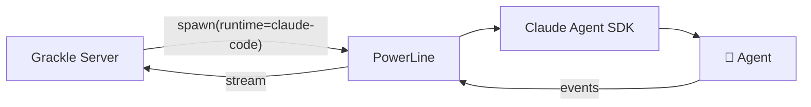

# Agent Runtimes

A **runtime** is the AI agent engine that actually does the work inside a session. Grackle is runtime-agnostic — you can swap between runtimes without changing anything else about your setup.

## Supported runtimes

Grackle ships two families of runtimes: **native** runtimes that wrap a vendor SDK directly, and an **ACP-bridged** family that talks to agents over the cross-vendor [Agent Client Protocol](#acp-agent-client-protocol).

### Native runtimes

| Runtime            | ID            | Default Model      | Models                    | SDK                        |
| ------------------ | ------------- | ------------------ | ------------------------- | -------------------------- |
| **Claude Code**    | `claude-code` | `sonnet`           | `sonnet`, `opus`, `haiku` | Anthropic Claude Agent SDK |
| **GitHub Copilot** | `copilot`     | `gpt-4o`           | `gpt-4o`                  | GitHub Copilot SDK         |
| **OpenAI Codex**   | `codex`       | `gpt-5.5`          | `gpt-5.5`                 | OpenAI Codex SDK           |
| **GenAIScript**    | `genaiscript` | _(script-defined)_ | _(script-defined)_        | GenAIScript CLI            |

The native runtimes support the core Grackle features: streaming, tool use, session resume, MCP integration, and worktree isolation. **GenAIScript** is a scripting runtime rather than a conversational agent — it powers [script personas](./personas), where the persona's behavior is defined by a GenAIScript program instead of a system prompt.

### ACP-bridged runtimes (experimental)

These runtimes connect through the [Agent Client Protocol](#acp-agent-client-protocol). They are **experimental**, and their model selection is provider-dependent (the catalog exposes no fixed model list).

| Runtime               | ID                | Bridge                                            |
| --------------------- | ----------------- | ------------------------------------------------- |
| **Goose**             | `goose`           | Native ACP (`goose acp`)                          |
| **Codex (ACP)**       | `codex-acp`       | stdio bridge (`@zed-industries/codex-acp`)        |
| **Copilot (ACP)**     | `copilot-acp`     | stdio bridge (`copilot --acp --stdio`)            |
| **Claude Code (ACP)** | `claude-code-acp` | stdio bridge (`@zed-industries/claude-agent-acp`) |

Goose is provider-agnostic — it can use Anthropic, OpenAI, Google, and many other LLM providers. Configure your Goose provider and model via `goose configure` or environment variables (`GOOSE_PROVIDER`, `GOOSE_MODEL`). Goose must be [installed](https://block.github.io/goose/docs/getting-started/installation/) separately on the system.

## Runtime × environment compatibility

Runtimes are **host-agnostic**. Availability is not reported by the host: PowerLine lazily `npm`-installs a runtime's packages on demand the first time it's used, so the entire catalog is available on any environment type — Local, Docker, SSH, or Codespace. "Available" simply means "in the catalog."

This means there's no per-runtime support list to memorize: any runtime can run on any environment. Note, however, that not every runtime × environment combination is exercised by CI, so experimental runtimes (Goose and the ACP-bridged family) may need extra setup on a given host.

Grackle handles credential injection, git repo setup, and agent bootstrapping for each combination. If a runtime needs a specific token on a remote environment (e.g., `GITHUB_TOKEN` for Copilot on Docker), the [token broker](../guides/credentials) pushes it automatically.

### ACP (Agent Client Protocol)

Grackle also supports runtimes that implement the **Agent Client Protocol** — a cross-vendor standard for agent communication. Goose natively speaks ACP, so it uses this protocol directly. The `codex-acp`, `copilot-acp`, and `claude-code-acp` variants reach their respective agents through a stdio-based bridge instead of the native SDKs. All ACP-bridged runtimes are experimental.

## How runtimes work

When you spawn a session, Grackle tells PowerLine (running inside the environment) which runtime to use. PowerLine loads the corresponding SDK, starts the agent, and streams events back.


```mermaid
graph LR
    S["Grackle Server"] -->|"spawn(runtime=claude-code)"| PL["PowerLine"]
    PL --> SDK["Claude Agent SDK"]
    SDK --> Agent["🤖 Agent"]
    Agent -->|events| PL
    PL -->|stream| S
```

The runtime determines:

- Which AI model provider is called
- How the conversation is managed
- What tools the agent has access to
- How sessions are resumed

## Choosing a runtime

Runtimes are configured through **[personas](./personas)**. Each persona specifies a runtime and model. The default persona (created on first run) uses Claude Code with the `sonnet` model.

You can override the runtime per-session:

```bash
# Use a persona with a different runtime
grackle spawn my-env "Fix the bug" --persona copilot-engineer
```

Or change the default persona's runtime in the web UI under **Settings > Personas**.

## Credential providers

Each runtime needs credentials to authenticate with its AI provider. Grackle manages this through **credential providers**:

| Provider    | Modes                            | What it does                                  |
| ----------- | -------------------------------- | --------------------------------------------- |
| **Claude**  | `off`, `subscription`, `api_key` | Anthropic API access                          |
| **GitHub**  | `off`, `on`                      | GitHub token for Copilot and Codespace access |
| **Copilot** | `off`, `on`                      | GitHub Copilot authentication                 |
| **Codex**   | `off`, `on`                      | OpenAI API access                             |
| **Goose**   | `off`, `on`                      | Goose config and provider API keys            |

Configure them from the CLI:

```bash
grackle credential-provider set claude api_key
grackle credential-provider set github on
```

Or from the web UI under **Settings > Credentials**.

When `claude` is set to `api_key`, you'll also need to set your Anthropic API key as a [token](../guides/auth#tokens):

```bash
grackle token set ANTHROPIC_API_KEY
# (prompts for the value interactively)
```
