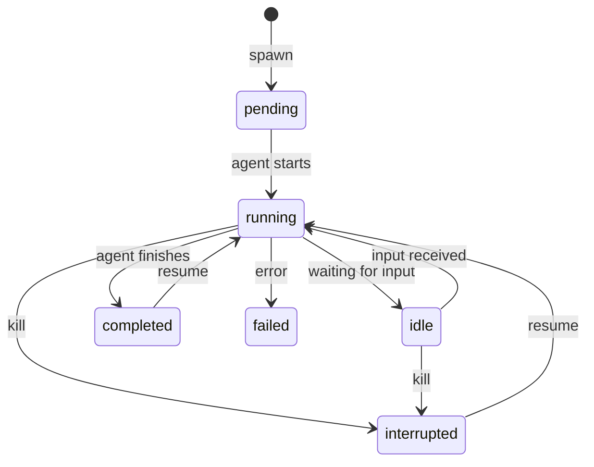

# Agent Sessions

A **session** is a single agent execution. You give it a prompt, it runs in an environment, and you watch the output in real time. Sessions are the fundamental unit of work in Grackle.

## Spawning a session

From the CLI:

```bash
grackle spawn my-env "Refactor the auth module to use JWT"
```

From the web UI, click **New Chat**, pick an environment, and type your prompt.

Options:
- `--max-turns` — Limit how many turns the agent can take
- `--persona` — Use a specific [persona](./personas) (otherwise uses the default)

## Streaming events

Once spawned, Grackle streams the session's events in real time. Each event has a type:

| Event | Description |
|-------|------------|
| `TEXT` | Agent response text |
| `TOOL_USE` | Agent invoked a tool (shows tool name and input) |
| `TOOL_RESULT` | Tool execution result |
| `STATUS` | Status change (running, idle, completed, failed) |
| `ERROR` | Error message |
| `SYSTEM` | Internal messages (setup info, worktree creation, etc.) |
| `USER_INPUT` | Input sent by a user or parent task |

The CLI renders these with color coding. The web UI shows them in a chat-style transcript.

## Session lifecycle



- **pending** — Session created, agent starting up
- **running** — Agent is actively working
- **idle** — Agent is waiting for user input
- **completed** — Agent finished successfully
- **failed** — Agent hit an error
- **interrupted** — Manually killed

## Sending input

When a session is **idle** (waiting for input), you can send it text:

```bash
grackle send-input <session-id> "Yes, go ahead and apply that change"
```

Or from the web UI, type in the input field that appears when the session is waiting.

## Attaching to a session

If you detached from a session (or want to watch one started by someone else):

```bash
grackle attach <session-id>
```

This streams all events and gives you an interactive prompt when the session is waiting for input. `Ctrl+C` detaches without killing the session.

## Resuming a session

Completed or interrupted sessions can be resumed:

```bash
grackle resume <session-id>
```

The agent picks up where it left off with its full conversation history intact. This is useful for iterating — review the agent's work, then resume with feedback.

## Killing a session

```bash
grackle kill <session-id>
```

This terminates the agent immediately. The session status changes to **interrupted**.

## Viewing logs

Every session's events are persisted to a JSONL log file. You can review them after the fact:

```bash
# Raw event log
grackle logs <session-id>

# Markdown transcript
grackle logs <session-id> --transcript

# Follow live
grackle logs <session-id> --tail
```

Session IDs support prefix matching — you don't need to type the full UUID.
