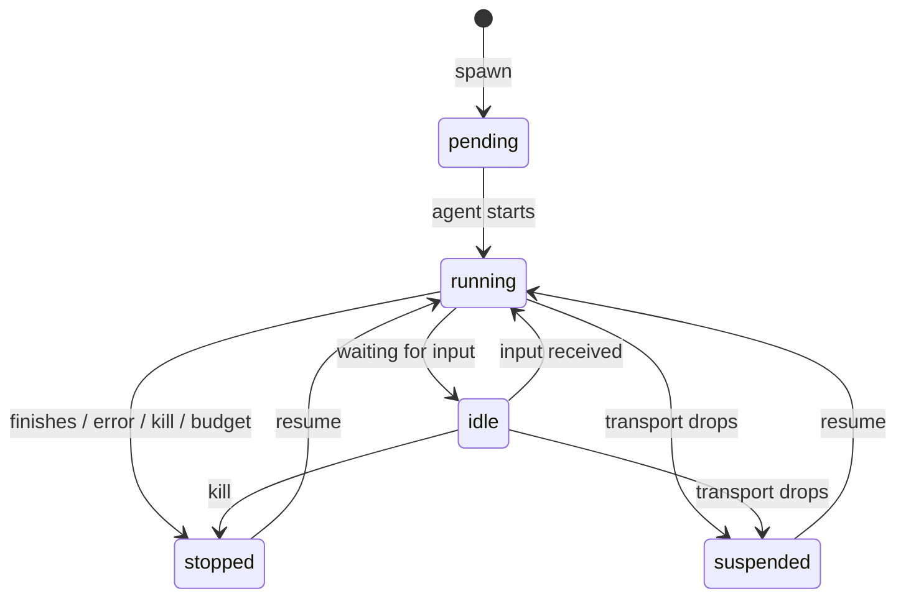

# Agent Sessions

A **session** is a single agent execution. You give it a prompt, it runs in an environment, and you watch the output in real time. Sessions are the fundamental unit of work in Grackle.

## Spawning a session

From the CLI:

```bash
grackle spawn my-env "Refactor the auth module to use JWT"
```

From the web UI, click **New Chat**, pick an environment, and type your prompt.

Options:

- `--max-turns` — Limit how many turns the agent can take
- `--persona` — Use a specific [persona](./personas) (otherwise uses the default)
- `--workspace` — Associate the session with a workspace (enables workspace-scoped MCP tools)

## Streaming events

Once spawned, Grackle streams the session's events in real time. Each event has a type:

| Event           | Description                                              |
| --------------- | -------------------------------------------------------- |
| `text`          | Agent response text                                      |
| `tool_use`      | Agent invoked a tool (shows tool name and input)         |
| `tool_result`   | Tool execution result                                    |
| `status`        | Status change (`pending`, `running`, `idle`, `stopped`)  |
| `error`         | Error message                                            |
| `system`        | Internal messages (setup info, worktree creation, etc.)  |
| `user_input`    | Input sent by a user or parent task                      |
| `usage`         | Token and cost accounting for the turn                   |
| `signal`        | Control signal delivered to the agent (e.g. `SIGTERM`)   |
| `widget`        | Agent-rendered UI widget (MCP App)                       |
| `turn_started`  | A turn opened (carries the user message that started it) |
| `turn_complete` | A turn finished (session went idle)                      |
| `input_needed`  | A turn is blocked awaiting user input                    |

The CLI renders these with color coding. The web UI shows them in a chat-style transcript. The list above is illustrative — see the `EventType` enum in `grackle_types.proto` for the authoritative set.

`usage` events feed per-session accounting: each session tracks cumulative `input_tokens`, `output_tokens`, and `cost_millicents`, visible in `grackle status` and the web UI.

## Session lifecycle

A session always has one of **five** statuses: `pending`, `running`, `idle`, `stopped`, or `suspended`. There is no separate `completed`, `failed`, or `interrupted` status — those are _end reasons_ recorded on a session once it reaches `stopped`.


```mermaid
stateDiagram-v2
    [*] --> pending: spawn
    pending --> running: agent starts
    running --> idle: waiting for input
    idle --> running: input received
    running --> stopped: finishes / error / kill / budget
    idle --> stopped: kill
    running --> suspended: transport drops
    idle --> suspended: transport drops
    suspended --> running: resume
    stopped --> running: resume
```

- **pending** — Session created, agent starting up
- **running** — Agent is actively working
- **idle** — Agent is waiting for user input
- **stopped** — Session has ended; the reason is recorded in its `end_reason` (see below)
- **suspended** — Parked on the server, not consuming compute (see below)

`stopped` is the only terminal status. When a session stops, an **end reason** explains why:

| End reason        | Meaning                                                 |
| ----------------- | ------------------------------------------------------- |
| `completed`       | Agent finished its work normally                        |
| `killed`          | Hard kill (`SIGKILL`) — terminated immediately          |
| `interrupted`     | Graceful kill (`SIGTERM`) — asked to stop and wind down |
| `terminated`      | Stopped by the runtime or environment                   |
| `budget_exceeded` | Hit a configured limit (e.g. max turns)                 |

A stopped session can be **resumed** (it returns to `running`); see below.

## Session suspension

Sessions can enter a **suspended** state — a transport-level recovery state where the agent's connection drops but the server preserves the session. This happens automatically when the transport between PowerLine and the server is interrupted.

```bash
# Reconnect to a suspended session
grackle resume <session-id>
```

Suspended sessions:

- Keep their full conversation history and context on the server
- Are typically auto-recovered when their original environment reconnects, and can also be resumed manually with `grackle resume`
- Resume on their original environment, not a different one

## Sending input

When a session is **idle** (waiting for input), you can send it text:

```bash
grackle send-input <session-id> "Yes, go ahead and apply that change"
```

Or from the web UI, type in the input field that appears when the session is waiting.

## Attaching to a session

If you detached from a session (or want to watch one started by someone else):

```bash
grackle attach <session-id>
```

This streams all events and gives you an interactive prompt when the session is waiting for input. `Ctrl+C` detaches without killing the session.

## Resuming a session

A `stopped` session (whatever its end reason) or a `suspended` one can be resumed:

```bash
grackle resume <session-id>
```

The agent picks up where it left off with its full conversation history intact, transitioning back to `running`. This is useful for iterating — review the agent's work, then resume with feedback. (Active sessions — `pending`, `running`, or `idle` — can't be resumed; they're already live.)

## Killing a session

```bash
grackle kill <session-id>
```

By default this hard-kills the agent (`SIGKILL`) immediately: the session moves to **stopped** with end reason `killed`. Pass `-g`/`--graceful` to send a `SIGTERM` instead — the agent is asked to finish its current operation and wind down, ending as **stopped** with end reason `interrupted`:

```bash
grackle kill <session-id> --graceful
```

## Viewing logs

Every session's events are persisted to a JSONL log file. You can review them after the fact:

```bash
# Raw event log
grackle logs <session-id>

# Markdown transcript
grackle logs <session-id> --transcript

# Follow live
grackle logs <session-id> --tail
```

Session IDs support prefix matching — you don't need to type the full UUID.
