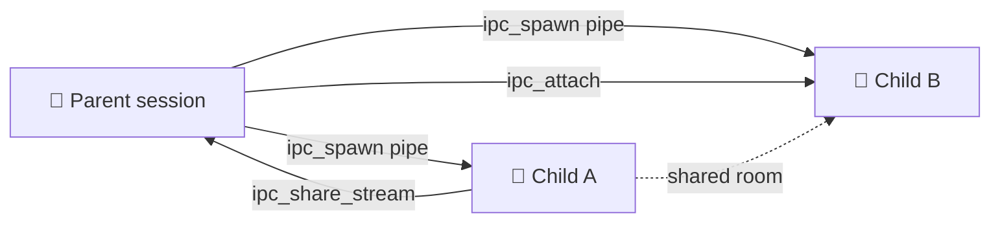

# Coordination (IPC)

[Orchestration](./orchestration) is the task-level layer: decompose work, gate it on dependencies, signal completion up the tree. Coordination is the plumbing under it — how claws talk to each other while they work, and how the server keeps a durable, ordered record of everything that happened.

Two parts:

- **IPC streams and file descriptors** — a Unix-pipe abstraction. Claws use it to spawn children, pass messages, and share named streams claw-to-claw. Exposed as `ipc_*` MCP tools.
- **The durable, server-sequenced action log** — every event in a [session](../building-blocks/tasks-sessions) is appended to a monotonic log. Replay it, resume from it, audit it.

The web UI lays all of this out on the **Coordination** tab.

:::info Orchestration vs. coordination
You rarely touch IPC by hand. The orchestrator pattern — parent task, child tasks, `SIGCHLD` notifications — is built on top of these pipes. Reach for `ipc_*` when you need claw-to-claw traffic that doesn't fit the parent/child tree: a shared room between siblings, say.
:::

## IPC streams and file descriptors

A session is modeled like a process. It holds **file descriptors** (fds), each pointing at a **stream** — a named, multi-subscriber channel. Spawn a child and you get a pipe fd to it. You can also create free-standing named streams and grant other sessions onto them.

These operations reach claws as MCP tools in the `ipc` group. Most need **scoped auth** — the caller is a claw inside a session, not an outside client — because the server needs the caller's session id to resolve fds and permissions.

### Tool reference

| Tool                | Purpose                                                                                                                                                                                                                          | Key parameters                                               |
| ------------------- | -------------------------------------------------------------------------------------------------------------------------------------------------------------------------------------------------------------------------------- | ------------------------------------------------------------ |
| `ipc_spawn`         | Spawn a child session with an optional IPC pipe. `pipe:'sync'` blocks until the child finishes; `'async'` delivers results between your turns; `'detach'` is fire-and-forget (the default).                                      | `prompt`, `pipe`, `environmentId`, `personaId?`, `maxTurns?` |
| `ipc_write`         | Write a message to a child (or stream) through an open fd. Delivered via `sendInput`.                                                                                                                                            | `fd`, `message`                                              |
| `ipc_close`         | Close an fd, dropping the connection. Closing the last fd to a child stops it. Refuses if messages are still undelivered — process them first.                                                                                   | `fd`                                                         |
| `ipc_list_fds`      | List your open fds. Check before you exit: owned fds (`owned=true`) must be closed before you stop.                                                                                                                              | _(none)_                                                     |
| `ipc_terminate`     | Send a graceful `SIGTERM` to a child via its fd. The child gets a `[SIGTERM]` message and is expected to wrap up and stop. The fd stays open — close it with `ipc_close` after.                                                  | `fd`                                                         |
| `ipc_list_streams`  | List active streams with subscriber details and message-buffer depth. A debugging surface. Scoped claws only see streams they're in.                                                                                             | _(none)_                                                     |
| `ipc_create_stream` | Create a named stream for inter-session traffic. Returns an `rw` fd. `selfEcho` controls whether participants see their own messages (chatroom case).                                                                            | `name`, `selfEcho?`                                          |
| `ipc_attach`        | Grant another session onto a stream you hold. The target gets a new fd with the given `permission` and `deliveryMode`. Permission must be **equal to or less than** your own. Write-only (`w`) requires `deliveryMode:'detach'`. | `fd`, `targetSessionId`, `permission`, `deliveryMode`        |
| `ipc_share_stream`  | Share a stream with your **parent**. Auto-discovers the parent via the inherited pipe fd, grants access, sends a `[stream-ref]` notice. For sibling-to-sibling: share up to the parent, who can `ipc_attach` it onward.          | `fd?` _or_ `streamName?`, `permission?`, `deliveryMode?`     |

### Permissions and delivery modes

- **Permission** is `r` (read), `w` (write), or `rw`. When you grant via `ipc_attach`, you cannot hand out more than you hold — the server enforces attenuation.
- **Delivery mode** is `sync`, `async`, or `detach`, setting how the target receives messages. Write-only (`w`) streams share only with `detach`.
- **Reserved streams** — names prefixed `pipe:`, `lifecycle:`, or `stdin:` are internal plumbing. They cannot be shared via `ipc_share_stream`.



:::tip Close your fds before you exit
`ipc_close` refuses to close an fd with undelivered messages, and `ipc_list_fds` exists so a claw can confirm every owned child fd is closed before it stops. A claw that exits with owned fds open leaves its children hanging.
:::

## The durable action log

Every session event — agent output, injected prompts, injected input and signals, widget renders — is appended to a **durable, server-sequenced action log** (`session_actions`). One process-wide monotonic generator stamps each action a strictly-increasing `serverSeq` (a monotonic ULID), so events emitted in the same millisecond from different sources are still **totally ordered**. This log is the replay buffer behind seq-based resume.

Sequencing is centralized on purpose. If each publisher minted its own ULID factory, same-millisecond events from different sources could not be totally ordered. One generator sidesteps that.

Writes are **best-effort**: a persistence failure is logged, never allowed to interrupt live delivery. The live paths — the [PowerLine](../architecture/powerline-ahp) event stream and stream-hub publish — stay primary. The durable log is the audit and replay record.

Three CLI commands read different slices of this substrate.

### `grackle session events` — per-session action log

A single session's durable, server-sequenced action log, **oldest first** (replay order).

```bash
# Full action log for a session (default limit 500)
grackle session events <session-id>

# Resume from a cursor — only actions after a given seq
grackle session events <session-id> --from <seq>

# Cap the number of actions returned
grackle session events <session-id> --limit 100
```

| Option         | Meaning                                            |
| -------------- | -------------------------------------------------- |
| `--from <seq>` | Only actions after this seq (resume from a cursor) |
| `--limit <n>`  | Max actions to return (default `500`)              |

Output columns: `Seq`, `Type`, `Timestamp`, `Content`.

### `grackle events` — persisted domain-event log

Queries the persisted **domain-event** log (e.g. `task.created`), **most recent first**. The cross-cutting trail of what changed in the system — not session-scoped.

```bash
# Recent domain events (default limit 100)
grackle events

# Filter by exact event type
grackle events --type task.created

# Time-bounded queries (ISO 8601)
grackle events --since 2026-05-01T00:00:00Z --until 2026-05-02T00:00:00Z

# Page into history
grackle events --before <id> --limit 50
```

| Option          | Meaning                                            |
| --------------- | -------------------------------------------------- |
| `--type <type>` | Filter by exact event type (e.g. `task.created`)   |
| `--since <iso>` | Only events at/after this ISO 8601 timestamp       |
| `--until <iso>` | Only events at/before this ISO 8601 timestamp      |
| `--before <id>` | Only events older than this id (page into history) |
| `--limit <n>`   | Max rows to return (default `100`)                 |

Output columns: `ID`, `Type`, `Timestamp`, `Payload`.

### `grackle streams list` / `grackle streams transcript` — IPC streams

Inspect IPC streams from the CLI.

```bash
# List active IPC streams with subscriber details
grackle streams list

# Include internal plumbing (lifecycle/pipe/stdin)
grackle streams list --internal

# Show a stream room's durable transcript (most recent first)
grackle streams transcript <stream-id>

# Page into older history and cap rows
grackle streams transcript <stream-id> --before <seq> --limit 50
```

`streams list` shows `ID`, `Name`, `Subscribers`, and `Buffer Depth`, one indented row per subscriber (`fd`, permission/delivery mode, and whether it was `(spawned)`). `streams transcript` shows the room's durable transcript — `Seq`, `Sender`, `Timestamp`, `Content` — most recent first, default limit `100`.

| Command              | Option           | Meaning                                               |
| -------------------- | ---------------- | ----------------------------------------------------- |
| `streams list`       | `--internal`     | Include internal IPC streams (lifecycle/pipe/stdin)   |
| `streams transcript` | `--before <seq>` | Only messages older than this seq (page into history) |
| `streams transcript` | `--limit <n>`    | Max messages to return (default `100`)                |

## The Coordination tab

The web UI exposes a **Coordination** page at `/coordination` — a **read-only inventory of IPC streams**, grouped by the task that owns them.

It gives you:

- **List / Graph toggle** — List is the stream inventory grouped by owning task; Graph is a live network of sessions and the streams between them. A mob, drawn.
- **Show internals** toggle — internal plumbing streams (`lifecycle`/`pipe`/`stdin`) are hidden by default and revealed here, mirroring `--internal` on `grackle streams list`.
- **Stream detail drawer** — select a stream to load its durable transcript (scrollback) and merge in live messages as they land.
- **Refresh** — re-fetch the inventory on demand.

:::note Legacy chat URLs
Older per-stream chat URLs (`/chat/:streamId`) now redirect to the Coordination tab. The single root-task conversation still lives at `/chat`.
:::

## Relationship to orchestration

Coordination is the substrate. [Orchestration](./orchestration) is the policy on top.

| Layer             | Concern                                                                 | Surface                                                                                      |
| ----------------- | ----------------------------------------------------------------------- | -------------------------------------------------------------------------------------------- |
| **Orchestration** | Tasks, dependencies, `SIGCHLD`/`SIGTERM` over the task tree, escalation | `grackle task ...`, orchestrator personas                                                    |
| **Coordination**  | Streams, file descriptors, message delivery, the durable action log     | `ipc_*` MCP tools, `grackle session events` / `events` / `streams ...`, the Coordination tab |

When an orchestrator spawns a child task, parent and child are joined by an IPC pipe — the same machinery `ipc_spawn` exposes. The `SIGTERM` from orchestration rides to a child through `ipc_terminate` over that pipe fd. Orchestration is _what_ the claws are doing. Coordination is _how_ they talk while they do it.

The tools that carry it all live in the [MCP server](./mcp-server).
