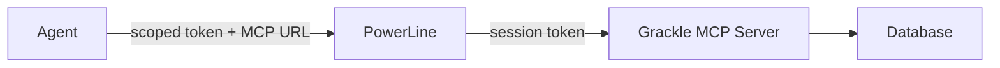

# MCP Server

Grackle's whole API, handed to an agent as tools. Let an agent drive your agents.

The server speaks **MCP (Model Context Protocol)**. Any MCP-capable agent — Claude Desktop, Claude Code, anything else — gets the same verbs you do: create tasks, spawn sessions, manage environments, search the knowledge graph. An agent with these tools can run Grackle itself.

For the worked example, see [Claude drives Grackle](../getting-started/claude-drives-grackle).

## Connecting

The MCP server comes up with `grackle serve` on port **7435**. Point your tool at it:

```json
{
  "mcpServers": {
    "grackle": {
      "type": "http",
      "url": "http://localhost:7435/mcp",
      "headers": {
        "Authorization": "Bearer <your-api-key>"
      }
    }
  }
}
```

Tools that speak OAuth (Claude Desktop, say) skip the key entirely — the server runs the flow and advertises its metadata at `/.well-known/oauth-protected-resource/mcp`.

## The tool surface

Roughly 80 tools, grouped by domain across 18 groups. Every tool is namespaced at call time: `task_create` is invoked as `mcp__grackle__task_create`. Which groups appear depends on which plugins are enabled.

### Environments

| Tool                         | Description                                                                              |
| ---------------------------- | ---------------------------------------------------------------------------------------- |
| `env_list`                   | List all environments with status                                                        |
| `env_add`                    | Register a new environment                                                               |
| `env_provision`              | Start and connect an environment                                                         |
| `env_stop`                   | Stop a running environment                                                               |
| `env_destroy`                | Permanently remove an environment                                                        |
| `env_remove`                 | Unregister an environment                                                                |
| `env_wake`                   | Restart a stopped environment                                                            |
| `env_list_docker_containers` | List running Docker containers an environment can attach to (Docker adapter attach mode) |

### Sessions

A session is an agent on the wire. These tools spawn it, watch it, kill it when it strays.

| Tool                 | Description                           |
| -------------------- | ------------------------------------- |
| `session_spawn`      | Start a new agent session             |
| `session_resume`     | Resume a terminated session           |
| `session_status`     | List sessions (filter by environment) |
| `session_kill`       | Terminate a running session           |
| `session_attach`     | Stream session events                 |
| `session_send_input` | Send input to a waiting session       |

### Tasks

| Tool            | Description                                                  |
| --------------- | ------------------------------------------------------------ |
| `task_list`     | List tasks (status / parent filters)                         |
| `task_search`   | Fuzzy search tasks by title/description, ranked by relevance |
| `task_create`   | Create a new task                                            |
| `task_show`     | Get full task details                                        |
| `task_update`   | Update task metadata                                         |
| `task_start`    | Start a task (spawns a session)                              |
| `task_complete` | Mark a task as complete                                      |
| `task_resume`   | Resume a paused task                                         |
| `task_delete`   | Delete a task                                                |

### Workspaces

| Tool                           | Description                                            |
| ------------------------------ | ------------------------------------------------------ |
| `workspace_list`               | List all workspaces                                    |
| `workspace_create`             | Create a new workspace                                 |
| `workspace_get`                | Get workspace details                                  |
| `workspace_update`             | Update workspace metadata                              |
| `workspace_archive`            | Archive a workspace                                    |
| `workspace_link_environment`   | Link an environment into the workspace's dispatch pool |
| `workspace_unlink_environment` | Remove a linked environment from the workspace pool    |

### Personas

A persona is an agent's preset — its system prompt, its runtime, the slice of tools it's allowed to touch. See [Personas & runtimes](../building-blocks/personas-runtimes).

| Tool             | Description                                              |
| ---------------- | -------------------------------------------------------- |
| `persona_list`   | List all personas                                        |
| `persona_create` | Create a new persona                                     |
| `persona_show`   | Get full persona details (system prompt, script, config) |
| `persona_edit`   | Update a persona                                         |
| `persona_delete` | Delete a persona                                         |

### Knowledge

| Tool                 | Description                                                                     | Parameters                                                   |
| -------------------- | ------------------------------------------------------------------------------- | ------------------------------------------------------------ |
| `knowledge_search`   | Natural-language semantic search over the knowledge graph, ranked by similarity | `query`, `limit?`, `workspaceId?`, `expand?`, `expandDepth?` |
| `knowledge_get_node` | Retrieve a knowledge node by ID, with its edges                                 | `id`, `expand?`, `expandDepth?`                              |

These come from the [knowledge graph plugin](./knowledge-graph), enabled by default. They vanish only if you disable the plugin (`grackle plugin disable knowledge`, or the `plugin_set_enabled` tool — then restart). `GRACKLE_KNOWLEDGE_ENABLED` only sets the initial state when the database is first seeded; on an existing install it does nothing.

### Configuration

| Tool                         | Description                     |
| ---------------------------- | ------------------------------- |
| `config_get_default_persona` | Get the default persona setting |
| `config_set_default_persona` | Set the default persona         |

### Schedules

A schedule fires a persona on a cadence — interval shorthand like `5m`, or a 5-field cron expression like `0 9 * * MON`. The agent wakes on its own clock.

| Tool              | Description                                     | Parameters                                                                                  |
| ----------------- | ----------------------------------------------- | ------------------------------------------------------------------------------------------- |
| `schedule_list`   | List scheduled triggers                         | `workspaceId?`                                                                              |
| `schedule_create` | Create a scheduled trigger                      | `title`, `scheduleExpression`, `personaId`, `description?`, `workspaceId?`, `parentTaskId?` |
| `schedule_show`   | Get details of a schedule by ID                 | `scheduleId`                                                                                |
| `schedule_update` | Update a schedule (only provided fields change) | `scheduleId`, `title?`, `description?`, `scheduleExpression?`, `personaId?`, `enabled?`     |
| `schedule_delete` | Delete a schedule                               | `scheduleId`                                                                                |

### Escalations

When an agent hits a wall it can't decide, it asks the human. The message routes to your configured notification channels.

| Tool                     | Description                                       | Parameters                                    |
| ------------------------ | ------------------------------------------------- | --------------------------------------------- |
| `escalate_to_human`      | Escalate a question/decision to the human         | `message`, `urgency?` (`low`/`normal`/`high`) |
| `escalation_list`        | List recent escalations and their delivery status | `workspaceId?`, `status?`, `limit?`           |
| `escalation_acknowledge` | Mark an escalation as seen by the human           | `id`                                          |

### Workpad

A workpad is structured context bolted to a task — what the agent did, recorded before it completes.

| Tool            | Description                                     | Parameters                              |
| --------------- | ----------------------------------------------- | --------------------------------------- |
| `workpad_write` | Write structured context to a task              | task content (defaults to current task) |
| `workpad_read`  | Read a task's workpad (current task or a child) | `taskId?`                               |

### Inter-agent IPC

How agents talk to each other while they work — spawn children, pass messages, share named streams sibling-to-sibling and child-to-parent. These need **scoped auth**: they only fire from inside a Grackle session, never from an external API-key client. The `fd` values returned by `ipc_spawn`/`ipc_create_stream` name a connection; `permission` is one of `r`/`w`/`rw`, and `deliveryMode`/`pipe` is one of `sync`/`async`/`detach`. Full mechanics in [Coordination](./coordination).

| Tool                | Description                                                      | Parameters                                                    |
| ------------------- | ---------------------------------------------------------------- | ------------------------------------------------------------- |
| `ipc_spawn`         | Spawn a child agent with an optional IPC pipe                    | `prompt`, `environmentId`, `pipe?`, `personaId?`, `maxTurns?` |
| `ipc_write`         | Write a message to a child/stream via an open fd                 | `fd`, `message`                                               |
| `ipc_close`         | Close an fd (stops the child if it was the last fd)              | `fd`                                                          |
| `ipc_list_fds`      | List your open fds (close owned child fds before exiting)        | _(none)_                                                      |
| `ipc_terminate`     | Send a graceful SIGTERM to a child via its fd                    | `fd`                                                          |
| `ipc_list_streams`  | List active IPC streams with subscribers and buffer depth        | _(none)_                                                      |
| `ipc_create_stream` | Create a named stream; returns an `rw` fd                        | `name`, `selfEcho?`                                           |
| `ipc_attach`        | Grant another session access to a stream you hold                | `fd`, `targetSessionId`, `permission?`, `deliveryMode?`       |
| `ipc_share_stream`  | Share a stream with your parent (auto-discovers the parent pipe) | `fd?` or `streamName?`, `permission?`, `deliveryMode?`        |

### Components & widgets (MCP Apps)

An agent can author and render UI inline in the chat — one-off renders, or reusable components persisted in the workspace registry. Default renderer is `grackle-react` (JSX); `mcp-app-html` renders raw HTML. Promote a component with `component_promote` and it gains a dynamic, per-workspace `render_<name>` tool whose input schema is the component's `propsSchema`. See [Generative UX](./widgets).

| Tool                 | Description                                               | Parameters                                                                        |
| -------------------- | --------------------------------------------------------- | --------------------------------------------------------------------------------- |
| `component_register` | Persist a reusable component in the workspace registry    | `name`, `source`, `rendererKind?`, `description?`, `propsSchema?`, `workspaceId?` |
| `component_update`   | Update a registered component (bumps its version)         | `id`, `source?`, `name?`, `description?`, `propsSchema?`, `workspaceId?`          |
| `component_list`     | List components registered in the workspace               | `workspaceId?`                                                                    |
| `component_search`   | Search the registry (incl. Grackle built-ins) by keyword  | `query`, `limit?`, `workspaceId?`                                                 |
| `component_promote`  | Promote (or demote) a component to a `render_<name>` tool | `id?` or `name?`, `promoted?`, `workspaceId?`                                     |
| `component_render`   | Render a registered component by id/name with props       | `id?` or `name?`, `props?`, `workspaceId?`                                        |
| `component_show`     | Render a one-off React/JSX component (no persistence)     | `source`, `props?`, `workspaceId?`                                                |
| `widget_show`        | Render a one-off raw-HTML widget (no persistence)         | `body`, `props?`, `workspaceId?`                                                  |
| `show_hello_widget`  | Demo widget that echoes a message (MCP Apps sample)       | `message?`                                                                        |

Each **promoted** component also adds a dynamic `render_<name>` tool to that workspace's tool list, so any agent can render it by name with validated props.

### Credentials & tokens

Every agent gets its own name and its own key. These tools wire the keys.

| Tool                       | Description                                                    | Parameters          |
| -------------------------- | -------------------------------------------------------------- | ------------------- |
| `credential_provider_list` | List credential-provider auto-forwarding configuration         | _(none)_            |
| `credential_provider_set`  | Set a provider mode (`claude`/`github`/`copilot`/`codex`)      | provider, mode      |
| `token_list`               | List configured tokens (values are never returned)             | _(none)_            |
| `token_set`                | Set a token auto-forwarded to environments (encrypted at rest) | name, value, target |
| `token_delete`             | Delete a configured token by name                              | name                |

### Plugins

| Tool                 | Description                                                                                                               | Parameters    |
| -------------------- | ------------------------------------------------------------------------------------------------------------------------- | ------------- |
| `plugin_list`        | List known plugins with state (enabled/loaded/required)                                                                   | _(none)_      |
| `plugin_set_enabled` | Enable/disable a plugin (a **server restart is required** for the change to take effect; core plugins cannot be disabled) | name, enabled |

### Diagnostics

| Tool                 | Description                                                                        | Parameters |
| -------------------- | ---------------------------------------------------------------------------------- | ---------- |
| `usage_get`          | Aggregated token usage and USD cost for a session/task/tree/workspace/environment  | scope id   |
| `logs_get`           | Retrieve session logs (raw events, transcript, or live tail)                       | session id |
| `get_version_status` | Check whether a newer Grackle version is available (and whether running in Docker) | _(none)_   |

## Two endpoints, one codebase

Grackle exposes the tools through two doors. Same tools underneath; different auth, different reach.

### Global MCP server (port 7435)

The standalone server you point external tools at. API key or OAuth. Full access to every tool and every workspace. This is the door you walk through.

### PowerLine MCP broker (per-session)

When Grackle spawns an agent, the server hands it a **scoped MCP URL and session token** over PowerLine. The agent connects with that token — never your API key:

- It holds a **session token** that identifies it, not your key.
- Tool access is filtered by its **persona** — a reviewer agent might see only read-only tools.
- Tasks it creates are parented to its own task automatically.
- `workspaceId` is injected. No reaching across workspaces.

This is the orchestrator pattern's spine: an agent spawns subtasks and watches them through MCP, and sees nothing outside its own scope.



### How an agent sees the tools

An agent running inside Grackle finds the MCP server already wired as a tool source. It sees `mcp__grackle__task_create`, `mcp__grackle__session_spawn`, and the rest, sitting alongside its built-in tools. That's all it takes:

- An orchestrator decomposes a task into subtasks with `task_create`.
- A researcher searches the [knowledge graph](./knowledge-graph) for prior context.
- A supervisor watches task status and feeds corrections back down.

One agent, the whole API, a fleet of agents at its command.
