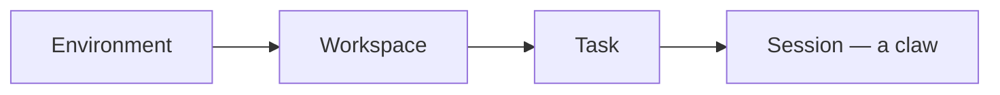

# Web UI

A window onto the plague. The web UI is where you watch claws perch, work, and stray — in real time, from one browser tab. The server hosts it at **http://localhost:3000** by default.


## First run

A four-step wizard opens on first launch:

1. **Welcome** — what you're looking at.
2. **About** — what Grackle does.
3. **Runtime** — pick the default runtime: Claude Code, Copilot, Codex, or Goose.
4. **Notifications** — grant browser notifications, or don't.

It writes your default persona's runtime and drops you into the [Root chat](./chat). You won't see it again.

## Pairing

No code, no entry. Generate one from the CLI:

```bash
grackle pair
```

Type the six characters in the browser, or scan the QR from your phone. The session holds for 24 hours, then the door locks again.

## Top navigation

A bar across the top switches the main views:

| View             | What it is                                                                                  |
| ---------------- | ------------------------------------------------------------------------------------------- |
| **Dashboard**    | Home. The wide view.                                                                        |
| **Tasks**        | Every task, across every workspace. Shown when the orchestration plugin is live.            |
| **Environments** | Your environments, and the workspaces nested under them.                                    |
| **Root**         | The [root-task chat](./chat).                                                               |
| **Knowledge**    | The [knowledge graph](./knowledge-graph) explorer. Shown when the knowledge plugin is live. |
| **Coordination** | A read-only inventory of [how concurrent claws talk to each other](./coordination).         |
| **Settings**     | Pinned to the right. Credentials, personas, and the rest.                                   |

Grackle is **environment-centric**. Workspaces live under environments — the real path is `/environments/:envId/workspaces/:wsId`. **Environments** is the way in. Visit `/workspaces` and you land on `/environments`; any old `/workspaces/:id` link is rewritten to its environment-scoped home.

### The hierarchy



An environment is a wire. Workspaces perch on it. Tasks live in workspaces. A running task is a claw — a `session` — and that's what you watch.

### Contextual sidebar

Some views grow a left sidebar:

- **Environments** lists your environments and their workspaces, so you can drill into a workspace.
- **Tasks** and **Knowledge** carry their own browsing sidebars.

## Inside a workspace

Each workspace has three tabs. Keys `1`, `2`, `3` switch between them.

### Graph

The task DAG — hierarchy and dependencies, drawn. Click a node for its stream or overview.


### Board

A kanban wall: Not Started, Working, Paused, Complete, Failed. Progress at a glance.

### Tasks

A searchable list — status badges, branch names, dependency info. Find the one that strayed.

## Inside a task

Click a task for the full-page detail view. Fields are click-to-edit: click, type, Enter to save, Escape to back out.

**Overview** — status badge, metadata (branch, environment, persona, timestamps), token usage, and the buttons that move it: Start, Complete, Resume, Delete.

**Stream** — the live event feed from the task's latest session. Agent text, tool calls rendered as cards (file edits show diffs, grep shows matches, bash shows output), collapsible results, status changes. When the claw waits on you, an input field appears at the bottom.


Creating and editing follow one pattern everywhere — workspaces, tasks, personas, environments. Edit mode auto-saves each field on blur or Enter. Create mode starts every field open with a **Create** button, then drops into the edit view once it exists.

## Settings

Tabs down the side:

| Tab                 | What it holds                                                                                 |
| ------------------- | --------------------------------------------------------------------------------------------- |
| **Credentials**     | [Credential providers](./credentials) and encrypted tokens — a name and key per claw.         |
| **GitHub Accounts** | The accounts used for repository access.                                                      |
| **Personas**        | [Personas](./orchestration) — runtime, model, max turns, system prompt, MCP tool permissions. |
| **Schedules**       | [Triggers that run agents on cron](../advanced/scheduled-tasks).                              |
| **Appearance**      | Nine themes, several with light and dark cuts.                                                |
| **Shortcuts**       | The keyboard map.                                                                             |
| **Plugins**         | Which plugins are live, and what each contributes.                                            |
| **About**           | Version and links.                                                                            |


Environments left Settings — they live at the top-level **Environments** view now. `settings/environments` redirects there.


## Where next

- [Install Grackle](../getting-started/installation) if you haven't.
- [Spawn a claw from the Root chat](./chat).
- [Watch a mob coordinate](./coordination).
- [Read what the claws left behind](./knowledge-graph).
- [Hand widgets to a running agent](./widgets).
