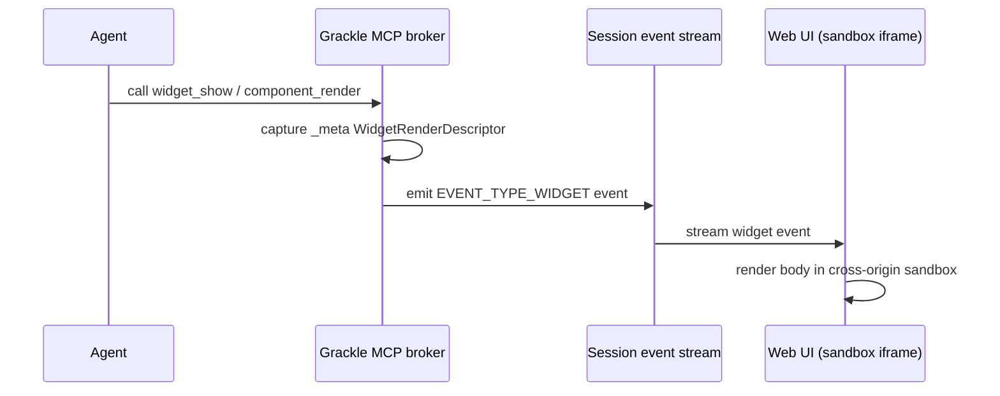

# Generative UX (Widgets)

A claw does not have to answer in text. It can build the panel you read it in.

Grackle lets an agent author **generative UI** — interactive widgets and React
components that render inline in the chat instead of plain prose. This is Grackle's
take on **MCP Apps**, the Model Context Protocol's UI extension: the agent calls a
tool, the tool result carries a UI payload, and the web UI renders it inside a
sandboxed iframe.

A widget is one of two things:

- A **one-off render** that lives for a single message and then is gone, or
- A **reusable component** persisted in the workspace registry and re-rendered with
  fresh data over time.

Two renderers, picked per component via `rendererKind`:

- **`grackle-react`** (default) — the agent writes JSX against Grackle's React
  component library and shared runtime.
- **`mcp-app-html`** — the agent writes raw HTML, inline `<script>`/`<style>` allowed.

## How it works

When a claw runs inside a Grackle session, the tools below are in scope. The render
path:

1. **The agent calls a render tool** — `widget_show` (raw HTML), `component_show`
   (one-off JSX), or `component_render` (a registered component).
2. **The tool emits a render descriptor.** Each render tool attaches a
   `WidgetRenderDescriptor` to the tool result's `_meta`: the body (HTML or JSX),
   props, renderer kind, and CSP flags (`allowInlineScripts` / `allowUnsafeEval`).
3. **The broker captures it.** The MCP server reads `_meta` in-process and emits an
   `EVENT_TYPE_WIDGET` event into the session's stream.
4. **The web UI renders it.** The event renderer hands `widget` events to the
   `McpAppWidget` component, which mounts the body inside a **cross-origin sandbox
   iframe**.

:::note Broker capture, not host rendering
The widget event is produced by Grackle's in-process **broker** when a scoped session
invokes a render tool. It does not depend on the agent's MCP client preserving `_meta`.
Capture only happens for scoped sessions — claws running inside Grackle. For external
API-key clients it is a no-op.
:::

## The component lifecycle

Reusable components run a **register → discover → promote → render** loop. The one-off
tools (`widget_show`, `component_show`) skip the registry entirely.

1. **Register** — `component_register` persists a component (JSX or HTML) into the
   current workspace's registry, optionally with a `propsSchema` (JSON Schema) for the
   data it accepts. Returns the component `id`.
2. **Discover** — `component_search` (keyword search over name + description, Grackle's
   **built-ins** included — Button, Callout, Spinner) and `component_list` let an agent
   find something to reuse before authoring new. Built-in results (`builtin: true`) are
   composed directly in JSX; registry results render through `component_render`.
3. **Promote** (optional) — `component_promote` exposes a registered component as its
   own dynamic **`render_<name>`** tool, input schema derived from its `propsSchema`.
   Promoted components show up in `tools/list` for the workspace, so any agent can
   render them by name with validated props. Pass `promoted: false` to demote.
4. **Render** — `component_render` resolves a component by `id` or `name`, validates
   `props` against the stored `propsSchema`, and emits the widget event.
   `component_update` bumps `version`.

:::tip Search before authoring
Every component tool description nudges the agent to call `component_search` first —
reuse an existing component, including built-ins, before writing a new one.
:::

### Dynamic `render_<name>` tools

Promotion turns a component into a first-class tool. The MCP server synthesizes one
`render_<name>` tool per promoted component for the caller's workspace, deriving its
input schema from the component's `propsSchema`. No schema falls back to a permissive
object that accepts arbitrary keys. The dynamic dispatcher reuses the same render
descriptor path as `component_render`, so the two cannot drift. Promote or demote, and
the server emits `notifications/tools/list_changed` to refresh the workspace's tool list.

## Tool reference

`workspaceId` is **auto-injected** from the scoped session context when omitted, so an
agent normally does not pass it.

| Tool                 | Description                                                                                     | Key parameters                                                                                  |
| -------------------- | ----------------------------------------------------------------------------------------------- | ----------------------------------------------------------------------------------------------- |
| `component_register` | Persist a reusable component into the workspace registry; returns its `id`.                     | `name`, `source` (JSX or HTML), `rendererKind?`, `description?`, `propsSchema?`, `workspaceId?` |
| `component_update`   | Update a registered component's source/name/description/schema; bumps `version`.                | `id`, `source?`, `name?`, `description?`, `propsSchema?`, `workspaceId?`                        |
| `component_list`     | List the components registered in the workspace.                                                | `workspaceId?`                                                                                  |
| `component_search`   | Keyword search over registry components **and** Grackle built-ins.                              | `query`, `limit?` (default 10), `workspaceId?`                                                  |
| `component_promote`  | Promote a component to a dynamic `render_<name>` tool (or demote it).                           | `id?` or `name?`, `promoted?` (default `true`), `workspaceId?`                                  |
| `component_render`   | Render a registered component by `id`/`name`; props validated against `propsSchema`.            | `id?` or `name?`, `props?`, `workspaceId?`                                                      |
| `component_show`     | Render a **one-off** React/JSX component against the Grackle library (no persistence).          | `source` (must call `render(<C {...props}/>)`), `props?`, `workspaceId?`                        |
| `widget_show`        | Render a **one-off** raw-HTML widget (no persistence). May include inline `<script>`/`<style>`. | `body`, `props?`, `workspaceId?`                                                                |
| `show_hello_widget`  | Demo MCP Apps widget that echoes a message back.                                                | `message?`                                                                                      |
| `render_<name>`      | Dynamic tool created by promoting a component; renders it with validated props.                 | the component's `propsSchema`                                                                   |

:::note Authoring JSX with `component_show` / `component_register`
For the `grackle-react` renderer, `source` is JSX that must call
`render(<YourComponent {...props}/>)` (react-live no-inline mode). `React`, the incoming
`props`, and Grackle's component library are in scope.
:::

`show_hello_widget` is a static Grackle-served sample. Unlike the registry tools, it
carries a fixed `uiResourceUri` and is listed only to hosts that can render MCP Apps
widgets. The registry tools are plain tools — always listed to scoped agents — that
produce widgets dynamically via `_meta`.

## Configuration

Agent-authored HTML/JSX is **untrusted**. Grackle serves the sandbox from a **separate
origin** from the main web UI, so a malicious or broken widget cannot touch the host
page, its cookies, or its session. Browser-facing widgets point at this sandbox origin
through their Content-Security-Policy.

### Sandbox port and origin

| Setting                              | Env var                  | `grackle serve` flag        | Default                                 |
| ------------------------------------ | ------------------------ | --------------------------- | --------------------------------------- |
| Sandbox port                         | `GRACKLE_SANDBOX_PORT`   | `--sandbox-port <port>`     | `7436`                                  |
| Sandbox origin (explicit)            | `GRACKLE_SANDBOX_ORIGIN` | `--sandbox-origin <origin>` | derived from page origin + sandbox port |
| MCP origin (widget asset/CSP origin) | `GRACKLE_MCP_ORIGIN`     | `--mcp-origin <origin>`     | derived from bind host + MCP port       |

- **`GRACKLE_SANDBOX_PORT`** (default `7436`) — the port for the separate origin the
  double-iframe widget sandbox runs on.
- **`GRACKLE_SANDBOX_ORIGIN`** — set this when the web UI sits behind a reverse proxy or
  TLS and the browser-facing scheme + port cannot be inferred from the page origin plus
  the sandbox port (e.g. an HTTPS SPA but the sandbox on plain HTTP). When set, it wins
  over the port.
- **`GRACKLE_MCP_ORIGIN`** — the browser-facing MCP origin used as the trusted asset/CSP
  origin for broker-captured widgets. Set it for reverse-proxy / TLS deployments where
  the loopback MCP origin is not browser-reachable; otherwise it is derived from the bind
  host plus the MCP port.

:::warning Why a separate origin matters
Widget bodies are written by agents, so they run with the privileges of an _untrusted_
document. A distinct origin means the browser enforces same-origin policy between the
widget and the host page. Share the host origin, and a widget's inline scripts could read
the host's DOM and session. Keep the sandbox origin distinct from the web UI origin in
every deployment.
:::

If the web UI has no sandbox proxy URL configured, `widget` events degrade to a plain
text rendering of the event content. Nothing breaks; the panel just falls back to words.

## Next

- [MCP Server](./mcp-server) — the full tool catalog and how scoped sessions get filtered access.
- [Web UI](./web-ui) — where widgets render.
- [Chat](./chat) — the thread they show up in.
