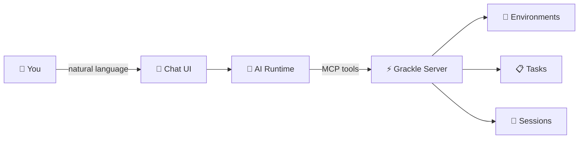

# Chat Interface

Grackle's landing page is a chat interface backed by a configurable AI runtime. Type natural language commands — "connect to any codespace and start working on #454" or "what's the status of the API redesign?" — and the agent handles it using Grackle's MCP tools.

## How it works

The chat interface connects a swappable AI runtime (Claude Code, Codex, Copilot, or Goose) to Grackle's MCP server. The agent sees all of Grackle's capabilities as tools — environment management, task creation, session spawning, findings, personas — and uses them to fulfill your request.

This means you don't need to memorize CLI commands or navigate the UI. Just describe what you want.

## Choosing a runtime

The chat runtime is configured during the first-run setup wizard. You can change it later under **Settings > Personas** by editing the default persona's runtime.

| Runtime | Best for |
|---------|---------|
| **Claude Code** | General purpose, strong at orchestration and code tasks |
| **Codex** | OpenAI model access, reasoning-heavy tasks |
| **Copilot** | GitHub-integrated workflows |
| **Goose** | Provider-agnostic, bring your own LLM |

The chat interface uses whichever runtime your default persona specifies.

## Suggested actions

On the landing page, Grackle shows contextual **suggested action cards** based on your current state:

- **First run** — "Add your first environment", "Set up credentials"
- **No environments connected** — "Connect a Docker environment", "Add an SSH host"
- **Active work** — "Check on [workspace name]", "Start the next task in [workspace]"
- **Recent activity** — Quick links to resume recent sessions or view findings

Click any card to pre-fill the chat with that action, or just type your own request.

## What you can do

Anything the [MCP server](./mcp) exposes is available through chat. Common patterns:

**Environment management:**
> "Add a Docker environment called build-server and provision it"

**Task workflows:**
> "Create a task to fix the flaky auth test in the API workspace and start it"

**Status checks:**
> "What tasks are currently running? Any failures?"

**Knowledge queries (with knowledge graph enabled):**
> "What do we know about the payment module architecture?"

**Multi-step orchestration:**
> "Set up three Docker environments and start the top three priority tasks in parallel"

## Ephemeral conversations

Chat conversations are not persisted across page refreshes in the current version. They're designed as a quick command interface, not a long-running conversation log. For persistent work, use [tasks](../concepts/projects-tasks) and [findings](../concepts/findings).
