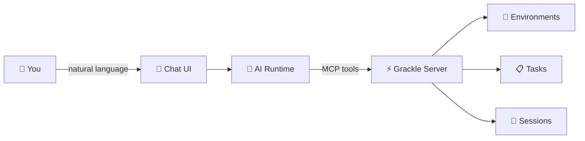

# Chat Interface

Grackle's landing page is a chat interface backed by a configurable AI runtime. It's your persistent conversation with the **System orchestrator** — the agent that runs on the root task. Type natural language commands — "connect to any codespace and start working on #454" or "what's the status of the API redesign?" — and the agent handles it using Grackle's MCP tools.

## How it works

The chat interface connects a swappable AI runtime (Claude Code, Codex, Copilot, or an ACP-bridged runtime) to Grackle's MCP server. The agent sees all of Grackle's capabilities as tools — environment management, task creation, session spawning, personas — and uses them to fulfill your request.

```mermaid
graph LR
    You["👤 You"] -->|natural language| Chat["💬 Chat UI"]
    Chat --> RT["🤖 AI Runtime"]
    RT -->|MCP tools| G["⚡ Grackle Server"]
    G --> E["🐳 Environments"]
    G --> T["📋 Tasks"]
    G --> S["🔌 Sessions"]
```

This means you don't need to memorize CLI commands or navigate the UI. Just describe what you want.

## Choosing a runtime

The chat runtime is configured during the first-run setup wizard. You can change it later under **Settings > Personas** by editing the default persona's runtime.

| Runtime         | Best for                                                |
| --------------- | ------------------------------------------------------- |
| **Claude Code** | General purpose, strong at orchestration and code tasks |
| **Codex**       | OpenAI model access, reasoning-heavy tasks              |
| **Copilot**     | GitHub-integrated workflows                             |

In addition, Grackle ships ACP-bridged runtimes that drive external agents over the [Agent Client Protocol](https://agentclientprotocol.com) — `goose`, `codex-acp`, `copilot-acp`, and `claude-code-acp` (all experimental). See [Runtimes](../concepts/runtimes) for the full catalog.

The chat interface uses whichever runtime your default persona specifies.

## Before you start

The chat connects to the System agent through a **local environment**. If you haven't added one yet, the empty state prompts you to do so:

> Add a local environment in Settings to start chatting.

Add a local environment under **Settings → Environments**, then return to the chat. Once a connected local environment exists, the message input appears and you can start the conversation.

## What you can do

Anything the [MCP server](./mcp) exposes is available through chat. Common patterns:

**Environment management:**

> "Add a Docker environment called build-server and provision it"

**Task workflows:**

> "Create a task to fix the flaky auth test in the API workspace and start it"

**Status checks:**

> "What tasks are currently running? Any failures?"

**Knowledge queries (with knowledge graph enabled):**

> "What do we know about the payment module architecture?"

**Multi-step orchestration:**

> "Set up three Docker environments and start the top three priority tasks in parallel"

## A persistent conversation

The chat is **not** ephemeral. It's the durable conversation with the System orchestrator on the root task: history is persisted server-side and reloaded when the page mounts, so it survives a refresh and is shared across browser tabs. Picking the chat back up continues the same conversation rather than starting a new one.

For structured, long-running work, the System agent creates [tasks](../concepts/projects-tasks) on your behalf — the chat is where you steer it.

:::tip Per-stream and IPC browsing
The chat page is strictly the root-task conversation. To inspect individual agent-to-agent IPC streams, use the **Coordination** tab. (Older `/chat/:streamId` links now redirect there.)
:::
