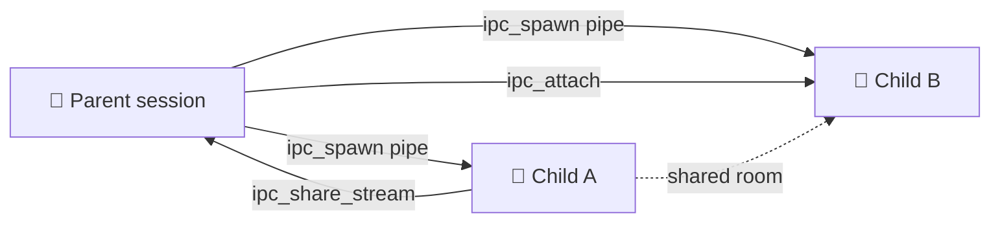

# Coordination & IPC

Where [orchestration](./orchestration) is the _task-level_ layer — decomposing work, gating execution with dependencies, and signaling completion up the task tree — **coordination** is the lower-level plumbing underneath it. It is how parallel agents actually talk to each other and how the server keeps a durable, totally-ordered record of everything that happens in a session.

Two mechanisms make this up:

- **IPC streams and file descriptors** — a Unix-pipe-style abstraction agents use to spawn children, send messages, and share named streams agent-to-agent. Exposed as `ipc_*` MCP tools.
- **The durable, server-sequenced action log** — every event in a session is appended to a monotonic log so it can be replayed, resumed, and audited.

The web UI surfaces all of this on the **Coordination** tab.

:::info Orchestration vs. coordination
You rarely have to touch IPC directly. The orchestrator pattern (parent task + child tasks + `SIGCHLD` notifications) is built _on top of_ IPC pipes. Reach for the `ipc_*` tools when you need agent-to-agent communication that doesn't fit the parent/child task tree — for example, a shared "chatroom" stream between siblings.
:::

## IPC streams and file descriptors

An agent session is modeled like a process: it holds **file descriptors** (fds), each pointing at a **stream**. A stream is a named, multi-subscriber message channel. Spawning a child agent gives you a pipe fd to it; you can also create free-standing named streams and grant other sessions access to them.

These operations are exposed to agents as MCP tools in the `ipc` group. Most require **scoped auth** — i.e. the caller is an agent running inside a session, not an external client — because the server needs the caller's session id to resolve fds and permissions.

### Tool reference

| Tool                | Purpose                                                                                                                                                                                                                                                     | Key parameters                                               |
| ------------------- | ----------------------------------------------------------------------------------------------------------------------------------------------------------------------------------------------------------------------------------------------------------- | ------------------------------------------------------------ |
| `ipc_spawn`         | Spawn a child agent session with an optional IPC pipe. `pipe:'sync'` blocks until the child completes; `'async'` delivers results between your turns; `'detach'` is fire-and-forget (the default).                                                          | `prompt`, `pipe`, `environmentId`, `personaId?`, `maxTurns?` |
| `ipc_write`         | Write a message to a child (or stream) via an open fd. Delivered to the target via `sendInput`.                                                                                                                                                             | `fd`, `message`                                              |
| `ipc_close`         | Close an fd, dropping the connection. Closing the last fd to a child stops it. Fails if there are undelivered messages — process them first.                                                                                                                | `fd`                                                         |
| `ipc_list_fds`      | List your open fds. Check before exiting: owned fds (`owned=true`) must be closed before you stop.                                                                                                                                                          | _(none)_                                                     |
| `ipc_terminate`     | Send a graceful `SIGTERM` to a child via its fd. The child receives a `[SIGTERM]` message and is expected to wrap up and stop. The fd stays open — close it with `ipc_close` afterward.                                                                     | `fd`                                                         |
| `ipc_list_streams`  | List active IPC streams with subscriber details and message-buffer depth. A debugging surface. Scoped agents only see streams they participate in.                                                                                                          | _(none)_                                                     |
| `ipc_create_stream` | Create a new named stream for inter-session communication. Returns an `rw` fd on it. `selfEcho` controls whether participants see their own messages (chatroom scenarios).                                                                                  | `name`, `selfEcho?`                                          |
| `ipc_attach`        | Grant another session access to a stream you hold. The target gets a new fd with the given `permission` and `deliveryMode`. Permission must be **equal to or less than** your own. Write-only (`w`) requires `deliveryMode:'detach'`.                       | `fd`, `targetSessionId`, `permission`, `deliveryMode`        |
| `ipc_share_stream`  | Share a stream with your **parent** session. Auto-discovers the parent via the inherited pipe fd, grants access, and sends the parent a `[stream-ref]` notification. For sibling-to-sibling sharing: share with the parent, who can `ipc_attach` it onward. | `fd?` _or_ `streamName?`, `permission?`, `deliveryMode?`     |

### Permissions and delivery modes

- **Permission** is one of `r` (read), `w` (write), or `rw`. When you grant access via `ipc_attach`, you cannot grant more than you hold — the server enforces attenuation.
- **Delivery mode** is `sync`, `async`, or `detach`, controlling how the target receives messages. Write-only (`w`) streams can only be shared with `detach`.
- **Reserved streams** — names prefixed with `pipe:`, `lifecycle:`, or `stdin:` are internal plumbing and cannot be shared via `ipc_share_stream`.



:::tip Closing fds before exit
`ipc_close` refuses to close an fd that still has undelivered messages, and `ipc_list_fds` exists precisely so an agent can confirm all of its owned child fds are closed before it stops working. An agent that exits with open owned fds leaves children hanging.
:::

## The durable action log

Every session event — agent output, injected prompts, injected input and signals, widget renders — is appended to a **durable, server-sequenced action log** (`session_actions`). A single process-wide monotonic generator assigns each action a strictly-increasing `serverSeq` (a monotonic ULID), so events emitted in the same millisecond from different sources are still **totally ordered**. This log is the replay buffer that powers seq-based resume.

Sequencing is centralized for exactly this reason: if each publisher minted its own ULID factory, events emitted in the same millisecond from different sources could not be totally ordered. A single generator sidesteps that.

Writes are **best-effort**: a persistence failure is logged but never interrupts live event delivery. The live paths (the PowerLine event stream and stream-hub publish) remain primary; the durable log is the audit/replay record.

Three CLI commands inspect different slices of this substrate.

### `grackle session events` — per-session action log

Shows a single session's durable, server-sequenced action log, **oldest first** (replay order).

```bash
# Full action log for a session (default limit 500)
grackle session events <session-id>

# Resume from a cursor — only actions after a given seq
grackle session events <session-id> --from <seq>

# Cap the number of actions returned
grackle session events <session-id> --limit 100
```

| Option         | Meaning                                            |
| -------------- | -------------------------------------------------- |
| `--from <seq>` | Only actions after this seq (resume from a cursor) |
| `--limit <n>`  | Max actions to return (default `500`)              |

Output columns: `Seq`, `Type`, `Timestamp`, `Content`.

### `grackle events` — persisted domain-event log

Queries the persisted **domain-event** log (e.g. `task.created`), **most recent first**. This is the cross-cutting audit trail of what changed in the system, not session-scoped.

```bash
# Recent domain events (default limit 100)
grackle events

# Filter by exact event type
grackle events --type task.created

# Time-bounded queries (ISO 8601)
grackle events --since 2026-05-01T00:00:00Z --until 2026-05-02T00:00:00Z

# Page into history
grackle events --before <id> --limit 50
```

| Option          | Meaning                                            |
| --------------- | -------------------------------------------------- |
| `--type <type>` | Filter by exact event type (e.g. `task.created`)   |
| `--since <iso>` | Only events at/after this ISO 8601 timestamp       |
| `--until <iso>` | Only events at/before this ISO 8601 timestamp      |
| `--before <id>` | Only events older than this id (page into history) |
| `--limit <n>`   | Max rows to return (default `100`)                 |

Output columns: `ID`, `Type`, `Timestamp`, `Payload`.

### `grackle streams list` / `grackle streams transcript` — IPC streams

Inspect IPC streams from the CLI.

```bash
# List active IPC streams with subscriber details
grackle streams list

# Include internal plumbing (lifecycle/pipe/stdin)
grackle streams list --internal

# Show a stream room's durable transcript (most recent first)
grackle streams transcript <stream-id>

# Page into older history and cap rows
grackle streams transcript <stream-id> --before <seq> --limit 50
```

`streams list` shows `ID`, `Name`, `Subscribers`, and `Buffer Depth`, with one indented row per subscriber (`fd`, permission/delivery mode, and whether it was `(spawned)`). `streams transcript` shows the stream room's durable transcript with `Seq`, `Sender`, `Timestamp`, and `Content` (most recent first; default limit `100`).

| Command              | Option           | Meaning                                               |
| -------------------- | ---------------- | ----------------------------------------------------- |
| `streams list`       | `--internal`     | Include internal IPC streams (lifecycle/pipe/stdin)   |
| `streams transcript` | `--before <seq>` | Only messages older than this seq (page into history) |
| `streams transcript` | `--limit <n>`    | Max messages to return (default `100`)                |

## The Coordination tab

The web UI exposes a **Coordination** page at `/coordination` — a **read-only inventory of IPC streams**, grouped by the task that owns them.

It provides:

- **List / Graph toggle** — the List view is the stream inventory grouped by owning task; the Graph view is a live network graph of sessions and the streams connecting them.
- **Show internals** toggle — internal plumbing streams (`lifecycle`/`pipe`/`stdin`) are hidden by default and revealed by this toggle, mirroring the `--internal` flag on `grackle streams list`.
- **Stream detail drawer** — selecting a stream opens a panel that loads its durable transcript (scrollback) and merges in live messages as they arrive.
- **Refresh** — re-fetches the stream inventory on demand.

:::note Legacy chat URLs
Older per-stream chat URLs (`/chat/:streamId`) now redirect to the Coordination tab. The single root-task conversation still lives at `/chat`.
:::

## Relationship to orchestration

Coordination is the substrate; [orchestration](./orchestration) is the policy layer on top.

| Layer             | Concern                                                                 | Surface                                                                                      |
| ----------------- | ----------------------------------------------------------------------- | -------------------------------------------------------------------------------------------- |
| **Orchestration** | Tasks, dependencies, `SIGCHLD`/`SIGTERM` over the task tree, escalation | `grackle task ...`, orchestrator personas                                                    |
| **Coordination**  | Streams, file descriptors, message delivery, the durable action log     | `ipc_*` MCP tools, `grackle session events` / `events` / `streams ...`, the Coordination tab |

When an orchestrator spawns a child task, the parent and child are connected by an IPC pipe — the same machinery `ipc_spawn` exposes. The `SIGTERM` you read about in orchestration is delivered to a child via `ipc_terminate` over that pipe fd. In short: orchestration is _what_ the agents are doing; coordination is _how_ they communicate while doing it.
