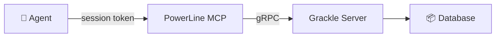

# MCP Server

Grackle exposes its full API as an **MCP (Model Context Protocol) server**. This means any AI agent with MCP support — Claude Desktop, Claude Code, or anything else — can create tasks, spawn sessions, post findings, and manage environments through Grackle.

## What it enables

With the MCP server, you can:
- Have Claude Code manage Grackle tasks without the CLI
- Build orchestration workflows where one agent controls others through Grackle
- Connect external AI tools to your Grackle instance

## Connecting to the MCP server

The MCP server starts automatically with `grackle serve` on port **7435**. Configure your AI tool to connect to it:

```json
{
  "mcpServers": {
    "grackle": {
      "type": "http",
      "url": "http://localhost:7435/mcp",
      "headers": {
        "Authorization": "Bearer <your-api-key>"
      }
    }
  }
}
```

For tools that support OAuth (like Claude Desktop), the MCP server handles the OAuth flow automatically — no manual API key configuration needed.

## Available tools

The MCP server exposes tools grouped by domain:

### Environments
| Tool | Description |
|------|------------|
| `env_list` | List all environments with status |
| `env_add` | Register a new environment |
| `env_provision` | Start and connect an environment |
| `env_stop` | Stop a running environment |
| `env_destroy` | Permanently remove an environment |
| `env_remove` | Unregister an environment |
| `env_wake` | Restart a stopped environment |

### Sessions
| Tool | Description |
|------|------------|
| `session_spawn` | Start a new agent session |
| `session_resume` | Resume a terminated session |
| `session_status` | List sessions (filter by environment) |
| `session_kill` | Terminate a running session |
| `session_attach` | Stream session events |
| `session_send_input` | Send input to a waiting session |

### Tasks
| Tool | Description |
|------|------------|
| `task_list` | List tasks (with search and status filters) |
| `task_create` | Create a new task |
| `task_show` | Get full task details |
| `task_update` | Update task metadata |
| `task_start` | Start a task (spawns a session) |
| `task_complete` | Mark a task as complete |
| `task_resume` | Resume a paused task |
| `task_delete` | Delete a task |

### Projects
| Tool | Description |
|------|------------|
| `project_list` | List all projects |
| `project_create` | Create a new project |
| `project_get` | Get project details |
| `project_update` | Update project metadata |
| `project_archive` | Archive a project |

### Findings
| Tool | Description |
|------|------------|
| `finding_list` | Query findings by category/tags |
| `finding_post` | Record a finding |

### Personas
| Tool | Description |
|------|------------|
| `persona_list` | List all personas |
| `persona_create` | Create a new persona |
| `persona_edit` | Update a persona |
| `persona_delete` | Delete a persona |

### Knowledge (when enabled)
| Tool | Description |
|------|------------|
| `knowledge_search` | Semantic search over the knowledge graph |
| `knowledge_get_node` | Retrieve a knowledge node by ID |
| `knowledge_create_node` | Create a new knowledge entry |

These tools are only available when the [knowledge graph plugin](./knowledge-graph) is enabled.

### Configuration
| Tool | Description |
|------|------------|
| `config_get_default_persona` | Get the default persona setting |
| `config_set_default_persona` | Set the default persona |

## MCP broker architecture

Grackle has two MCP endpoints that share the same tool codebase but differ in auth and scope:

### Global MCP server (port 7435)

The standalone MCP server you connect external tools to. Authenticates via API key or OAuth. Full access to all tools and all workspaces.

### PowerLine MCP broker (per-session)

When Grackle spawns an agent session, PowerLine hosts an MCP server instance **inside the environment** with session-scoped auth:

- The agent gets a **session token** (not your API key) that identifies it
- Tool access is filtered by the agent's **persona** — a reviewer persona might only see read-only tools
- Task creation is automatically parented to the agent's own task
- `workspaceId` is injected automatically — no cross-workspace access

This is what enables the orchestrator pattern: an agent can create subtasks, post findings, and monitor progress through MCP without seeing anything outside its scope.



### How agents see MCP tools

When an agent runs inside Grackle, the MCP server is automatically configured as an available tool source. The agent sees tools like `mcp__grackle__task_create` and `mcp__grackle__finding_post` alongside its built-in tools.

This is what enables patterns like:
- An orchestrator agent that decomposes a task into subtasks using `task_create`
- A researcher agent that posts findings for other agents to read
- A supervisor agent that monitors task status and provides feedback
