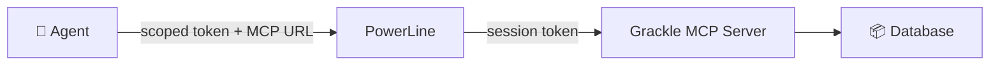

# MCP Server

Grackle exposes its full API as an **MCP (Model Context Protocol) server**. This means any AI agent with MCP support — Claude Desktop, Claude Code, or anything else — can create tasks, spawn sessions, and manage environments through Grackle.

## What it enables

With the MCP server, you can:

- Have Claude Code manage Grackle tasks without the CLI
- Build orchestration workflows where one agent controls others through Grackle
- Connect external AI tools to your Grackle instance

## Connecting to the MCP server

The MCP server starts automatically with `grackle serve` on port **7435**. Configure your AI tool to connect to it:

```json
{
  "mcpServers": {
    "grackle": {
      "type": "http",
      "url": "http://localhost:7435/mcp",
      "headers": {
        "Authorization": "Bearer <your-api-key>"
      }
    }
  }
}
```

For tools that support OAuth (like Claude Desktop), the MCP server handles the OAuth flow automatically — no manual API key configuration needed. The server advertises its OAuth metadata at `/.well-known/oauth-protected-resource/mcp`.

## Available tools

The MCP server exposes roughly 80 tools grouped by domain. Every tool is namespaced when an agent calls it — e.g. `task_create` is invoked as `mcp__grackle__task_create`. Tool group availability depends on which plugins are enabled.

### Environments

| Tool                         | Description                                                                              |
| ---------------------------- | ---------------------------------------------------------------------------------------- |
| `env_list`                   | List all environments with status                                                        |
| `env_add`                    | Register a new environment                                                               |
| `env_provision`              | Start and connect an environment                                                         |
| `env_stop`                   | Stop a running environment                                                               |
| `env_destroy`                | Permanently remove an environment                                                        |
| `env_remove`                 | Unregister an environment                                                                |
| `env_wake`                   | Restart a stopped environment                                                            |
| `env_list_docker_containers` | List running Docker containers an environment can attach to (Docker adapter attach mode) |

### Sessions

| Tool                 | Description                           |
| -------------------- | ------------------------------------- |
| `session_spawn`      | Start a new agent session             |
| `session_resume`     | Resume a terminated session           |
| `session_status`     | List sessions (filter by environment) |
| `session_kill`       | Terminate a running session           |
| `session_attach`     | Stream session events                 |
| `session_send_input` | Send input to a waiting session       |

### Tasks

| Tool            | Description                                                  |
| --------------- | ------------------------------------------------------------ |
| `task_list`     | List tasks (status / parent filters)                         |
| `task_search`   | Fuzzy search tasks by title/description, ranked by relevance |
| `task_create`   | Create a new task                                            |
| `task_show`     | Get full task details                                        |
| `task_update`   | Update task metadata                                         |
| `task_start`    | Start a task (spawns a session)                              |
| `task_complete` | Mark a task as complete                                      |
| `task_resume`   | Resume a paused task                                         |
| `task_delete`   | Delete a task                                                |

### Workspaces

| Tool                           | Description                                            |
| ------------------------------ | ------------------------------------------------------ |
| `workspace_list`               | List all workspaces                                    |
| `workspace_create`             | Create a new workspace                                 |
| `workspace_get`                | Get workspace details                                  |
| `workspace_update`             | Update workspace metadata                              |
| `workspace_archive`            | Archive a workspace                                    |
| `workspace_link_environment`   | Link an environment into the workspace's dispatch pool |
| `workspace_unlink_environment` | Remove a linked environment from the workspace pool    |

### Personas

| Tool             | Description                                              |
| ---------------- | -------------------------------------------------------- |
| `persona_list`   | List all personas                                        |
| `persona_create` | Create a new persona                                     |
| `persona_show`   | Get full persona details (system prompt, script, config) |
| `persona_edit`   | Update a persona                                         |
| `persona_delete` | Delete a persona                                         |

### Knowledge

| Tool                 | Description                                                                     | Parameters                                                   |
| -------------------- | ------------------------------------------------------------------------------- | ------------------------------------------------------------ |
| `knowledge_search`   | Natural-language semantic search over the knowledge graph, ranked by similarity | `query`, `limit?`, `workspaceId?`, `expand?`, `expandDepth?` |
| `knowledge_get_node` | Retrieve a knowledge node by ID, with its edges                                 | `id`, `expand?`, `expandDepth?`                              |

These tools come from the [knowledge graph plugin](./knowledge-graph), which is **enabled by default**. They are unavailable only if you explicitly disable the plugin (e.g. `plugin_set_enabled` or `GRACKLE_KNOWLEDGE_ENABLED=false`).

### Configuration

| Tool                         | Description                     |
| ---------------------------- | ------------------------------- |
| `config_get_default_persona` | Get the default persona setting |
| `config_set_default_persona` | Set the default persona         |

### Schedules

Scheduled triggers fire a persona on a cadence (interval shorthand like `5m`, or a 5-field cron expression like `0 9 * * MON`).

| Tool              | Description                                     | Parameters                                                                                  |
| ----------------- | ----------------------------------------------- | ------------------------------------------------------------------------------------------- |
| `schedule_list`   | List scheduled triggers                         | `workspaceId?`                                                                              |
| `schedule_create` | Create a scheduled trigger                      | `title`, `scheduleExpression`, `personaId`, `description?`, `workspaceId?`, `parentTaskId?` |
| `schedule_show`   | Get details of a schedule by ID                 | `scheduleId`                                                                                |
| `schedule_update` | Update a schedule (only provided fields change) | `scheduleId`, `title?`, `description?`, `scheduleExpression?`, `personaId?`, `enabled?`     |
| `schedule_delete` | Delete a schedule                               | `scheduleId`                                                                                |

### Escalations

Escalations let an agent ask the human for input; the message is routed to configured notification channels.

| Tool                     | Description                                       | Parameters                                    |
| ------------------------ | ------------------------------------------------- | --------------------------------------------- |
| `escalate_to_human`      | Escalate a question/decision to the human         | `message`, `urgency?` (`low`/`normal`/`high`) |
| `escalation_list`        | List recent escalations and their delivery status | `workspaceId?`, `status?`, `limit?`           |
| `escalation_acknowledge` | Mark an escalation as seen by the human           | `id`                                          |

### Workpad

A workpad is persistent structured context attached to a task — agents record what they accomplished before completing.

| Tool            | Description                                     | Parameters                              |
| --------------- | ----------------------------------------------- | --------------------------------------- |
| `workpad_write` | Write structured context to a task              | task content (defaults to current task) |
| `workpad_read`  | Read a task's workpad (current task or a child) | `taskId?`                               |

### Inter-agent IPC

These tools let an agent spawn child agents and coordinate with siblings/parents over named streams and pipes. They require **scoped auth** (i.e. they only work when called from inside a Grackle agent session, not from an external API-key client). File descriptors (`fd`) returned by `ipc_spawn`/`ipc_create_stream` identify a connection; `permission` is one of `r`/`w`/`rw` and `deliveryMode`/`pipe` is one of `sync`/`async`/`detach`.

| Tool                | Description                                                      | Parameters                                                    |
| ------------------- | ---------------------------------------------------------------- | ------------------------------------------------------------- |
| `ipc_spawn`         | Spawn a child agent with an optional IPC pipe                    | `prompt`, `environmentId`, `pipe?`, `personaId?`, `maxTurns?` |
| `ipc_write`         | Write a message to a child/stream via an open fd                 | `fd`, `message`                                               |
| `ipc_close`         | Close an fd (stops the child if it was the last fd)              | `fd`                                                          |
| `ipc_list_fds`      | List your open fds (close owned child fds before exiting)        | _(none)_                                                      |
| `ipc_terminate`     | Send a graceful SIGTERM to a child via its fd                    | `fd`                                                          |
| `ipc_list_streams`  | List active IPC streams with subscribers and buffer depth        | _(none)_                                                      |
| `ipc_create_stream` | Create a named stream; returns an `rw` fd                        | `name`, `selfEcho?`                                           |
| `ipc_attach`        | Grant another session access to a stream you hold                | `fd`, `targetSessionId`, `permission?`, `deliveryMode?`       |
| `ipc_share_stream`  | Share a stream with your parent (auto-discovers the parent pipe) | `fd?` or `streamName?`, `permission?`, `deliveryMode?`        |

### Components & widgets (MCP Apps)

These tools let an agent author and render generative UI (MCP Apps) inline in the chat — either one-off renders or reusable components persisted in the workspace registry. The default renderer is `grackle-react` (JSX); `mcp-app-html` renders raw HTML. Promoting a component via `component_promote` exposes it as a dynamic, per-workspace `render_<name>` tool whose input schema is the component's `propsSchema`.

| Tool                 | Description                                               | Parameters                                                                        |
| -------------------- | --------------------------------------------------------- | --------------------------------------------------------------------------------- |
| `component_register` | Persist a reusable component in the workspace registry    | `name`, `source`, `rendererKind?`, `description?`, `propsSchema?`, `workspaceId?` |
| `component_update`   | Update a registered component (bumps its version)         | `id`, `source?`, `name?`, `description?`, `propsSchema?`, `workspaceId?`          |
| `component_list`     | List components registered in the workspace               | `workspaceId?`                                                                    |
| `component_search`   | Search the registry (incl. Grackle built-ins) by keyword  | `query`, `limit?`, `workspaceId?`                                                 |
| `component_promote`  | Promote (or demote) a component to a `render_<name>` tool | `id?` or `name?`, `promoted?`, `workspaceId?`                                     |
| `component_render`   | Render a registered component by id/name with props       | `id?` or `name?`, `props?`, `workspaceId?`                                        |
| `component_show`     | Render a one-off React/JSX component (no persistence)     | `source`, `props?`, `workspaceId?`                                                |
| `widget_show`        | Render a one-off raw-HTML widget (no persistence)         | `body`, `props?`, `workspaceId?`                                                  |
| `show_hello_widget`  | Demo widget that echoes a message (MCP Apps sample)       | `message?`                                                                        |

In addition to the tools above, each **promoted** component contributes a dynamic `render_<name>` tool to that workspace's tool list, so any agent can render it by name with validated props.

### Credentials & tokens

| Tool                       | Description                                                    | Parameters          |
| -------------------------- | -------------------------------------------------------------- | ------------------- |
| `credential_provider_list` | List credential-provider auto-forwarding configuration         | _(none)_            |
| `credential_provider_set`  | Set a provider mode (`claude`/`github`/`copilot`/`codex`)      | provider, mode      |
| `token_list`               | List configured tokens (values are never returned)             | _(none)_            |
| `token_set`                | Set a token auto-forwarded to environments (encrypted at rest) | name, value, target |
| `token_delete`             | Delete a configured token by name                              | name                |

### Plugins

| Tool                 | Description                                                                                                               | Parameters    |
| -------------------- | ------------------------------------------------------------------------------------------------------------------------- | ------------- |
| `plugin_list`        | List known plugins with state (enabled/loaded/required)                                                                   | _(none)_      |
| `plugin_set_enabled` | Enable/disable a plugin (a **server restart is required** for the change to take effect; core plugins cannot be disabled) | name, enabled |

### Diagnostics

| Tool                 | Description                                                                        | Parameters |
| -------------------- | ---------------------------------------------------------------------------------- | ---------- |
| `usage_get`          | Aggregated token usage and USD cost for a session/task/tree/workspace/environment  | scope id   |
| `logs_get`           | Retrieve session logs (raw events, transcript, or live tail)                       | session id |
| `get_version_status` | Check whether a newer Grackle version is available (and whether running in Docker) | _(none)_   |

## MCP broker architecture

Grackle has two MCP endpoints that share the same tool codebase but differ in auth and scope:

### Global MCP server (port 7435)

The standalone MCP server you connect external tools to. Authenticates via API key or OAuth. Full access to all tools and all workspaces.

### PowerLine MCP broker (per-session)

When Grackle spawns an agent session, the server passes the agent a **scoped MCP URL and session token** via PowerLine. The agent connects to the central MCP server using this token rather than your API key:

- The agent gets a **session token** (not your API key) that identifies it
- Tool access is filtered by the agent's **persona** — a reviewer persona might only see read-only tools
- Task creation is automatically parented to the agent's own task
- `workspaceId` is injected automatically — no cross-workspace access

This is what enables the orchestrator pattern: an agent can create subtasks and monitor progress through MCP without seeing anything outside its scope.


```mermaid
graph LR
    A["🤖 Agent"] -->|scoped token + MCP URL| PL["PowerLine"]
    PL -->|session token| S["Grackle MCP Server"]
    S --> DB["📦 Database"]
```

### How agents see MCP tools

When an agent runs inside Grackle, the MCP server is automatically configured as an available tool source. The agent sees tools like `mcp__grackle__task_create` and `mcp__grackle__session_spawn` alongside its built-in tools.

This is what enables patterns like:

- An orchestrator agent that decomposes a task into subtasks using `task_create`
- A researcher agent that searches the knowledge graph for prior context
- A supervisor agent that monitors task status and provides feedback
