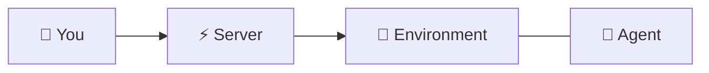
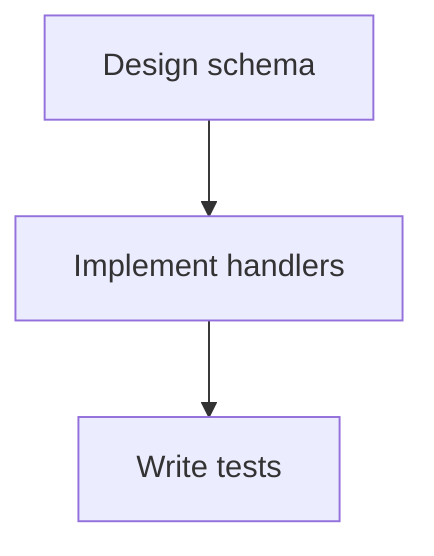
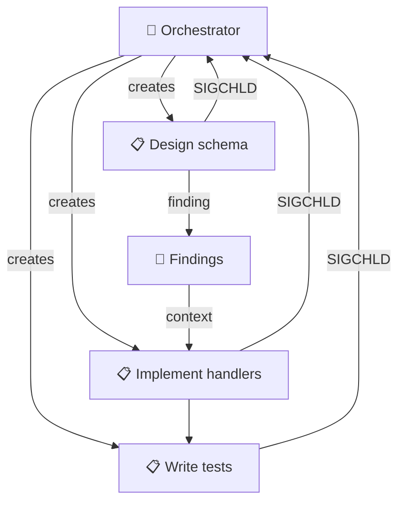

# Multi-Agent Orchestration

Grackle scales from a single agent on a single box to coordinated teams of agents working in parallel. You don't need to adopt everything at once — each layer builds on the last.

## Level 1: Remote control

The simplest use case. One environment, one agent, one session. You watch it work and send input when needed.

```bash
grackle env add my-env --docker
grackle env provision my-env
grackle spawn my-env "Fix the flaky test in auth.spec.ts"
```



No projects, no tasks, no orchestration. Just a session.

## Level 2: Structured tasks

Create a workspace and break work into tasks. Each task gets its own git branch, and you review the work before marking it complete.

```bash
grackle workspace create "API Redesign" --repo https://github.com/org/api --env my-env
grackle task create "Design new endpoint schema" --workspace api-redesign
grackle task create "Implement REST handlers" --workspace api-redesign --depends-on <schema-task-id>
grackle task create "Write integration tests" --workspace api-redesign --depends-on <handlers-task-id>
grackle task start <schema-task-id>
```



Agents work on one task at a time. Dependencies ensure tasks run in order. You review and approve each one.

## Level 3: Parallel agents

Add more environments and run multiple agents simultaneously. Each works on a different task, isolated in its own git worktree.

```bash
grackle env add docker-1 --docker
grackle env add docker-2 --docker
grackle env add docker-3 --docker

# Start multiple independent tasks in parallel
grackle task start <task-a> --env docker-1
grackle task start <task-b> --env docker-2
grackle task start <task-c> --env docker-3
```

Agents share context through **findings**. As one agent discovers something relevant, it posts a finding that other agents see when they start their next task.

## Level 4: Orchestrator pattern

Use a **parent task** with an orchestrator persona that decomposes work and coordinates child agents through MCP tools.

```bash
# Create an orchestrator persona
grackle persona create "Orchestrator" \
  --runtime claude-code \
  --model sonnet \
  --prompt "You are a technical project manager. Decompose the given task into subtasks, create them using MCP tools, and start them. Monitor progress and post findings to coordinate work."

# Create and start a root task
grackle task create "Implement OAuth2 support" --workspace <workspace-id>
grackle task start <root-task-id> --persona orchestrator
```

The orchestrator agent can:
1. Analyze the work and break it into subtasks using `task_create`
2. Post findings to share architectural decisions
3. Receive child completion notifications automatically (see [signals](#signals) below)
4. Review results and provide feedback



## Signals

Grackle uses kernel-style signals for process control across the task tree. These are automatic — you don't need to configure them.

### SIGCHLD — Child completion notification

When a child task finishes (success or failure), the parent's agent session automatically receives a notification with the child's title, status, and last message. The orchestrator doesn't need to poll — it gets woken up when there's something to react to.

### SIGTERM — Graceful shutdown

Requests an agent to stop gracefully. The agent has a chance to save state, post findings, and clean up before exiting.

```bash
grackle kill <session-id> --graceful
```

### Cascade kill

Kills a task and all of its descendants. The process group equivalent — when you kill an orchestrator, all its child tasks terminate too.

### Orphan adoption

If a parent task's session ends (crashes, times out, or is killed) while children are still running, the server re-parents the orphaned tasks to the workspace root. This is Grackle's version of init(1) adopting orphan processes.

### Session suspension (SIGSTOP/SIGCONT)

Sessions can be **suspended** — a transport-level recovery state where the agent's connection drops but the session is preserved on the server. When the connection is re-established, the agent picks up where it left off.

```bash
# Reconnect to a suspended session
grackle resume <session-id>
```

This is distinct from killing a session — a suspended session keeps its full conversation history and restarts from where it paused. It happens automatically on transport loss and can be triggered by the agent runtime itself.

### Escalation

When an agent can't proceed (needs human input, hit an error it can't resolve), it exits with a `needs_input` disposition. This triggers a chain:

1. Agent posts context to its workpad
2. Parent receives SIGCHLD with the `needs_input` status
3. Parent either handles it or also exits with `needs_input`
4. Chain flows up the task tree until it reaches a human
5. Human gets a notification (browser notification or webhook)

This composed pattern means escalation works at any depth without a dedicated escalation subsystem.

## Environment scheduling

When you start a task without specifying an environment, Grackle's **dispatch phase** automatically assigns it to an available environment based on:

- **Concurrency limits** — each environment has a maximum number of concurrent sessions
- **Environment resolution** — the task inherits its workspace's linked environment, or Grackle picks the best available one
- **Queue management** — tasks wait in a dispatch queue until an environment slot opens

This means at Level 3+, you can just create and start tasks without worrying about which environment runs them.

## Personas for specialization

Different tasks benefit from different agent configurations. Use personas to specialize:

| Persona | Purpose |
|---------|---------|
| **Orchestrator** | Decomposes work, coordinates agents |
| **Engineer** | Implements features, writes code |
| **Reviewer** | Reviews code, posts findings, doesn't modify files |
| **Researcher** | Explores codebase, documents patterns, reads only |

Each persona can have different runtimes, models, system prompts, and tool access. A reviewer persona might use `disallowedTools` to block write operations, while an engineer gets full access.

## Findings as coordination

Findings are the main mechanism for inter-agent knowledge sharing. Key patterns:

- **Seed findings** — Post architectural decisions and constraints before starting agents
- **Discovery findings** — Agents post observations as they work (bugs, patterns, dependencies)
- **Decision findings** — Record design choices so other agents know why something was done

Every agent that starts a task automatically receives recent findings in its system context, so it starts with the collective knowledge of all agents that came before it.

## Tips

- **Start simple.** Use Level 1-2 for a while before introducing orchestration.
- **Limit decomposition depth.** Deep task trees add coordination overhead. 2-3 levels is usually enough.
- **Use findings liberally.** They're cheap and solve most coordination problems.
- **Review intermediate results.** Don't let an orchestrator run unsupervised on critical work.
- **Match environments to workload.** Use Docker for isolation, local for speed, Codespaces for team access.
