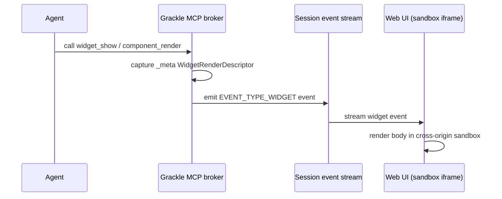

# MCP Apps & Widgets

Grackle lets an agent author and render **generative UI** — interactive widgets and
React components that show up inline in the chat, instead of plain text. This is
Grackle's implementation of **MCP Apps** (the Model Context Protocol's UI extension):
an agent calls a tool, the tool result carries a UI payload, and the Grackle web UI
renders it inside a sandboxed iframe.

A widget can be:

- A **one-off render** that exists only for a single message, or
- A **reusable component** persisted in the workspace registry and re-rendered with
  different data over time.

Two renderers are supported:

- **`grackle-react`** (the default) — the agent writes JSX that runs against Grackle's
  React component library and shared runtime.
- **`mcp-app-html`** — the agent writes raw HTML (it may include inline
  `<script>`/`<style>`).

The renderer is selected per component via `rendererKind`.

## How it works

When an agent runs inside a Grackle session, the MCP tools below are available. The
render path is:

1. **The agent calls a render tool** — e.g. `widget_show` (raw HTML),
   `component_show` (one-off JSX), or `component_render` (a registered component).
2. **The tool produces a render descriptor.** Each render tool attaches a
   `WidgetRenderDescriptor` to the tool result's `_meta`. The descriptor carries the body
   (HTML or JSX), props, the renderer kind, and CSP flags
   (`allowInlineScripts` / `allowUnsafeEval`).
3. **The broker captures the descriptor** and pushes a `widget` session event. The
   MCP server reads the `_meta` in-process and emits an event of type
   `EVENT_TYPE_WIDGET` into the session's event stream.
4. **The web UI renders it.** The event renderer dispatches `widget` events to the
   `McpAppWidget` component, which mounts the body inside a **cross-origin sandbox
   iframe**.

:::note Broker capture, not host rendering
The widget event is produced by Grackle's in-process **broker** when a scoped agent
session invokes a render tool — it does **not** depend on the agent's MCP client
preserving `_meta`. Broker capture only happens for scoped sessions (agents running
inside Grackle); it is a no-op for external API-key clients.
:::

## The component lifecycle

Reusable components flow through a register → discover → promote → render lifecycle.
The one-off tools (`widget_show`, `component_show`) skip the registry entirely.

1. **Register** — `component_register` persists a component (JSX or HTML) into the
   current workspace's registry, optionally with a `propsSchema` (JSON Schema)
   describing the data it accepts. Returns the component `id`.
2. **Discover** — `component_search` (keyword search over name + description, including
   Grackle's **built-in** components like Button/Callout/Spinner) and `component_list`
   let an agent find existing components to reuse before authoring a new one. Built-in
   results (`builtin: true`) are composed directly in JSX; registry results are rendered
   with `component_render`.
3. **Promote** (optional) — `component_promote` exposes a registered component as its
   own dynamic **`render_<name>`** MCP tool, whose input schema is the component's
   `propsSchema`. Promoted components appear in `tools/list` for the workspace, so any
   agent can render them by name with validated props. Pass `promoted: false` to demote.
4. **Render** — `component_render` resolves a registered component by `id` or `name`,
   validates `props` against the stored `propsSchema`, and emits the widget event.
   Updating a component with `component_update` bumps its `version`.

:::tip Search before authoring
Each component tool description nudges agents to call `component_search` first to find
an existing component (including Grackle built-ins) before writing a new one.
:::

### Dynamic `render_<name>` tools

Promotion is what turns a component into a first-class tool. The MCP server synthesizes
a `render_<name>` tool per promoted component for the caller's workspace, deriving its
input schema from the component's `propsSchema`. A component with no schema falls
back to a permissive object that accepts arbitrary keys. The dynamic dispatcher reuses
the same render descriptor path as `component_render`, so the two cannot drift. When a
component is promoted or demoted, the server emits `notifications/tools/list_changed` so
the workspace's tool list refreshes.

## Tool reference

The `workspaceId` parameter is **auto-injected** from the agent's scoped session context
when omitted, so an agent normally does not pass it.

| Tool                 | Description                                                                                     | Key parameters                                                                                  |
| -------------------- | ----------------------------------------------------------------------------------------------- | ----------------------------------------------------------------------------------------------- |
| `component_register` | Persist a reusable component into the workspace registry; returns its `id`.                     | `name`, `source` (JSX or HTML), `rendererKind?`, `description?`, `propsSchema?`, `workspaceId?` |
| `component_update`   | Update a registered component's source/name/description/schema; bumps `version`.                | `id`, `source?`, `name?`, `description?`, `propsSchema?`, `workspaceId?`                        |
| `component_list`     | List the components registered in the workspace.                                                | `workspaceId?`                                                                                  |
| `component_search`   | Keyword search over registry components **and** Grackle built-ins.                              | `query`, `limit?` (default 10), `workspaceId?`                                                  |
| `component_promote`  | Promote a component to a dynamic `render_<name>` tool (or demote it).                           | `id?` or `name?`, `promoted?` (default `true`), `workspaceId?`                                  |
| `component_render`   | Render a registered component by `id`/`name`; props validated against `propsSchema`.            | `id?` or `name?`, `props?`, `workspaceId?`                                                      |
| `component_show`     | Render a **one-off** React/JSX component against the Grackle library (no persistence).          | `source` (must call `render(<C {...props}/>)`), `props?`, `workspaceId?`                        |
| `widget_show`        | Render a **one-off** raw-HTML widget (no persistence). May include inline `<script>`/`<style>`. | `body`, `props?`, `workspaceId?`                                                                |
| `show_hello_widget`  | Demo MCP Apps widget that echoes a message back.                                                | `message?`                                                                                      |
| `render_<name>`      | Dynamic tool created by promoting a component; renders it with validated props.                 | the component's `propsSchema`                                                                   |

:::note Authoring JSX with `component_show` / `component_register`
For the `grackle-react` renderer, the `source` is JSX that must call
`render(<YourComponent {...props}/>)` (react-live no-inline mode). `React`, the
incoming `props`, and Grackle's component library are in scope.
:::

`show_hello_widget` is a static Grackle-served sample. Unlike the registry tools, it
carries a fixed `uiResourceUri` and is only listed to hosts that can render MCP Apps
widgets; the registry tools are plain tools (always listed to scoped agents) that
produce widgets dynamically via `_meta`.

## Configuration

Agent-authored HTML/JSX is **untrusted**. Grackle renders it inside a sandbox served
from a **separate origin** from the main web UI, so a malicious or buggy widget cannot
touch the host page, its cookies, or its session. The browser-facing widgets reference
this sandbox origin via their Content-Security-Policy.

### Sandbox port and origin

| Setting                              | Env var                  | `grackle serve` flag        | Default                                 |
| ------------------------------------ | ------------------------ | --------------------------- | --------------------------------------- |
| Sandbox port                         | `GRACKLE_SANDBOX_PORT`   | `--sandbox-port <port>`     | `7436`                                  |
| Sandbox origin (explicit)            | `GRACKLE_SANDBOX_ORIGIN` | `--sandbox-origin <origin>` | derived from page origin + sandbox port |
| MCP origin (widget asset/CSP origin) | `GRACKLE_MCP_ORIGIN`     | `--mcp-origin <origin>`     | derived from bind host + MCP port       |

- **`GRACKLE_SANDBOX_PORT`** (default `7436`) — the port for the separate origin used by
  the double-iframe widget sandbox.
- **`GRACKLE_SANDBOX_ORIGIN`** — set this explicitly when the web UI is behind a reverse
  proxy / TLS, where the scheme + port the browser must use for the sandbox cannot be
  inferred from the page origin plus the sandbox port (e.g. an HTTPS SPA but the sandbox
  on plain HTTP). When set, it takes precedence over the port.
- **`GRACKLE_MCP_ORIGIN`** — the browser-facing MCP origin used as the trusted asset/CSP
  origin for broker-captured widgets. Set this for reverse-proxy / TLS deployments where
  the loopback MCP origin is not browser-reachable; otherwise it is derived from the bind
  host plus the MCP port.

:::warning Why a separate origin matters
Because widget bodies are authored by agents, they must run with the privileges of an
_untrusted_ document. Serving them from a distinct origin (the sandbox) means the browser
enforces the same-origin policy between the widget and the Grackle host page. If the
sandbox shared the host origin, a widget's inline scripts could read the host's DOM and
session. Keep the sandbox origin distinct from the web UI origin in any deployment.
:::

If the web UI has no sandbox proxy URL configured, `widget` events degrade gracefully to
a plain text rendering of the event content rather than rendering the widget.

## See also

- [MCP Server](./mcp) — the full MCP tool catalog, including the Components & widgets
  group and how scoped sessions get filtered tool access.
