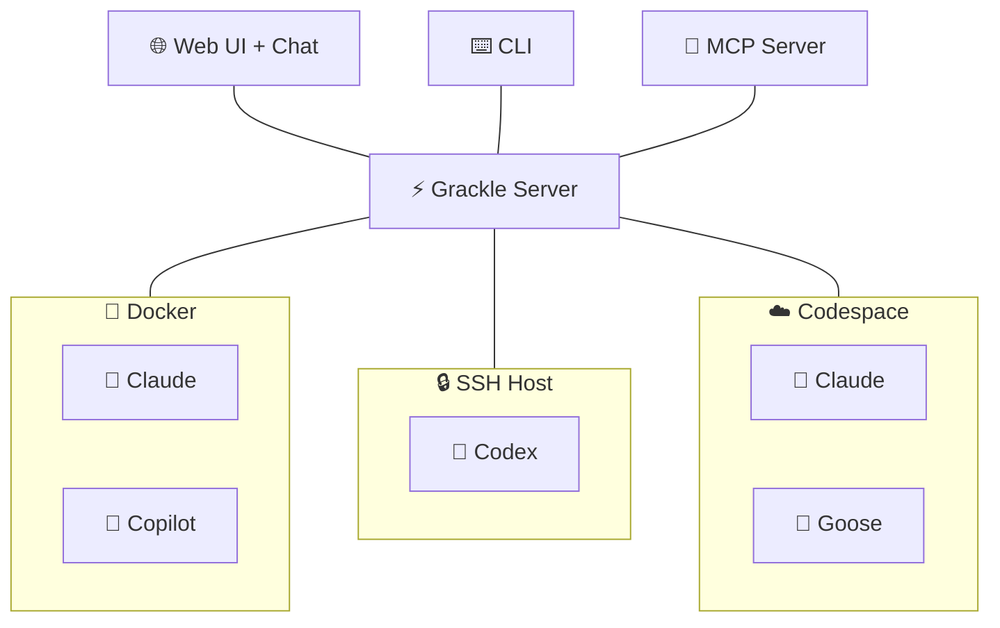

# Stop babysitting your AI agents

You have 6 agents running across 4 machines. You're tab-switching between terminals, copy-pasting context from one agent's output into another's prompt, and restarting dead sessions at 2 AM. Every agent has its own CLI, its own auth flow, its own way of crashing silently.

**Grackle is the control plane for AI coding agents.** Configure once, supervise by exception.

One platform to run [Claude Code](https://docs.anthropic.com/en/docs/agents-and-tools/claude-code/overview), [Copilot](https://github.com/features/copilot), [Codex](https://openai.com/index/codex/), or [Goose](https://block.github.io/goose/) on any environment — Docker, SSH, Codespaces, local. It handles provisioning, credentials, transport, and lifecycle. You get a CLI, web UI, and MCP server out of the box.

:::warning
Grackle is pre-1.0 and still experimental. It may have unresolved security issues, annoying bugs, and broken workflows. Not recommended for use in production systems.
:::

## What makes Grackle different

**Agent IPC** — Parent sessions spawn children with bidirectional pipes. Structured communication between agents — no polling, no shared files, no prompt-stuffing.

**Knowledge persistence** — A [semantic knowledge graph](./guides/knowledge-graph) backed by Neo4j. One agent's architectural insight becomes another agent's context automatically. Search by concept, not keyword.

**Session resilience** — Environments auto-reconnect on disconnect. Suspended sessions resume where they left off. Events buffer during outages and drain on reconnect. No lost work.

**Multi-vendor, one interface** — Swap runtimes per persona or per task. Your orchestration doesn't break when you switch from Claude to Codex or add Copilot as a second opinion.

**Plugin architecture** — The server is [composed of plugins](./guides/plugins) that you can toggle on and off. Run the full orchestration stack or strip down to a lightweight session manager.

## How it fits together

The **Grackle Server** is the control plane. It manages environments, sessions, tasks, and credentials. You interact with it through the **[chat interface](./guides/chat)**, **CLI**, **web UI**, or **[MCP server](./guides/mcp)**. Inside each environment, **[PowerLine](./concepts/powerline)** runs the actual agent and streams events back to the server.

## Features

| Feature | Description |
|---|---|
| **[Chat interface](./guides/chat)** | Natural language command interface — just describe what you want |
| **Real-time streaming** | Watch agent tool calls and output as they happen |
| **Git worktree isolation** | Every task gets its own branch — zero interference between agents |
| **[Knowledge graph](./guides/knowledge-graph)** | Semantic memory backed by Neo4j — agents share knowledge automatically |
| **[Findings](./concepts/findings)** | Categorized discoveries shared across agents within a workspace |
| **Multi-runtime** | Claude Code, Copilot, Codex, and Goose — swap freely |
| **[Task trees](./concepts/projects-tasks)** | Decompose work into parent/child subtasks up to 8 levels deep |
| **[Signals](./guides/orchestration#signals)** | SIGTERM, SIGCHLD, cascade kill, orphan adoption — kernel-style process control |
| **[Personas](./concepts/personas)** | Specialized agent configs with system prompts, tools, and model selection |
| **[Scheduled triggers](./guides/scheduled-triggers)** | Cron-style automated task creation |
| **[Plugin system](./guides/plugins)** | Compose server capabilities — orchestration, scheduling, knowledge graph |
| **[MCP server](./guides/mcp)** | Expose Grackle's full API as MCP tools for any AI agent |

## Scales from remote control to swarms

| Level | What you get | What you use |
|-------|-------------|-------------|
| **1. Remote control** | One agent, one environment, you watch it work | Sessions, environments |
| **2. Structured tasks** | Break work into tasks with branches and review gates | + Workspaces, tasks, personas |
| **3. Parallel agents** | Multiple agents working independently, sharing findings | + Multiple environments, findings |
| **4. Orchestrator pattern** | Parent agent decomposes work and coordinates child agents via MCP | + Task trees, MCP broker, signals |

You don't need to adopt everything at once. Each level builds on the last — see the [orchestration guide](./guides/orchestration) for details.

## Next steps

- **[Getting Started](./getting-started)** — Install Grackle and run your first agent in 5 minutes
- **[Credential Setup](./guides/credentials)** — Configure API keys for Claude, Copilot, Codex, and Goose
- **[Concepts](./concepts/environments)** — Understand environments, sessions, tasks, and the rest of the model
- **[Guides](./guides/web-ui)** — Web UI, orchestration, chat, plugins, and more
