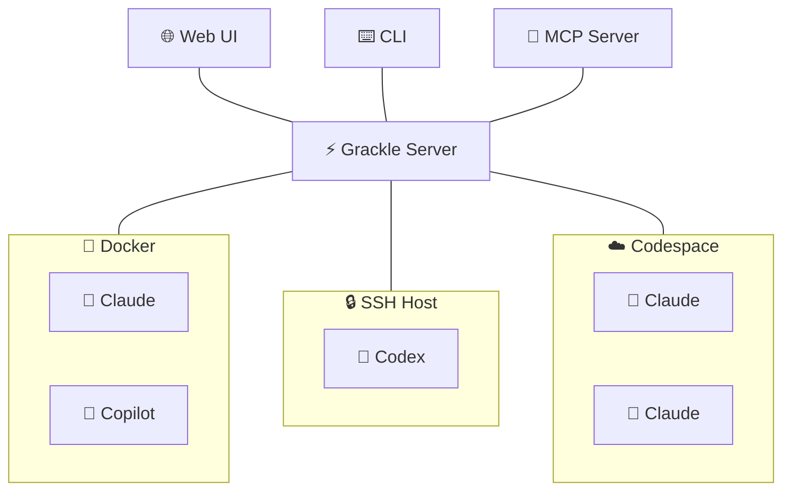

# Grackle

**Run any AI coding agent on any remote environment. Orchestration optional.**

You're running Claude Code on a devbox. Or Codex in a container. Or Copilot over SSH. You wrote a janky script to set it up, it breaks every week, and you can't share it with your team.

Grackle gives you a single platform to run any coding agent on any environment — Docker, SSH, Codespaces, whatever. It handles provisioning, credentials, transport, and lifecycle. You get a CLI, web UI, and MCP server out of the box.

Want agents to share knowledge? There's a findings system. Want one agent to spawn others? There's an MCP for that. Want task trees with dependencies and review gates? Same primitives. But you don't have to use any of that. **Start with one session on one box.**

:::warning
Grackle is pre-1.0 and still experimental. It may have unresolved security issues, annoying bugs, and broken workflows. Not recommended for use in production systems.
:::

## Philosophy

### Environments are just compute

Docker, local, SSH, and GitHub Codespaces — it shouldn't matter where an agent runs. Grackle treats environments as interchangeable compute behind a single protocol. Same interface, same results, regardless of where the work happens.

### Runtime agnostic by design

The agent loop landscape is wildly unstable. Claude Code, Copilot, Codex — whatever ships next month. Grackle wraps them all behind a standard interface so you can swap runtimes without changing your workflow. Your tooling shouldn't be coupled to whichever vendor is winning this quarter.

### Primitives, not opinions

Grackle doesn't tell you how to orchestrate your agents. It gives you the building blocks — sessions, tasks, findings, personas, an MCP control plane — and lets you compose them however you want. A single remote REPL session uses one primitive. A supervised swarm uses all of them. Same platform, same CLI, same MCP.

### Scales from remote control to swarms

Most tools force a choice: run one agent manually, or build a bespoke swarm framework from scratch. Grackle covers the whole spectrum — start simple, scale up.

## How it fits together

The **Grackle Server** is the control plane. It manages environments, sessions, tasks, and credentials. You interact with it through the **CLI**, **web UI**, or **MCP server**. Inside each environment, **PowerLine** runs the actual agent and streams events back to the server.

## Features

| Feature | Description |
|---|---|
| **Real-time streaming** | Watch agent tool calls and output as they happen |
| **Git worktree isolation** | Every task gets its own branch — zero interference between agents |
| **Findings** | Agents post discoveries that become context for other agents |
| **Multi-runtime** | Claude Code, Copilot, and Codex — swap freely |
| **Task trees** | Decompose work into parent/child subtasks up to 10 levels deep |
| **Task dependencies** | Blocked tasks wait for their dependencies to complete |
| **Personas** | Specialized agent configs with system prompts, tools, and model selection |
| **Session history** | Every task tracks its full session history — retry and compare |
| **Review & approval** | Approve or reject completed tasks with feedback |
| **MCP server** | Expose Grackle's full API as MCP tools for any AI agent |

## Next steps

- **[Getting Started](./getting-started)** — Install Grackle and run your first agent in 5 minutes
- **[Concepts](./concepts/environments)** — Understand environments, sessions, tasks, and the rest of the model
- **[Guides](./guides/auth)** — Practical guides for auth, orchestration, the web UI, and more
