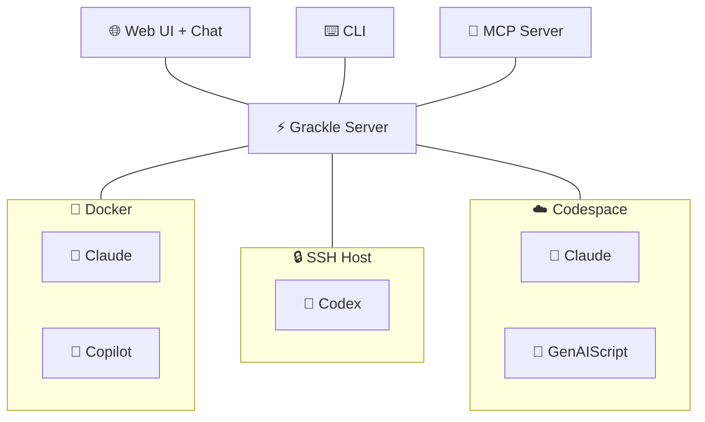

# A plague of grackles

That's the collective noun. Also what you get when you stop babysitting one agent in a terminal and start running many — each on its own wire, with its own key, leaving its own name in the log.

**Grackle is a self-hosted control plane for AI agents.** Spawn one and watch it work. Spawn a hundred and close the laptop. When one does something stupid at 3 AM, you know which one — not "the platform," not "your token," _that one_.

Run [Claude Code](https://docs.anthropic.com/en/docs/agents-and-tools/claude-code/overview), [Copilot](https://github.com/features/copilot), [Codex](https://openai.com/index/codex/), [GenAIScript](https://microsoft.github.io/genaiscript/), or any [ACP](https://agentclientprotocol.com/) agent — on Docker, an SSH box, a Codespace, or this machine. Grackle handles the provisioning, the credentials, the transport, the lifecycle. You get a CLI, a web UI, and an MCP server out of the box.

:::warning
Grackle is pre-1.0 and experimental. Unresolved security issues, sharp edges, broken workflows. Not for production.
:::

## What makes it different

**Agents talk to each other.** A parent session spawns children over real pipes — structured messages, not polling, not shared files, not prompt-stuffing.

**Knowledge persists.** A [semantic knowledge graph](./features/knowledge-graph) backed by Neo4j. One agent's insight becomes another's context, automatically. Search by concept, not keyword.

**Work survives the wire dropping.** Environments reconnect. Suspended sessions resume where they stopped. Events buffer through the outage and drain on return.

**One interface, every vendor.** Swap runtimes per persona or per task. Your orchestration doesn't break when you trade Claude for Codex or bring in Copilot for a second opinion.

**Not everything needs an LLM.** [Script personas](./advanced/scripting) run deterministic TypeScript — linters, formatters, analyzers — under the same session and task primitives as any agent.

## How it fits together

```mermaid
graph TD
    UI["🌐 Web UI + Chat"]
    CLI["⌨️ CLI"]
    MCP["🔌 MCP Server"]
    UI & CLI & MCP --- S["⚡ Grackle Server"]

    subgraph D1["🐳 Docker"]
        D1A["🤖 Claude"] & D1B["🤖 Copilot"]
    end

    subgraph SSH["🔒 SSH Host"]
        S1A["🤖 Codex"]
    end

    subgraph CS["☁️ Codespace"]
        CS1A["🤖 Claude"] & CS1B["🤖 GenAIScript"]
    end

    S --- D1 & SSH & CS
```

The **server** is the control plane — environments, sessions, tasks, credentials. You reach it through the [chat](./features/chat), the [CLI](./features/cli), the [web UI](./features/web-ui), or the [MCP server](./features/mcp-server). Inside each environment, [PowerLine](./architecture/powerline-ahp) is the wire: it runs the agent and streams every event back.

## Three ways to fly a plague

- **Alone.** Spawn one claw, give it a task, watch the stream. Same shape as your CLI agent — different hardware, different keys.
- **In formation.** Pre-wire a room, spawn several claws into it, kick off a task. Drop into the room mid-flight and your reply lands in their next turn.
- **Loose.** Wire a webhook and close the laptop. A claw fires on the trigger, works, and stops. When it hits something privileged, it asks before it acts.

You don't adopt all of it at once. Each builds on the last — see [Orchestration](./features/orchestration).

## Next

- **[Getting Started](./getting-started/installation)** — install Grackle and spawn your first claw in five minutes.
- **[Building Blocks](./building-blocks/environments-workspaces)** — environments, sessions, tasks, personas, and how they fit.
- **[Features](./features/web-ui)** — the web UI, the CLI, orchestration, coordination, and the rest.
- **[Architecture](./architecture/kernel)** — how the wire, the protocols, and the kernel actually work.
