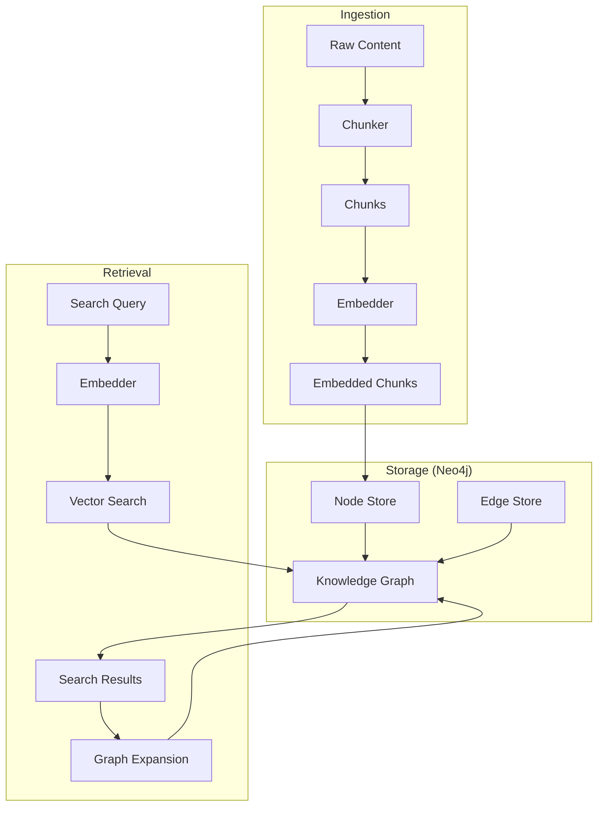

# @grackle-ai/knowledge-core

A domain-agnostic knowledge graph SDK built on [Neo4j](https://neo4j.com/). Provides pluggable text embedding, content chunking, an ingestion pipeline, node/edge CRUD, semantic vector search, and multi-hop graph traversal -- everything needed to build a knowledge graph with semantic search capabilities.

Part of the [Grackle](https://github.com/nick-pape/grackle) platform, where it powers the shared knowledge layer that lets AI agents build and query a persistent understanding of codebases, decisions, and context. However, `@grackle-ai/knowledge-core` is a standalone library with no dependency on the rest of Grackle -- you can use it in any Node.js application that needs a knowledge graph with vector search.

## Table of Contents

- [Installation](#installation)
- [Prerequisites](#prerequisites)
- [Quick Start](#quick-start)
- [Architecture Overview](#architecture-overview)
- [Key Concepts](#key-concepts)
  - [Node Kinds](#node-kinds)
  - [Edge Types](#edge-types)
  - [Workspace Scoping](#workspace-scoping)
- [API Reference](#api-reference)
  - [Connection Management](#connection-management)
  - [Schema Initialization](#schema-initialization)
  - [Embedders](#embedders)
  - [Chunkers](#chunkers)
  - [Ingestion Pipeline](#ingestion-pipeline)
  - [Node Operations](#node-operations)
  - [Edge Operations](#edge-operations)
  - [Semantic Search](#semantic-search)
  - [Graph Expansion](#graph-expansion)
  - [Listing Recent Nodes](#listing-recent-nodes)
  - [Type Guards](#type-guards)
  - [Logging](#logging)
- [Configuration](#configuration)
  - [Environment Variables](#environment-variables)
  - [Constants](#constants)
- [Custom Embedders and Chunkers](#custom-embedders-and-chunkers)
- [License](#license)

## Installation

```bash
npm install @grackle-ai/knowledge-core
```

Requires **Node.js >= 22**.

## Prerequisites

### Neo4j Database

This library requires a running [Neo4j](https://neo4j.com/) instance (version 5.x) with vector index support. The simplest way to run one locally is with Docker:

```bash
docker run -d \
  --name grackle-neo4j \
  -p 7474:7474 \
  -p 7687:7687 \
  -e NEO4J_AUTH=neo4j/grackle-dev \
  -v neo4j-data:/data \
  neo4j:5.25.1-community
```

This starts Neo4j with:

| Port | Protocol | Purpose |
|------|----------|---------|
| 7474 | HTTP | Neo4j Browser UI (visit `http://localhost:7474`) |
| 7687 | Bolt | Driver protocol (what this library connects to) |

The default credentials used by the library in development are `neo4j` / `grackle-dev`. In production, you **must** set the password via the `GRACKLE_NEO4J_PASSWORD` environment variable -- the library refuses to use the default password when `NODE_ENV=production`.

#### Docker Compose

If you are using Docker Compose, here is a service definition:

```yaml
services:
  neo4j:
    image: neo4j:5.25.1-community
    ports:
      - "7474:7474"
      - "7687:7687"
    environment:
      - NEO4J_AUTH=neo4j/grackle-dev
    volumes:
      - neo4j-data:/data
    healthcheck:
      test: ["CMD", "neo4j", "status"]
      interval: 10s
      timeout: 5s
      retries: 5
      start_period: 30s

volumes:
  neo4j-data:
```

#### Verifying Neo4j is Ready

After starting Neo4j, wait for it to become healthy before connecting. The health check above handles this in Docker Compose. For standalone Docker, you can poll:

```bash
# Wait until Neo4j responds to a status check
until docker exec grackle-neo4j neo4j status 2>/dev/null; do sleep 2; done
```

## Quick Start

```typescript
import {
  openNeo4j,
  closeNeo4j,
  initSchema,
  createLocalEmbedder,
  createPassThroughChunker,
  ingest,
  createNativeNode,
  knowledgeSearch,
  NATIVE_CATEGORY,
} from "@grackle-ai/knowledge-core";

// 1. Connect to Neo4j
await openNeo4j({ url: "bolt://127.0.0.1:7687" });

// 2. Initialize schema (idempotent -- safe to call on every startup)
await initSchema();

// 3. Create an embedder and chunker
const embedder = createLocalEmbedder();
const chunker = createPassThroughChunker();

// 4. Ingest some content (chunk + embed in one step)
const [embedded] = await ingest(
  "WebSocket reconnection uses exponential backoff with jitter",
  chunker,
  embedder,
);

// 5. Store the node in the graph
const nodeId = await createNativeNode({
  category: NATIVE_CATEGORY.INSIGHT,
  title: "WebSocket reconnection strategy",
  content: "WebSocket reconnection uses exponential backoff with jitter",
  tags: ["websocket", "networking"],
  embedding: embedded.vector,
  workspaceId: "",
});

// 6. Search the graph semantically
const results = await knowledgeSearch("how does reconnection work?", embedder, {
  limit: 5,
  minScore: 0.5,
});

for (const result of results) {
  console.log(`${result.score.toFixed(3)} - ${result.node.id}`);
}

// 7. Clean up
await closeNeo4j();
```

## Architecture Overview



The library is organized into three layers:

1. **Ingestion** -- Content is split into chunks by a `Chunker`, then each chunk is converted to a vector embedding by an `Embedder`. The `ingest()` pipeline composes these two steps.

2. **Storage** -- Nodes and edges are persisted in Neo4j. Nodes carry their embedding vectors, enabling vector similarity search via Neo4j's built-in vector index. Two node kinds exist: **reference nodes** (pointers to external entities) and **native nodes** (self-contained content).

3. **Retrieval** -- Semantic search embeds a query string and runs k-NN vector search against the Neo4j vector index. Results include similarity scores and immediate edges. Graph expansion traverses relationships from result nodes to discover connected context within N hops.

## Key Concepts

### Node Kinds

Every node in the knowledge graph is one of two kinds, forming a discriminated union:

#### Reference Nodes

A **reference node** points to an entity that lives elsewhere (e.g., a task in a relational database, a session log, a finding). It does not duplicate content -- it stores a `sourceType` and `sourceId` that identify the external entity, plus a `label` for display and an `embedding` for search.

```typescript
import { NODE_KIND, REFERENCE_SOURCE } from "@grackle-ai/knowledge-core";

// Built-in reference source types (you can use any string):
REFERENCE_SOURCE.TASK      // "task"
REFERENCE_SOURCE.SESSION   // "session"
REFERENCE_SOURCE.FINDING   // "finding"
REFERENCE_SOURCE.WORKSPACE // "workspace"

// Custom source types are fully supported:
const sourceType: string = "ado-work-item";  // any string works
```

**`ReferenceNode` properties:**

| Property | Type | Description |
|----------|------|-------------|
| `id` | `string` | UUID, auto-generated |
| `kind` | `"reference"` | Discriminator |
| `sourceType` | `string` | Entity type (e.g., `"task"`, `"finding"`, or any custom string) |
| `sourceId` | `string` | ID of the entity in the external system |
| `label` | `string` | Human-readable label (e.g., task title) |
| `embedding` | `number[]` | Dense vector for similarity search |
| `workspaceId` | `string` | Workspace scope (empty string = global) |
| `createdAt` | `string` | ISO 8601 timestamp, auto-generated |
| `updatedAt` | `string` | ISO 8601 timestamp, auto-maintained |

#### Native Nodes

A **native node** owns its content directly. It exists only in the knowledge graph and is suitable for insights, decisions, concepts, code snippets, or any freeform knowledge.

```typescript
import { NATIVE_CATEGORY } from "@grackle-ai/knowledge-core";

// Built-in native categories (you can use any string):
NATIVE_CATEGORY.DECISION  // "decision"
NATIVE_CATEGORY.INSIGHT   // "insight"
NATIVE_CATEGORY.CONCEPT   // "concept"
NATIVE_CATEGORY.SNIPPET   // "snippet"

// Custom categories are fully supported:
const category: string = "research-note";
```

**`NativeNode` properties:**

| Property | Type | Description |
|----------|------|-------------|
| `id` | `string` | UUID, auto-generated |
| `kind` | `"native"` | Discriminator |
| `category` | `string` | Subcategory (e.g., `"decision"`, `"insight"`, or any custom string) |
| `title` | `string` | Title or summary |
| `content` | `string` | Full content owned by this node |
| `tags` | `string[]` | Free-form tags for categorization |
| `embedding` | `number[]` | Dense vector for similarity search |
| `workspaceId` | `string` | Workspace scope (empty string = global) |
| `createdAt` | `string` | ISO 8601 timestamp, auto-generated |
| `updatedAt` | `string` | ISO 8601 timestamp, auto-maintained |

### Edge Types

Edges are directional typed relationships between nodes. Five relationship types are supported:

| Edge Type | Value | Semantics |
|-----------|-------|-----------|
| `EDGE_TYPE.RELATES_TO` | `"RELATES_TO"` | General association |
| `EDGE_TYPE.DEPENDS_ON` | `"DEPENDS_ON"` | Dependency relationship |
| `EDGE_TYPE.DERIVED_FROM` | `"DERIVED_FROM"` | One node was derived from another |
| `EDGE_TYPE.MENTIONS` | `"MENTIONS"` | One node references another |
| `EDGE_TYPE.PART_OF` | `"PART_OF"` | Containment / composition |

Edges can carry optional JSON metadata (e.g., a confidence score or a context snippet):

```typescript
import { createEdge, EDGE_TYPE } from "@grackle-ai/knowledge-core";

await createEdge(nodeA, nodeB, EDGE_TYPE.DEPENDS_ON, {
  confidence: 0.92,
  reason: "Identified in code review",
});
```

**`KnowledgeEdge` properties:**

| Property | Type | Description |
|----------|------|-------------|
| `fromId` | `string` | Source node ID |
| `toId` | `string` | Target node ID |
| `type` | `EdgeType` | Relationship type |
| `metadata` | `Record<string, unknown> \| undefined` | Optional JSON metadata |
| `createdAt` | `string` | ISO 8601 timestamp |

### Workspace Scoping

Every node has a `workspaceId` field. Setting it to a non-empty string scopes the node to that workspace. Setting it to an empty string (`""`) makes the node global. Search and listing operations accept an optional `workspaceId` filter to restrict results to a specific workspace.

## API Reference

### Connection Management

The library manages a **singleton Neo4j driver**. Call `openNeo4j()` once at application startup and `closeNeo4j()` on shutdown.

#### `openNeo4j(config?: Neo4jClientConfig): Promise<void>`

Open a connection to Neo4j. Reads configuration from environment variables first, then from the config parameter, then from built-in defaults. Idempotent -- returns silently if already connected.

```typescript
interface Neo4jClientConfig {
  /** Bolt URL (default: "bolt://127.0.0.1:7687") */
  url?: string;
  /** Username (default: "neo4j") */
  username?: string;
  /** Password (default: "grackle-dev"; REQUIRED in production) */
  password?: string;
  /** Database name (default: "neo4j") */
  database?: string;
}
```

Resolution order for each field: **environment variable > config parameter > default constant**.

| Field | Environment Variable | Default |
|-------|---------------------|---------|
| `url` | `GRACKLE_NEO4J_URL` | `bolt://127.0.0.1:7687` |
| `username` | `GRACKLE_NEO4J_USER` | `neo4j` |
| `password` | `GRACKLE_NEO4J_PASSWORD` | `grackle-dev` (dev only) |
| `database` | `GRACKLE_NEO4J_DATABASE` | `neo4j` |

**Production safety:** When `NODE_ENV=production`, the library throws if no explicit password is provided (via env var or config). The default development password is never used in production.

```typescript
// Minimal (uses all defaults):
await openNeo4j();

// Explicit config:
await openNeo4j({
  url: "bolt://my-neo4j-host:7687",
  username: "admin",
  password: "secure-password",
  database: "knowledge",
});
```

#### `closeNeo4j(): Promise<void>`

Gracefully close the Neo4j connection and release resources. Safe to call multiple times or when no connection is open. Waits for any in-flight initialization to settle before closing.

```typescript
await closeNeo4j();
```

#### `healthCheck(): Promise<boolean>`

Check Neo4j connectivity. Returns `true` if the connection is healthy, `false` otherwise (including when not initialized).

```typescript
const isHealthy = await healthCheck();
```

#### `getSession(): Session`

Get a Neo4j session for running queries. Sessions are lightweight and should be short-lived -- open one per logical unit of work and close it when done. Throws if `openNeo4j()` has not been called.

```typescript
const session = getSession();
try {
  const result = await session.run("MATCH (n) RETURN count(n) AS count");
  console.log(result.records[0].get("count"));
} finally {
  await session.close();
}
```

#### `getDriver(): Driver`

Get the raw Neo4j `Driver` instance. Prefer `getSession()` for most use cases. Use the driver directly only for `driver.executeQuery()` one-shot queries. Throws if `openNeo4j()` has not been called.

### Schema Initialization

#### `initSchema(): Promise<void>`

Initialize the Neo4j schema: constraints, property indexes, and the vector index. All statements use `IF NOT EXISTS` and are idempotent -- safe to call on every application startup. Must be called after `openNeo4j()`.

The following schema objects are created:

| Statement | Purpose |
|-----------|---------|
| `UNIQUE_NODE_ID` | Uniqueness constraint on `KnowledgeNode.id` |
| `INDEX_KIND` | Index on `kind` for efficient filtering by node type |
| `INDEX_WORKSPACE` | Index on `workspaceId` for scoped queries |
| `INDEX_SOURCE` | Composite index on `(sourceType, sourceId)` for reference lookups |
| `VECTOR_INDEX` | Vector index on `embedding` for cosine similarity search (1536 dimensions) |

```typescript
await openNeo4j();
await initSchema();
```

#### `SCHEMA_STATEMENTS: Record<string, string>`

The raw Cypher statements used by `initSchema()`, exported for inspection and testing.

### Embedders

An embedder converts text into dense vector embeddings for similarity search. The library ships with a local ONNX-based embedder and defines a pluggable `Embedder` interface so you can bring your own (e.g., OpenAI, Cohere).

#### `Embedder` Interface

```typescript
interface EmbeddingResult {
  /** The input text that was embedded. */
  text: string;
  /** The embedding vector. */
  vector: number[];
}

interface Embedder {
  /** Embed a single text string. */
  embed(text: string): Promise<EmbeddingResult>;
  /** Embed multiple texts in batch. */
  embedBatch(texts: string[]): Promise<EmbeddingResult[]>;
  /** Dimensionality of vectors produced by this embedder. */
  readonly dimensions: number;
}
```

#### `createLocalEmbedder(options?: EmbedderOptions): Embedder`

Create a local embedder that runs ONNX inference via `@huggingface/transformers`. Downloads and caches a HuggingFace model on first use, then runs inference locally on CPU -- **no API keys or external services required**.

The underlying pipeline is lazily initialized on the first call to `embed()` or `embedBatch()`, so construction is non-blocking.

```typescript
interface EmbedderOptions {
  /** HuggingFace model ID (default: "Xenova/all-MiniLM-L6-v2") */
  modelId?: string;
  /** Expected embedding dimensions (default: 384 for the default model) */
  dimensions?: number;
}
```

**Default model:** [`Xenova/all-MiniLM-L6-v2`](https://huggingface.co/Xenova/all-MiniLM-L6-v2) -- a small, fast, general-purpose English sentence embedding model that produces 384-dimensional vectors.

```typescript
// Use the default model:
const embedder = createLocalEmbedder();
console.log(embedder.dimensions); // 384

// Use a custom model:
const customEmbedder = createLocalEmbedder({
  modelId: "Xenova/bge-small-en-v1.5",
  dimensions: 384,
});
```

**Important:** The default local embedder produces 384-dimensional vectors, while the default Neo4j vector index schema created by `initSchema()` is configured for 1536 dimensions (see the `EMBEDDING_DIMENSIONS` constant in the library source). Because that constant is baked into the schema definition, downstream applications cannot realistically change it at runtime. If you use the local embedder, you should either:
- Use an embedding model that produces 1536-dimensional vectors so it matches the default schema created by `initSchema()`, or
- Skip `initSchema()` and create a custom Neo4j vector index whose dimensions match your embedder (for example, 384 for the default local model).

### Chunkers

A chunker splits content into smaller pieces suitable for embedding. The library ships with two chunkers and defines a pluggable `Chunker` interface.

#### `Chunker` Interface

```typescript
interface Chunk {
  /** The text content of this chunk. */
  text: string;
  /** Zero-based index within the source content. */
  index: number;
  /** Optional metadata carried through from the source. */
  metadata?: Record<string, unknown>;
}

interface Chunker {
  /** Split content into one or more chunks. */
  chunk(content: string, metadata?: Record<string, unknown>): Chunk[];
}
```

#### `createPassThroughChunker(): Chunker`

Create a chunker that returns the entire input as a single chunk unchanged. Suitable for short content (findings, decisions, insights) that does not need splitting.

```typescript
const chunker = createPassThroughChunker();
const chunks = chunker.chunk("A short insight about architecture.");
// => [{ text: "A short insight about architecture.", index: 0 }]
```

#### `createTranscriptChunker(options?: TranscriptChunkerOptions): Chunker`

Create a chunker that splits JSONL session transcripts by conversation turn. Designed for Grackle's session `stream.jsonl` logs, but usable with any JSONL content that follows the log entry format.

A "turn" starts at a `user_input` event and includes all subsequent events until the next `user_input`. Events before the first `user_input` are grouped into turn 0. Turns exceeding `maxChunkSize` are split into sub-chunks at line boundaries.

```typescript
interface TranscriptChunkerOptions {
  /** Max characters per chunk before splitting (default: 4000). */
  maxChunkSize?: number;
  /** Event types to skip (default: ["status", "signal", "usage", "system"]). */
  skipEventTypes?: string[];
}
```

Each chunk's `metadata` includes:

| Field | Type | Description |
|-------|------|-------------|
| `turnIndex` | `number` | Zero-based turn number |
| `timestampStart` | `string` | ISO 8601 timestamp of the first event in the turn |
| `timestampEnd` | `string` | ISO 8601 timestamp of the last event in the turn |
| `eventTypes` | `string[]` | Distinct event types present in the turn |

Events are rendered with human-readable labels: `user_input` becomes `"User:"`, `text` becomes `"Assistant:"`, `tool_use` becomes `"Tool:"`, `tool_result` becomes `"Result:"`, `error` becomes `"Error:"`, `finding` becomes `"Finding:"`, and `subtask_create` becomes `"Subtask:"`.

```typescript
const chunker = createTranscriptChunker({ maxChunkSize: 2000 });

const jsonl = [
  '{"session_id":"s1","type":"user_input","timestamp":"2026-01-01T10:00:00Z","content":"Fix the login bug"}',
  '{"session_id":"s1","type":"text","timestamp":"2026-01-01T10:00:05Z","content":"I found the issue in auth.ts..."}',
  '{"session_id":"s1","type":"user_input","timestamp":"2026-01-01T10:01:00Z","content":"Now write tests"}',
  '{"session_id":"s1","type":"text","timestamp":"2026-01-01T10:01:10Z","content":"Here are the test cases..."}',
].join("\n");

const chunks = chunker.chunk(jsonl, { sessionId: "s1" });
// => 2 chunks, one per conversation turn
```

### Ingestion Pipeline

#### `ingest(content, chunker, embedder, metadata?): Promise<EmbeddedChunk[]>`

Chunk content and embed each chunk in a single pipeline. This is the primary entry point for getting content into a form ready for storage.

```typescript
interface EmbeddedChunk extends Chunk {
  /** The embedding vector for this chunk's text. */
  vector: number[];
}
```

| Parameter | Type | Description |
|-----------|------|-------------|
| `content` | `string` | Raw text content to ingest |
| `chunker` | `Chunker` | Splits content into chunks |
| `embedder` | `Embedder` | Produces embedding vectors |
| `metadata` | `Record<string, unknown>` | Optional metadata passed to the chunker |

Returns an array of chunks, each augmented with its embedding vector. Returns an empty array if the chunker produces no chunks.

```typescript
const embedder = createLocalEmbedder();
const chunker = createPassThroughChunker();

const embeddedChunks = await ingest(
  "We decided to use Neo4j for the knowledge graph because of its native vector index support.",
  chunker,
  embedder,
  { source: "architecture-decision" },
);

// Each chunk now has a .vector property ready for createNativeNode() or createReferenceNode()
for (const chunk of embeddedChunks) {
  await createNativeNode({
    category: "decision",
    title: "Use Neo4j for knowledge graph",
    content: chunk.text,
    tags: ["architecture", "database"],
    embedding: chunk.vector,
    workspaceId: "my-workspace",
  });
}
```

### Node Operations

All node operations use short-lived Neo4j sessions that are automatically closed after each operation.

#### `createReferenceNode(input: CreateReferenceNodeInput): Promise<string>`

Create a reference node. Generates a UUID and timestamps automatically. Returns the new node's ID.

```typescript
interface CreateReferenceNodeInput {
  sourceType: string;   // e.g., "task", "finding", or any custom type
  sourceId: string;     // ID in the external system
  label: string;        // Human-readable label
  embedding: number[];  // Vector embedding
  workspaceId: string;  // Workspace scope ("" = global)
}
```

```typescript
const nodeId = await createReferenceNode({
  sourceType: REFERENCE_SOURCE.TASK,
  sourceId: "task-42",
  label: "Fix authentication middleware",
  embedding: (await embedder.embed("Fix authentication middleware")).vector,
  workspaceId: "workspace-1",
});
```

#### `createNativeNode(input: CreateNativeNodeInput): Promise<string>`

Create a native node. Generates a UUID and timestamps automatically. Returns the new node's ID.

```typescript
interface CreateNativeNodeInput {
  category: string;     // e.g., "decision", "insight", or any custom category
  title: string;        // Title or summary
  content: string;      // Full content
  tags: string[];       // Free-form tags
  embedding: number[];  // Vector embedding
  workspaceId: string;  // Workspace scope ("" = global)
}
```

```typescript
const nodeId = await createNativeNode({
  category: NATIVE_CATEGORY.DECISION,
  title: "Use Neo4j for knowledge graph",
  content: "We chose Neo4j because of native vector index support and Cypher query language.",
  tags: ["architecture", "database"],
  embedding: (await embedder.embed("Use Neo4j for knowledge graph")).vector,
  workspaceId: "",
});
```

#### `getNode(id: string): Promise<NodeWithEdges | undefined>`

Get a node by ID, including all its edges (both incoming and outgoing). Returns `undefined` if the node does not exist.

```typescript
interface NodeWithEdges {
  node: KnowledgeNode;      // The node (ReferenceNode | NativeNode)
  edges: KnowledgeEdge[];   // All connected edges
}
```

```typescript
const result = await getNode("some-uuid");
if (result) {
  console.log(result.node.kind);  // "reference" or "native"
  console.log(result.edges.length);
}
```

#### `updateNode(id: string, updates: UpdateNodeInput): Promise<KnowledgeNode | undefined>`

Update a node's mutable properties. Cannot change `kind`, `id`, `createdAt`, or `workspaceId`. Automatically updates the `updatedAt` timestamp. Returns the updated node, or `undefined` if the node was not found.

```typescript
// For reference nodes:
interface UpdateReferenceNodeInput {
  label?: string;
  sourceId?: string;
  embedding?: number[];
}

// For native nodes:
interface UpdateNativeNodeInput {
  title?: string;
  content?: string;
  tags?: string[];
  embedding?: number[];
}
```

```typescript
const updated = await updateNode("some-uuid", {
  title: "Updated title",
  tags: ["new-tag"],
});
```

#### `deleteNode(id: string): Promise<boolean>`

Delete a node and all its edges (`DETACH DELETE`). Returns `true` if a node was deleted, `false` if the node was not found.

```typescript
const wasDeleted = await deleteNode("some-uuid");
```

#### `recordToNode(properties: Record<string, unknown>): KnowledgeNode`

Convert raw Neo4j node properties to a typed `KnowledgeNode`. Handles the discriminated union based on the `kind` property. Useful when running custom Cypher queries.

#### `recordToEdge(raw: Record<string, unknown>): KnowledgeEdge`

Convert a raw edge object from Cypher results to a typed `KnowledgeEdge`. Parses JSON metadata. Useful when running custom Cypher queries.

### Edge Operations

#### `createEdge(fromId, toId, type, metadata?): Promise<KnowledgeEdge>`

Create a directed, typed edge between two nodes.

| Parameter | Type | Description |
|-----------|------|-------------|
| `fromId` | `string` | Source node ID |
| `toId` | `string` | Target node ID |
| `type` | `EdgeType` | One of `RELATES_TO`, `DEPENDS_ON`, `DERIVED_FROM`, `MENTIONS`, `PART_OF` |
| `metadata` | `Record<string, unknown>` | Optional metadata stored as JSON on the relationship |

Throws if either node does not exist or if the edge type is invalid.

```typescript
const edge = await createEdge(
  nodeIdA,
  nodeIdB,
  EDGE_TYPE.DERIVED_FROM,
  { confidence: 0.95 },
);
```

#### `removeEdge(fromId, toId, type): Promise<boolean>`

Remove a directed edge between two nodes. Returns `true` if an edge was removed, `false` if no matching edge existed. Throws if the edge type is invalid.

```typescript
const wasRemoved = await removeEdge(nodeIdA, nodeIdB, EDGE_TYPE.DERIVED_FROM);
```

### Semantic Search

#### `knowledgeSearch(query, embedder, options?): Promise<SearchResult[]>`

Search the knowledge graph by semantic similarity. Embeds the query text, runs k-NN vector search against Neo4j's vector index, and returns ranked results with similarity scores and immediate edges.

```typescript
interface SearchOptions {
  /** Max results to return (default: 10). */
  limit?: number;
  /** Filter to specific node kinds ("reference", "native", or both). */
  nodeKinds?: NodeKind[];
  /** Minimum similarity score threshold (default: 0). */
  minScore?: number;
  /** Filter to a specific workspace. */
  workspaceId?: string;
}

interface SearchResult {
  /** The matched node. */
  node: KnowledgeNode;
  /** Cosine similarity score (0-1). */
  score: number;
  /** Edges connected to this node. */
  edges: KnowledgeEdge[];
}
```

When filters (`nodeKinds`, `workspaceId`) are applied, the library automatically over-fetches candidates (3x the limit) to compensate for post-filtering, ensuring you still get enough results.

```typescript
// Basic search
const results = await knowledgeSearch("authentication middleware", embedder);

// Filtered search
const results = await knowledgeSearch("authentication", embedder, {
  limit: 5,
  minScore: 0.7,
  nodeKinds: ["native"],
  workspaceId: "workspace-1",
});

for (const { node, score, edges } of results) {
  console.log(`[${score.toFixed(3)}] ${node.id}`);
  if (node.kind === "native") {
    console.log(`  Title: ${node.title}`);
  }
  console.log(`  Edges: ${edges.length}`);
}
```

### Graph Expansion

Graph expansion traverses relationships from a starting node to discover connected context. This is useful for enriching search results with related knowledge.

#### `expandNode(nodeId, options?): Promise<ExpansionResult>`

Expand a single node: return its neighbors within N hops.

```typescript
interface ExpandOptions {
  /** Max traversal depth (default: 1). */
  depth?: number;
  /** Only follow edges of these types. If empty/undefined, follow all. */
  edgeTypes?: EdgeType[];
}

interface ExpansionResult {
  /** All neighbor nodes found (deduplicated), excluding the start node. */
  nodes: KnowledgeNode[];
  /** All edges traversed. */
  edges: KnowledgeEdge[];
}
```

```typescript
// Get immediate neighbors
const { nodes, edges } = await expandNode("some-uuid");

// Multi-hop expansion, following only specific edge types
const { nodes, edges } = await expandNode("some-uuid", {
  depth: 3,
  edgeTypes: [EDGE_TYPE.DEPENDS_ON, EDGE_TYPE.PART_OF],
});
```

#### `expandResults(results, options?): Promise<ExpansionResult>`

Expand all nodes from search results and merge the subgraphs. Runs `expandNode()` for each search result and deduplicates nodes and edges. The original search result nodes are excluded from the neighbor list.

```typescript
const searchResults = await knowledgeSearch("authentication", embedder);
const { nodes: neighbors, edges } = await expandResults(searchResults, { depth: 2 });

// neighbors contains nodes connected to the search results (but not the results themselves)
```

### Listing Recent Nodes

#### `listRecentNodes(limit?, workspaceId?): Promise<RecentNodesResult>`

List the most recently updated knowledge graph nodes. Returns nodes ordered by `updatedAt` descending, along with all edges between the returned nodes. Used by explorer/dashboard UIs.

```typescript
interface RecentNodesResult {
  /** The most recently updated nodes. */
  nodes: KnowledgeNode[];
  /** All edges between the returned nodes. */
  edges: KnowledgeEdge[];
}
```

| Parameter | Type | Default | Description |
|-----------|------|---------|-------------|
| `limit` | `number` | `20` | Maximum number of nodes to return |
| `workspaceId` | `string` | `undefined` | Optional workspace filter |

```typescript
// Global recent nodes
const { nodes, edges } = await listRecentNodes(10);

// Workspace-scoped recent nodes
const { nodes, edges } = await listRecentNodes(20, "workspace-1");
```

### Type Guards

#### `isReferenceNode(node: KnowledgeNode): node is ReferenceNode`

Returns `true` if the node is a reference node. Narrows the type for TypeScript.

#### `isNativeNode(node: KnowledgeNode): node is NativeNode`

Returns `true` if the node is a native node. Narrows the type for TypeScript.

```typescript
import { isReferenceNode, isNativeNode } from "@grackle-ai/knowledge-core";

const result = await getNode("some-uuid");
if (result) {
  if (isReferenceNode(result.node)) {
    console.log(result.node.sourceType, result.node.sourceId);
  }
  if (isNativeNode(result.node)) {
    console.log(result.node.title, result.node.content);
  }
}
```

### Logging

The library uses [pino](https://getpino.io/) for structured logging. The logger instance is exported if you need to adjust settings or pipe logs.

```typescript
import { logger } from "@grackle-ai/knowledge-core";

// Logger name: "grackle-knowledge"
// Default level: "info" (override with LOG_LEVEL env var)
```

## Configuration

### Environment Variables

| Variable | Purpose | Default |
|----------|---------|---------|
| `GRACKLE_NEO4J_URL` | Neo4j Bolt connection URL | `bolt://127.0.0.1:7687` |
| `GRACKLE_NEO4J_USER` | Neo4j username | `neo4j` |
| `GRACKLE_NEO4J_PASSWORD` | Neo4j password (**required** in production) | `grackle-dev` |
| `GRACKLE_NEO4J_DATABASE` | Neo4j database name | `neo4j` |
| `NODE_ENV` | When `"production"`, requires explicit password | -- |
| `LOG_LEVEL` | Pino log level (`trace`, `debug`, `info`, `warn`, `error`, `fatal`) | `info` |

### Constants

These are exported for reference and customization. They control the Neo4j connection pool and the vector index configuration.

| Constant | Value | Description |
|----------|-------|-------------|
| `DEFAULT_NEO4J_URL` | `"bolt://127.0.0.1:7687"` | Default Bolt URL |
| `DEFAULT_NEO4J_USER` | `"neo4j"` | Default username |
| `DEFAULT_NEO4J_DATABASE` | `"neo4j"` | Default database name |
| `NEO4J_MAX_POOL_SIZE` | `50` | Max connections in the Neo4j driver pool |
| `NEO4J_CONNECTION_ACQUISITION_TIMEOUT` | `30000` | Timeout (ms) for acquiring a pool connection |
| `NODE_LABEL` | `"KnowledgeNode"` | Neo4j label applied to all knowledge graph nodes |
| `VECTOR_INDEX_NAME` | `"knowledge_embedding_index"` | Name of the vector index |
| `EMBEDDING_DIMENSIONS` | `1536` | Dimensionality of the vector index |
| `VECTOR_SIMILARITY_FUNCTION` | `"cosine"` | Similarity function used by the vector index |

## Custom Embedders and Chunkers

The `Embedder` and `Chunker` interfaces are intentionally minimal so you can plug in any implementation.

### Custom Embedder Example (OpenAI)

```typescript
import type { Embedder, EmbeddingResult } from "@grackle-ai/knowledge-core";

function createOpenAIEmbedder(apiKey: string): Embedder {
  return {
    dimensions: 1536,

    async embed(text: string): Promise<EmbeddingResult> {
      const response = await fetch("https://api.openai.com/v1/embeddings", {
        method: "POST",
        headers: {
          Authorization: `Bearer ${apiKey}`,
          "Content-Type": "application/json",
        },
        body: JSON.stringify({
          model: "text-embedding-3-small",
          input: text,
        }),
      });
      const data = await response.json();
      return { text, vector: data.data[0].embedding };
    },

    async embedBatch(texts: string[]): Promise<EmbeddingResult[]> {
      const response = await fetch("https://api.openai.com/v1/embeddings", {
        method: "POST",
        headers: {
          Authorization: `Bearer ${apiKey}`,
          "Content-Type": "application/json",
        },
        body: JSON.stringify({
          model: "text-embedding-3-small",
          input: texts,
        }),
      });
      const data = await response.json();
      return data.data.map((d: { embedding: number[] }, i: number) => ({
        text: texts[i],
        vector: d.embedding,
      }));
    },
  };
}
```

### Custom Chunker Example (Fixed-Size)

```typescript
import type { Chunker, Chunk } from "@grackle-ai/knowledge-core";

function createFixedSizeChunker(maxChars: number = 1000): Chunker {
  return {
    chunk(content: string, metadata?: Record<string, unknown>): Chunk[] {
      const chunks: Chunk[] = [];
      for (let i = 0; i < content.length; i += maxChars) {
        chunks.push({
          text: content.slice(i, i + maxChars),
          index: chunks.length,
          metadata,
        });
      }
      return chunks.length > 0 ? chunks : [{ text: content, index: 0, metadata }];
    },
  };
}
```

## License

MIT
