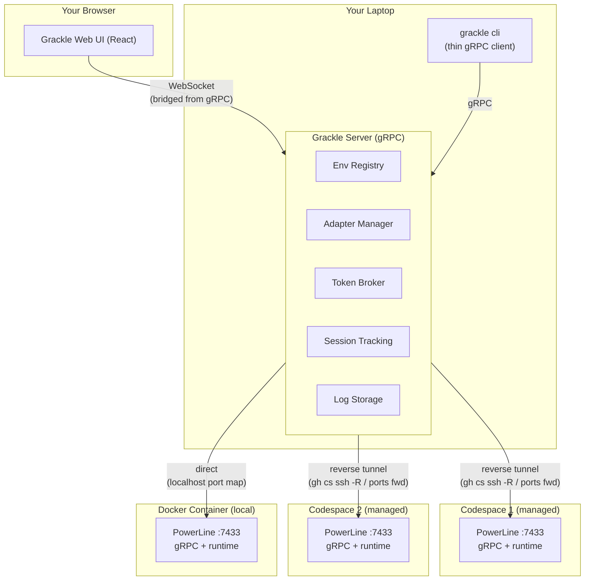
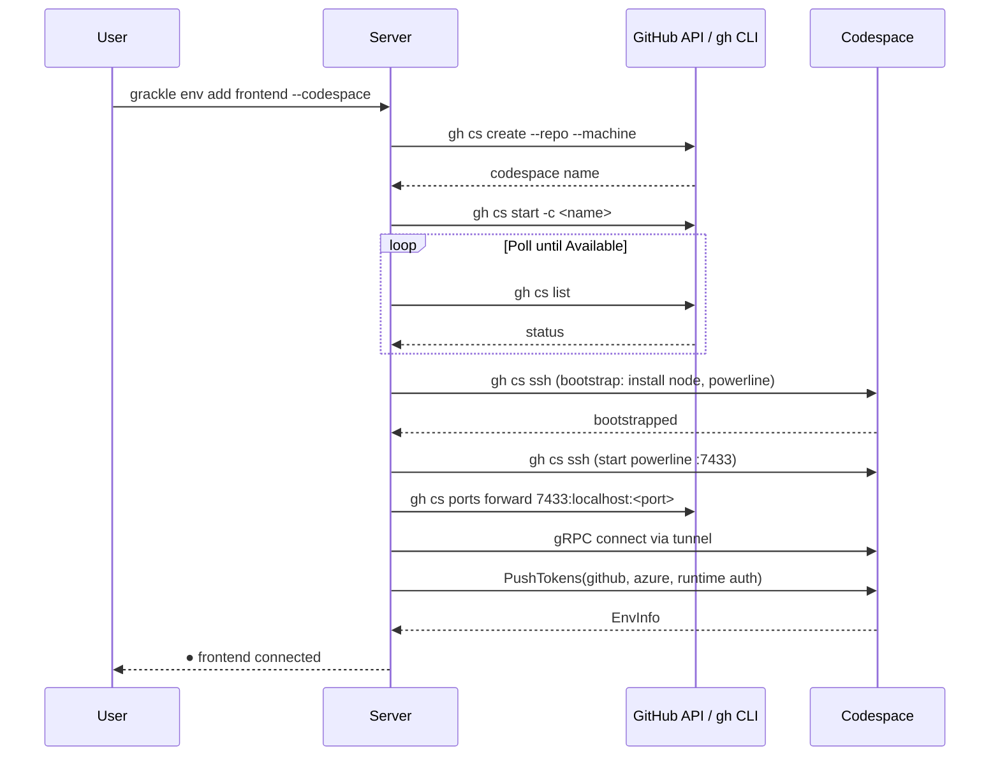
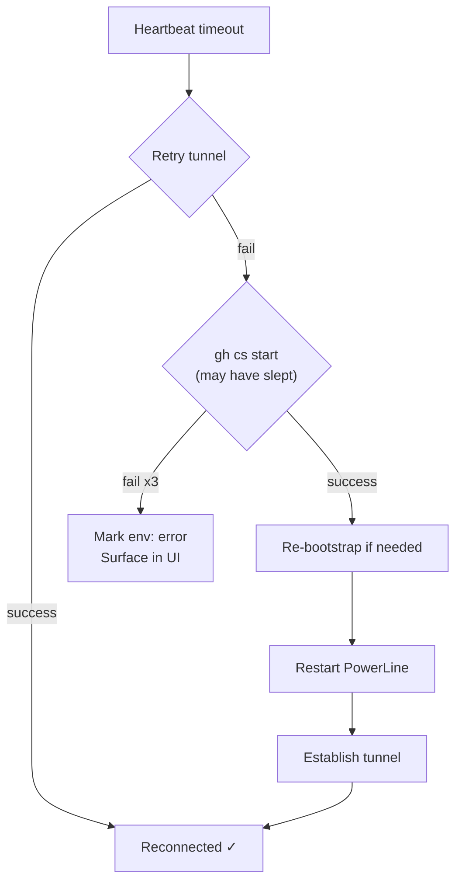
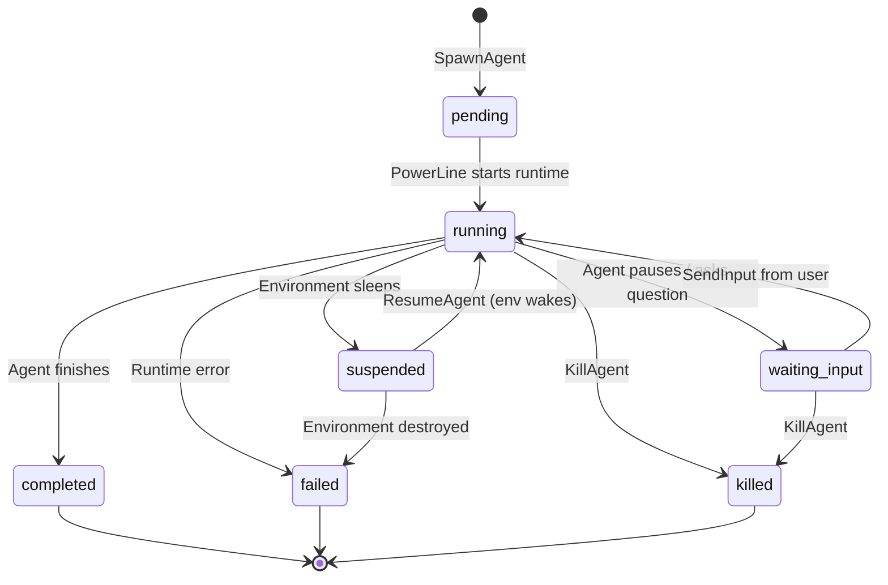

# Grackle V0 Spec

**Goal:** Stop opening 4 full VS Code windows just to type into AI coding agent terminals.
**What it is:** A multiplexed interface for managing AI coding agent sessions across remote environments, with a proxy/provisioning layer that handles connectivity and auth token brokering. Agent runtime is pluggable — Claude Code Agent SDK is the default, but the design supports swapping to Vercel AI SDK, Copilot CLI, or a custom agent loop.

> **Note on types and interfaces:** All types, message shapes, and protocol definitions in this document are illustrative, not final. They will need code review and iteration during implementation.

---

## The Problem

1. Each codespace requires a full VS Code window just to interact with your coding agent
2. MCPs and CLIs inside codespaces try to open a browser for auth (device token flow, `az login` with `CODESPACES=false`, etc.) — there's no browser to open
3. No unified view of what's running where
4. No way to interact from mobile/tablet
5. No audit trail of what agents actually did

## V0 Scope (and nothing more)

- **PowerLine**: Lightweight process that runs on each remote environment, wraps an agent runtime via a pluggable adapter, exposes a gRPC service
- **Server**: Central gRPC server on your local machine. Connects to all PowerLines, provisions environments, brokers auth tokens, serves a web UI
- **Web UI**: See all connected environments, stream agent sessions (like watching a terminal), type input, kill agents
- **CLI**: Thin gRPC client. Same capabilities as the web UI but from your terminal
- **Token broker**: Auth tokens (GitHub, Azure, agent runtime keys, etc.) managed centrally and pushed to environments on provisioning/connection — MCPs and CLIs never need to open a browser
- **Adapters**: Pluggable connection adapters for different environment types (codespace, docker container, SSH host, etc.)

### Explicitly NOT in V0

- Task DAG / scheduler / supervisor agent
- Knowledge graph / shared state
- Smart tool layer (smart_read, claim_mutex, etc.)
- AI-powered routing or decomposition
- Multi-agent coordination on same project
- Budget tracking / cost management

---

## Architecture



---

## gRPC-First Design

Everything is gRPC. The server exposes a single gRPC service. The web UI, the CLI, and potentially future tools are all clients of this service. Communication with PowerLines is also gRPC.

This means:
- **CLI** is a thin package that just calls gRPC methods. No business logic.
- **Web UI** connects via WebSocket (grpc-web or a WS bridge from the server), but the server-side is gRPC throughout.
- **PowerLine** exposes a gRPC service. Server is a gRPC client of each PowerLine.
- Adding a new client (Raycast extension, VS Code extension, Shortcuts automation) = just another gRPC client.

### Server Service (what clients call)

```protobuf
// Illustrative — will evolve during implementation

service Grackle {
  // Environment management
  rpc ListEnvironments(Empty) returns (EnvironmentList);
  rpc AddEnvironment(AddEnvRequest) returns (Environment);
  rpc RemoveEnvironment(EnvId) returns (Empty);
  rpc ProvisionEnvironment(EnvId) returns (stream ProvisionEvent);
  rpc StopEnvironment(EnvId) returns (Empty);
  rpc DestroyEnvironment(EnvId) returns (Empty);

  // Agent sessions
  rpc SpawnAgent(SpawnRequest) returns (Session);       // rejects if env already has active session (V0)
  rpc ResumeAgent(ResumeRequest) returns (Session);     // resume suspended session after env wake
  rpc SendInput(InputMessage) returns (Empty);           // only when agent is paused/waiting
  rpc KillAgent(SessionId) returns (Empty);
  rpc ListSessions(SessionFilter) returns (SessionList);

  // SpawnRequest includes: env_id, prompt, model, max_turns, runtime (default from env)

  // Streaming — the core of the UI experience
  rpc StreamSession(SessionId) returns (stream SessionEvent);
  rpc StreamAll(Empty) returns (stream SessionEvent);

  // Token management
  rpc SetToken(TokenEntry) returns (Empty);
  rpc ListTokens(Empty) returns (TokenList);  // names + expiry, not values
}
```

### PowerLine Service (what the server calls on each environment)

```protobuf
service GracklePowerLine {
  rpc GetInfo(Empty) returns (EnvInfo);
  rpc Spawn(SpawnRequest) returns (stream AgentEvent);       // SpawnRequest includes runtime
  rpc Resume(ResumeRequest) returns (stream AgentEvent);    // resume by runtime-native session ID
  rpc SendInput(InputMessage) returns (Empty);
  rpc Kill(SessionId) returns (Empty);
  rpc ListSessions(Empty) returns (SessionList);
  rpc Ping(Empty) returns (Pong);

  // Token injection
  rpc PushTokens(TokenBundle) returns (Empty);
}
```

---

## Connection Adapters

Environments are connected via pluggable adapters. Each adapter knows how to provision, connect, and teardown its environment type. Adding a new environment type = implement one adapter.

```typescript
// Illustrative adapter interface

interface EnvironmentAdapter {
  type: string;  // 'codespace' | 'docker' | 'ssh' | ...

  provision(config: AdapterConfig): AsyncGenerator<ProvisionEvent>;
  connect(config: AdapterConfig): Promise<GrpcConnection>;
  disconnect(envId: string): Promise<void>;
  stop(config: AdapterConfig): Promise<void>;
  destroy(config: AdapterConfig): Promise<void>;
  healthCheck(connection: GrpcConnection): Promise<boolean>;
}
```

### Codespace Adapter

Grackle owns the full lifecycle. You never log into the codespace.

**Provision flow:**


1. `gh cs create --repo <repo> --machine <machine>` (if doesn't exist)
   - Machine types: `basicLinux32gb`, `standardLinux32gb`, `premiumLinux`, `largePremiumLinux`
   - Discoverable per-repo via `gh api /repos/{owner}/{repo}/codespaces/machines`
2. `gh cs start -c <name>` — poll until "Available"
3. Bootstrap (first time): SSH in, install PowerLine, mark bootstrapped
   ```bash
   gh cs ssh -c <name> -- 'bash -s' << 'BOOTSTRAP'
     command -v node || curl -fsSL https://deb.nodesource.com/setup_lts.x | sudo bash - && sudo apt-get install -y nodejs
     npm install -g @grackle-ai/powerline
     touch ~/.grackle-bootstrapped
   BOOTSTRAP
   ```
4. Start PowerLine: `gh cs ssh -c <name> -- 'nohup grackle-powerline --port 7433 > /tmp/grackle-powerline.log 2>&1 &'`
5. Establish tunnel: `gh cs ports forward 7433:localhost:<local-port> -c <name>`
6. Connect gRPC to `localhost:<local-port>`
7. Push tokens via `PushTokens` gRPC call

**Reconnection:**



Exponential backoff, max 3 attempts per stage.

**Sleep/wake:** Codespaces auto-sleep after 30 min. Grackle detects disconnect, marks environment "sleeping" and sessions "suspended." On wake (user clicks Wake or spawns an agent), auto-provisions, then resumes suspended sessions via the runtime's `resume()`. Logs continue appending to the same `.jsonl` — the user sees a gap in timestamps but a continuous stream.

### Docker Adapter

For containers running on your DevBox (or locally). Same PowerLine, different transport.

**Provision flow:**
1. `docker run -d --name grackle-<env-id> -p <local-port>:7433 <powerline-image>`
   - Or `docker start <name>` + attach to existing container
2. gRPC connects directly to `localhost:<local-port>`
3. Push tokens

No tunneling needed. Docker port mapping gives direct access.

The PowerLine container image is the same environment concept as a codespace (Node, agent runtime dependencies, PowerLine binary). Your DevBox runs 1-4 of these.

### SSH Adapter

For bare VMs, remote servers, any machine you can SSH into.

**Provision flow:**
1. SSH in, bootstrap PowerLine
2. Reverse tunnel: `ssh -R 0:localhost:7433 <host>` (or explicit port)
3. Connect gRPC to tunneled local port
4. Push tokens

---

## Agent Runtime Adapters

The PowerLine doesn't know or care what agent is running. It talks to an `AgentRuntime` interface. Claude Code Agent SDK is the only implementation in V0, but the design supports swapping runtimes without touching the PowerLine, server, or any client.

```typescript
// Illustrative runtime interface

interface AgentRuntime {
  name: string;  // 'claude-code' | 'vercel-ai' | 'copilot-cli' | ...

  spawn(opts: SpawnOpts): AgentSession;
  resume(sessionId: string): AgentSession;
}

interface AgentSession {
  id: string;                          // Runtime's native session ID
  status: SessionStatus;

  stream(): AsyncIterable<AgentEvent>; // Yields events as they happen
  sendInput(message: string): void;    // Human-in-the-loop input (when paused)
  kill(): void;
}

// AgentEvent is runtime-agnostic. Each runtime adapter maps its
// native events into this shape.
type AgentEvent = {
  type: 'text' | 'tool_use' | 'tool_result' | 'error' | 'status' | 'system';
  timestamp: string;
  content: string;
  raw?: unknown;  // Original runtime-specific payload, for debugging
}
```

### Claude Code Runtime (V0 default)

Wraps `@anthropic-ai/claude-code` SDK. Maps SDK message types (`SDKAssistantMessage`, `SDKResultMessage`, etc.) into `AgentEvent`. Uses SDK session IDs for resume. Reads subscription auth from token broker-written files.

### Future Runtimes

- **Vercel AI SDK**: Roll your own agent loop with tool calling. You control the model, the tools, the context window.
- **Copilot CLI**: If Microsoft's agent offering matures and you need to stay in-ecosystem.
- **Custom**: Any process that can yield a stream of events and accept input. Could even wrap a shell script.

The runtime is specified per-environment or per-spawn:
```bash
grackle spawn frontend "fix the bug" --runtime claude-code
grackle env add ml-worker --docker --image ... --runtime vercel-ai
```

Default is `claude-code`. If an environment has a default runtime, spawns inherit it.

---

## Token Broker

Solves the real problem: MCPs and CLIs inside the remote environment try to open a browser for device token flow or `az login`. There's no browser. They hang or fail.

### How It Works

1. You configure tokens once locally:
   ```bash
   grackle token set github
   grackle token set azure
   grackle token set anthropic --file ~/.claude/key   # or whatever runtime needs
   ```
2. On provision/connect, server calls `PushTokens` on the PowerLine
3. PowerLine writes tokens to expected filesystem locations:
   - GitHub: `~/.config/gh/hosts.yml` or `GH_TOKEN` env var
   - Azure: `~/.azure/` credential cache
   - Agent runtime auth: subscription key files, API keys, etc. to expected paths + env vars
   - Custom: any name → env var or file path
4. Agent spawns with the right env vars set
5. MCPs and CLIs find valid credentials — never trigger browser auth

### Token Refresh

- Server monitors expiry where applicable
- Re-pushes refreshed tokens proactively
- If can't auto-refresh: surfaces "needs re-auth" in UI with one-click fix

### Token Shape

```typescript
// Illustrative

type TokenEntry = {
  name: string;              // "github", "azure", "anthropic", custom
  type: 'env_var' | 'file';
  env_var?: string;          // e.g., "GH_TOKEN"
  file_path?: string;        // e.g., "~/.config/gh/hosts.yml"
  value: string;             // encrypted in transit + at rest
  expires_at?: string;
}
```

---

## Session Log Streaming

V0 doesn't track budgets. Instead, you get exactly what you'd see watching `claude` in a terminal — streamed to a file and the UI simultaneously.

### What Gets Logged

Every `AgentEvent` from the runtime, in order:
- System messages (init, session info)
- Assistant text (thinking/responses)
- Tool use (what tool, what arguments)
- Tool results (stdout, stderr, truncated if huge)
- Errors
- Final result (status, duration, cost if runtime reports it)

### Storage

```
~/.grackle/logs/
  └── {session-id}/
      ├── stream.jsonl        # Every AgentEvent, one per line, source of truth
      └── transcript.md       # Human-readable render (generated on completion)
```

Server writes `.jsonl` as events arrive. `.md` is convenience — copy-paste into a PR or share with a colleague.

### UI Rendering

Session panel renders the stream like a terminal via `xterm.js` or similar, with syntax highlighting for code in tool results. When connecting to a session already in progress, UI replays from `.jsonl` then switches to live. Feels like watching the agent run in a terminal — because you are, just through a relay.

---

## Monorepo Structure

```
grackle/
├── rush.json
├── common/config/rush/
│   └── pnpm-lock.yaml
├── packages/
│   ├── common/                    # @grackle-ai/common
│   │   ├── package.json
│   │   └── src/
│   │       ├── proto/             # .proto files (source of truth)
│   │       │   ├── grackle.proto
│   │       │   └── powerline.proto
│   │       ├── types.ts
│   │       └── index.ts
│   │
│   ├── powerline/                 # @grackle-ai/powerline
│   │   ├── package.json
│   │   └── src/
│   │       ├── index.ts
│   │       ├── session-mgr.ts
│   │       ├── token-writer.ts    # Writes pushed tokens to fs/env
│   │       ├── grpc-server.ts     # Implements GracklePowerLine service
│   │       └── runtimes/
│   │           ├── runtime.ts     # AgentRuntime interface
│   │           ├── claude-code.ts # Claude Code Agent SDK (default)
│   │           └── stub.ts        # Echo stub for testing
│   │
│   ├── server/                    # @grackle-ai/server
│   │   ├── package.json
│   │   └── src/
│   │       ├── index.ts
│   │       ├── grpc-service.ts    # Implements Grackle service
│   │       ├── adapter-manager.ts
│   │       ├── adapters/
│   │       │   ├── adapter.ts     # Adapter interface
│   │       │   ├── codespace.ts
│   │       │   ├── docker.ts
│   │       │   └── ssh.ts
│   │       ├── token-broker.ts
│   │       ├── env-registry.ts    # SQLite
│   │       ├── session-store.ts   # SQLite
│   │       ├── log-writer.ts      # Writes .jsonl files
│   │       └── ws-bridge.ts       # WS bridge for web UI
│   │
│   ├── cli/                       # @grackle-ai/cli
│   │   ├── package.json
│   │   └── src/
│   │       ├── index.ts
│   │       └── commands/          # Thin: parse args → gRPC → print
│   │           ├── env.ts
│   │           ├── agent.ts
│   │           ├── token.ts
│   │           └── logs.ts
│   │
│   └── web/                       # @grackle-ai/web
│       ├── package.json
│       └── src/
│           ├── App.tsx
│           ├── components/
│           │   ├── EnvironmentList.tsx
│           │   ├── SessionPanel.tsx
│           │   ├── InputBar.tsx
│           │   └── StatusBar.tsx
│           └── hooks/
│               └── useGrackleSocket.ts
```

---

## SQLite Schema

### Session Lifecycle



```sql
CREATE TABLE environments (
  id            TEXT PRIMARY KEY,
  display_name  TEXT NOT NULL,
  adapter_type  TEXT NOT NULL,       -- "codespace" | "docker" | "ssh"
  adapter_config TEXT NOT NULL,      -- JSON, adapter-specific
  default_runtime TEXT DEFAULT 'claude-code',  -- default agent runtime for this env
  bootstrapped  BOOLEAN DEFAULT 0,
  status        TEXT DEFAULT 'disconnected',
  last_seen     TEXT,
  env_info      TEXT,                -- JSON from PowerLine GetInfo
  created_at    TEXT DEFAULT (datetime('now'))
);

CREATE TABLE sessions (
  id            TEXT PRIMARY KEY,
  env_id        TEXT NOT NULL REFERENCES environments(id),
  runtime       TEXT NOT NULL,       -- "claude-code" | "vercel-ai" | ...
  runtime_session_id TEXT,           -- Runtime-native session ID (for resume)
  prompt        TEXT NOT NULL,
  model         TEXT NOT NULL,
  status        TEXT DEFAULT 'pending',  -- pending | running | waiting_input | suspended | completed | failed | killed
  log_path      TEXT,                -- path to .jsonl
  turns         INTEGER DEFAULT 0,
  started_at    TEXT DEFAULT (datetime('now')),
  suspended_at  TEXT,                -- when env went to sleep
  ended_at      TEXT,
  error         TEXT
);

CREATE TABLE tokens (
  id            TEXT PRIMARY KEY,    -- "github", "azure", "anthropic"
  config        TEXT NOT NULL,       -- JSON TokenEntry (value encrypted)
  created_at    TEXT DEFAULT (datetime('now'))
);
```

---

## Web UI

Vite + React. Looks and feels like watching your agent run in a terminal.

```
┌──────────────────────────────────────────────────────┐
│ 🐦‍⬛ Grackle                         3 connected │ ⚙ │
├────────────┬─────────────────────────────────────────┤
│            │                                         │
│ Envs       │  Session Stream                         │
│            │                                         │
│ ● frontend │  $ claude "fix the auth bug"            │
│   └ sess-1 │                                         │
│   └ sess-2 │  I'll look at the auth module first.    │
│            │                                         │
│ ● backend  │  > bash: cd src/auth && cat index.ts    │
│   (idle)   │  [tool output: 47 lines]                │
│            │                                         │
│ 💤 docker-1│  I see the issue. The token refresh     │
│   (sleep)  │  logic doesn't handle the 401 case.     │
│            │                                         │
│            │  > str_replace_editor: src/auth/index.ts │
│            │  [diff: +3 -1]                          │
│            │                                         │
│            ├─────────────────────────────────────────┤
│            │ > type a message...                [⏎] │
├────────────┴─────────────────────────────────────────┤
│ New: [prompt...        ] Env: frontend ▼  Model ▼ Go │
└──────────────────────────────────────────────────────┘
```

- Click environment → see sessions (or Wake if sleeping)
- Click session → live terminal stream (replays from log if joining mid-stream)
- Type in input bar → human-in-the-loop message to agent
- Right-click agent → Kill / View log / Copy transcript
- Bottom bar → spawn new agent on any connected environment
- Mobile: single-panel with back navigation

---

## CLI (@grackle-ai/cli)

Thin gRPC client. No business logic.

```bash
# Server
grackle serve                  # Start server + web UI on :3000

# Tokens
grackle token set github                         # Interactive
grackle token set anthropic --file ~/.claude/key  # From file
grackle token set azure --env AZ_TOKEN            # From env var
grackle token list

# Environments
grackle env add frontend --codespace --repo my-org/frontend --machine premiumLinux
grackle env add backend --codespace --repo my-org/backend
grackle env add ml-worker --docker --image grackle-powerline:latest --runtime vercel-ai
grackle env add devbox --ssh --host 10.0.0.5 --user nick
grackle env list
grackle env provision frontend    # Create + start + bootstrap + connect
grackle env wake frontend         # Start + reconnect sleeping env
grackle env stop frontend
grackle env destroy frontend      # Delete the actual environment
grackle env remove frontend       # Remove from registry only

# Agents
grackle spawn frontend "Fix the auth bug in src/auth"
grackle spawn backend "Review PR #423" --model claude-sonnet-4-5-20250514 --max-turns 20
grackle resume <session-id>            # Resume a suspended session
grackle status
grackle kill <session-id>
grackle logs <session-id>               # Tail the .jsonl
grackle logs <session-id> --transcript  # Render as markdown
grackle attach <session-id>             # Interactive: stream + input
```

---

## Design Decisions

1. **Agent input**: The Claude Code runtime's `query()` supports input injection. We don't need to inject mid-stream — only when the agent pauses (waiting for input, hit a question, etc.) and the user types something in the web UI. Other runtimes will need to implement equivalent behavior via the `AgentSession.sendInput()` interface.

2. **Session resumability**: The Claude Code runtime uses persistent session IDs (GUIDs). As long as the codespace *exists* (even if sleeping), a session can be resumed. Grackle tracks session IDs (mapped to runtime-native IDs) and supports resume-on-wake. When a codespace sleeps, sessions are marked `suspended` (not `failed`). On wake, the runtime's `resume()` is called. Other runtimes that don't support resume can simply re-spawn.

3. **One agent per environment (V0)**: Enforced as a software check in the server — reject `SpawnAgent` if environment already has an active session. The protocol and data model support multiple agents per environment so this constraint can be relaxed later without redesign.

4. **SQLite**: Yes. The data is relational (environments → sessions → logs, tokens → environments). Queries are simple (list sessions for env, get env by id). Zero infrastructure, single file, synchronous via `better-sqlite3`. If the V2 knowledge graph needs graph traversal or vector search, that's a second store alongside SQLite (sqlite-vec or similar), not a replacement.

5. **gRPC flavor**: Decide between pure gRPC (`@grpc/grpc-js`) and [Connect](https://connectrpc.com/) (gRPC-compatible, HTTP/1.1, better browser/TypeScript story). Leaning Connect.

## Open Items to Spike

1. **Tunneling**: Need a reliable solution for reverse-tunneling ports from codespaces back to the server. This matters for both PowerLine connectivity AND for when agents start dev servers inside codespaces. Test `gh cs ports forward` vs `gh cs ssh -R` vs `cloudflared`. This is the highest-risk infrastructure question — spike first.

2. **Auth file formats**: Determine exactly what files/env vars each supported runtime reads for auth. Claude Code has subscription key files, Copilot CLI has its own auth, etc. This determines token broker push mechanics per runtime.

3. **Connect vs pure gRPC**: Build a minimal spike with Connect to validate browser streaming works smoothly before committing.

---

## Build Order

```mermaid
gantt
    title Grackle V0 Build Plan
    dateFormat  YYYY-MM-DD
    axisFormat  Week %W

    section Foundation
    rush init + scaffold          :w1a, 2d
    @grackle-ai/common protos        :w1b, after w1a, 1d
    PowerLine gRPC + mock agent   :w1c, after w1b, 2d

    section Server + Adapters
    Server core + SQLite          :w2a, after w1c, 2d
    Docker adapter                :w2b, after w2a, 1d
    Codespace adapter + tunnel    :w2c, after w2b, 2d
    Token broker                  :w2d, after w2b, 1d

    section Runtime + Logging
    AgentRuntime interface        :w3a, after w2c, 1d
    Claude Code adapter           :w3b, after w3a, 2d
    Input forwarding              :w3c, after w3b, 1d
    Log writer (.jsonl)           :w3d, after w3a, 1d

    section Clients
    CLI (thin gRPC client)        :w4a, after w3c, 2d
    Web UI scaffold + WS bridge   :w4b, after w3c, 2d
    Session panel + log replay    :w4c, after w4b, 2d
    Env list + spawn + input      :w4d, after w4c, 1d
```

### Week 1: Foundation
1. `rush init`, scaffold 5 packages, shared tsconfig/eslint
2. `@grackle-ai/common` — .proto files, codegen
3. `@grackle-ai/powerline` — gRPC server, mock agent wrapper (echo)
4. Test: run PowerLine, call with `grpcurl`

### Week 2: Server + Adapters
5. `@grackle-ai/server` — SQLite, env registry, adapter manager, gRPC service
6. Docker adapter (simplest: run container, direct port, connect)
7. Codespace adapter — create/start/bootstrap/tunnel/connect
8. Token broker — store, push on connect
9. Test: `grackle env add test --docker` provisions + connects

### Week 3: Agent Runtime + Logging
10. `AgentRuntime` interface + Claude Code adapter in PowerLine
11. Map Claude Code SDK messages → `AgentEvent` stream
12. Human input forwarding via `sendInput()`
13. Log writer — .jsonl as events stream through
14. Stub runtime for integration testing without burning tokens
15. Test: spawn real agent, complete task, read log

### Week 4: Clients
15. `@grackle-ai/cli` — all commands
16. `@grackle-ai/web` — Vite + React
17. WS bridge in server
18. Session panel + log replay
19. Env list, spawn dialog, input bar
20. Test: full flow browser → server → PowerLine → agent → browser

### Then: Use It
21. Set up environments (2 codespaces, 2 docker containers)
22. Configure tokens once
23. Do real work through Grackle
24. Write down what sucks
25. That becomes V1

---

## Dependencies

| Package | What | Why |
|---------|------|-----|
| `@anthropic-ai/claude-code` | Claude Code Agent SDK | Default agent runtime (optional — only needed if using claude-code runtime) |
| `@connectrpc/connect` | gRPC/Connect | Protocol (or `@grpc/grpc-js`) |
| `@bufbuild/protobuf` | Protobuf | Codegen from .proto |
| `better-sqlite3` | SQLite | Server state |
| `react` + `vite` | Web UI | Simple, fast |
| `xterm.js` | Terminal rendering | Session stream panel |
| `commander` | CLI | Arg parsing |
| `keytar` | OS keychain | Token storage |