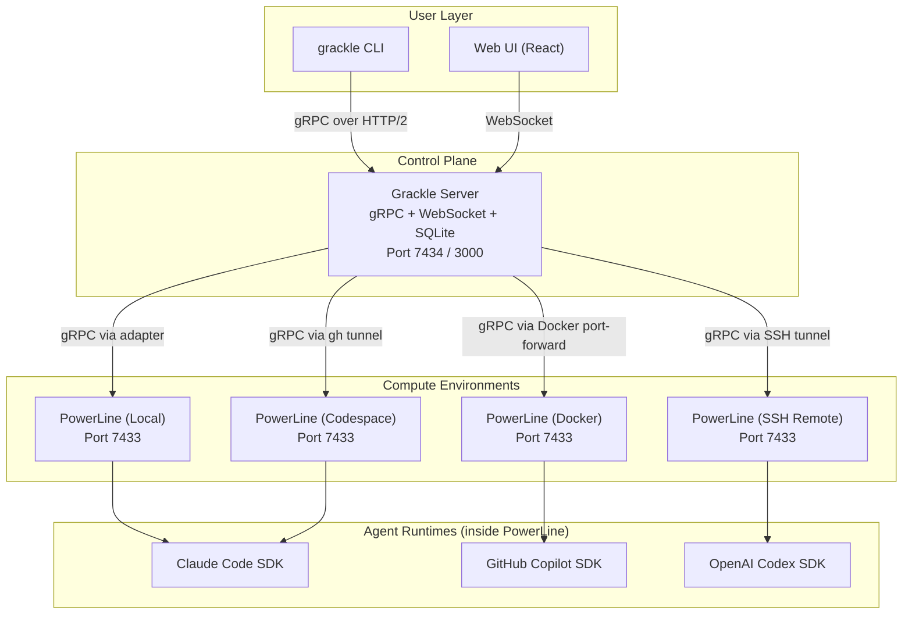
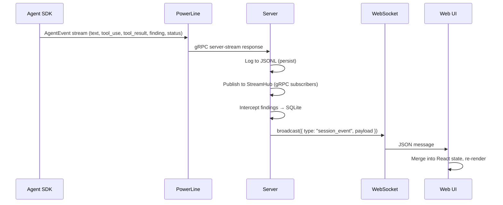

# Grackle: Complete Technical Deep Dive

## Table of Contents

1. [What Grackle Is](#1-what-grackle-is)
2. [Architecture Overview](#2-architecture-overview)
3. [The Five Packages](#3-the-five-packages)
4. [The gRPC API Surface](#4-the-grpc-api-surface)
5. [Environment Adapters](#5-environment-adapters)
6. [Agent Runtimes](#6-agent-runtimes)
7. [Multi-Agent Coordination](#7-multi-agent-coordination)
8. [Security Architecture](#8-security-architecture)
9. [Real-Time Communication](#9-real-time-communication)
10. [Build, CI/CD & Distribution](#10-build-cicd--distribution)
11. [Key Differentiators](#11-key-differentiators)

---

## 1. What Grackle Is

Grackle is a **multi-agent orchestration platform** for AI coding agents. It solves a fundamental problem: how do you take an AI coding assistant — like Claude Code, GitHub Copilot, or OpenAI Codex — and make it work as part of a coordinated team of agents, across multiple compute environments, on complex projects with interdependent tasks?

### The Core Value Proposition

Today, AI coding agents run one at a time, in one terminal, on one machine. Grackle makes them:

- **Multi-environment**: Run agents on your local machine, in Docker containers, on remote SSH servers, or in GitHub Codespaces — all managed through a single control plane.
- **Multi-agent**: Spawn multiple agents working on different tasks simultaneously, with structured coordination through findings and task dependencies.
- **Multi-runtime**: Use Claude Code, GitHub Copilot, or OpenAI Codex interchangeably — or even mix them on the same project. Grackle abstracts away the differences between SDKs.
- **Observable**: Watch what agents are doing in real-time through a web UI, with streaming event logs, diff viewers, and task DAG visualizations.
- **Secure**: Manage credentials centrally, push them to environments on demand, encrypt at rest, and isolate workspaces via git worktrees.

### What You Can Do With Grackle

1. **Define a project** with a repository URL and a default compute environment.
2. **Create a task DAG** — a tree of tasks with parent-child relationships and inter-task dependencies.
3. **Assign each task to an agent** — Grackle spawns an AI agent in the appropriate environment, on its own git branch (isolated via worktree), with full context about what it's supposed to do.
4. **Watch in real-time** as agents work — see their text output, tool calls, tool results, and errors streamed live to the web UI or CLI.
5. **Agents coordinate** by posting findings — structured observations about architecture, bugs, patterns, or decisions that other agents can query.
6. **Review and approve** completed tasks — inspect the git diff, check findings, approve or reject with notes (rejected tasks get sent back for rework).
7. **Track dependencies** — when a blocking task completes, downstream tasks are automatically unblocked and can be started.

---

## 2. Architecture Overview

Grackle uses a hub-and-spoke architecture with three tiers:



### Data Flow

```
User (CLI/Web) → Server (gRPC/WS) → Adapter → PowerLine (gRPC) → Agent SDK → Events stream back
```

1. **User** issues a command (spawn agent, start task, create project).
2. **Server** validates, persists to SQLite, and forwards to the appropriate adapter.
3. **Adapter** manages the compute lifecycle (Docker container, SSH tunnel, etc.) and maintains a gRPC connection to the PowerLine instance.
4. **PowerLine** receives the spawn/resume request and delegates to the configured agent runtime (Claude Code, Copilot, Codex).
5. **Agent SDK** runs autonomously, producing a stream of events (text, tool calls, tool results, errors, findings).
6. **Events flow back** through the same chain — PowerLine streams them over gRPC to the server, which persists them to JSONL logs, publishes to WebSocket subscribers, and broadcasts to the web UI.

---

## 3. The Five Packages

Grackle is a Rush monorepo with pnpm, containing 5 main packages:

### 3.1 `@grackle-ai/common` — Proto Definitions & Shared Types

The contract layer. Everything starts here.

**Proto services defined:**
- `Grackle` — 31 RPCs for the central server (environments, sessions, projects, tasks, findings, tokens)
- `GracklePowerLine` — 10 RPCs for the remote environment agent host

**Shared exports:**
- Generated TypeScript from protobuf via `protoc-gen-es` (ConnectRPC v2)
- String union types: `SessionStatus`, `EnvironmentStatus`, `TaskStatus`, `ProjectStatus`, `AdapterType`, `RuntimeName`, `TokenType`, `AgentEventType`
- Bidirectional enum converters (proto enum ↔ string) with null-prototype maps to prevent prototype pollution
- Constants: port defaults (7433, 7434, 3000), file paths, limits (`MAX_TASK_DEPTH = 8`)

**Namespace convention:**
```typescript
import { grackle, powerline } from "@grackle-ai/common";
// grackle.Environment, grackle.Task, grackle.SessionEvent, etc.
// powerline.SpawnRequest, powerline.AgentEvent, etc.
```

### 3.2 `@grackle-ai/server` — Central Control Plane

The brain. Manages all state, coordinates environments, and bridges the user-facing interfaces to the agent compute layer.

**Components:**

| Component | File | Purpose |
|-----------|------|---------|
| gRPC Service | `grpc-service.ts` | 26 RPC handlers for the `Grackle` service |
| WebSocket Bridge | `ws-bridge.ts` | Bidirectional WS for the web UI |
| WS Broadcast | `ws-broadcast.ts` | Fan-out events to all connected WS clients |
| Environment Registry | `env-registry.ts` | CRUD for environments with status tracking |
| Adapter Manager | `adapter-manager.ts` | Adapter registration, connection tracking, heartbeat |
| Session Store | `session-store.ts` | CRUD for agent sessions |
| Project Store | `project-store.ts` | CRUD for projects |
| Task Store | `task-store.ts` | Full DAG operations: create, update, dependency resolution, tree traversal |
| Finding Store | `finding-store.ts` | Structured finding storage and query |
| Token Broker | `token-broker.ts` | Encrypted token storage and push to environments |
| Event Processor | `event-processor.ts` | Background event stream consumption, finding interception, log writing |
| Stream Hub | `stream-hub.ts` | In-memory pub/sub for real-time event delivery |
| Crypto | `crypto.ts` | AES-256-GCM encryption for token values |
| API Key | `api-key.ts` | 256-bit key generation and constant-time verification |
| Log Writer | `log-writer.ts` | JSONL event persistence |
| Schema | `schema.ts` | SQLite DDL + migrations |

**Database tables:** `environments`, `sessions`, `projects`, `tasks`, `tokens`, `findings`

**Two HTTP servers:**
- Port 7434: HTTP/2 gRPC (ConnectRPC) for CLI and programmatic access
- Port 3000: HTTP/1.1 serving the React web UI + WebSocket bridge

### 3.3 `@grackle-ai/powerline` — Remote Agent Runtime Host

The workhorse. Runs inside each compute environment (Docker container, SSH remote, local, Codespace) and actually spawns and manages AI agents.

**Key responsibilities:**
- Receive `Spawn`/`Resume` RPCs from the server
- Delegate to the appropriate agent runtime (Claude Code, Copilot, Codex, Stub)
- Stream `AgentEvent` messages back over gRPC
- Manage git worktrees for branch isolation
- Accept pushed tokens and inject them as environment variables or files
- Auto-inject the Grackle MCP server for agent coordination

**Runtime architecture:**
```
PowerLine HTTP/2 Server (port 7433)
    ↓
Runtime Registry (claude-code, copilot, codex, stub)
    ↓
BaseAgentRuntime.spawn() / resume()
    ↓
BaseAgentSession.stream() → AsyncQueue<AgentEvent>
    ↓
SDK-specific: consumeQuery() / consumeStream()
```

**Bundled MCP server** (`mcp-grackle/index.js`):
- `post_finding` — Agents call this to share discoveries with other agents
- `query_findings` — Stub (real data is injected into the agent's system prompt)
- Auto-injected when the script exists at `/app/mcp-grackle/index.js`

### 3.4 `@grackle-ai/cli` — Command-Line Interface

A thin, stateless gRPC client built on Commander.js.

**Command tree (30+ operations across 8 groups):**

| Group | Commands |
|-------|----------|
| `grackle serve` | Start server + web UI |
| `grackle env` | `list`, `add`, `provision`, `stop`, `destroy`, `remove`, `wake` |
| `grackle spawn/resume/status/kill/attach` | Agent session management with interactive REPL |
| `grackle project` | `list`, `create`, `archive` |
| `grackle task` | `list`, `create`, `show`, `start`, `delete`, `approve`, `reject` |
| `grackle token` | `set`, `delete`, `list` |
| `grackle logs` | View session logs (`--tail`, `--transcript`) |
| `grackle finding` | `list`, `post` |

**Features:**
- Colored terminal output via chalk (status dots, event type coloring)
- Table formatting via cli-table3
- Real-time event streaming with timestamps
- Interactive attach mode with two-way REPL
- Global error handling with helpful diagnostics

### 3.5 `@grackle-ai/web` — React Web UI

A real-time dashboard for monitoring and controlling agents.

**Tech stack:** React 19, Vite 6, SCSS modules, React Flow (DAG visualization), motion (animations), react-markdown with syntax highlighting

**Views:**

| View | Features |
|------|----------|
| **Projects** | Hierarchical task tree with expand/collapse, depth indentation, child completion badges |
| **Task Stream** | Live session event log with markdown rendering, auto-scroll |
| **Task Diff** | Unified diff viewer with stats, file list, colored additions/deletions |
| **Task Findings** | Categorized finding cards with staggered animations, tag support |
| **Task Graph** | Interactive DAG via React Flow + Dagre layout, two edge types (hierarchy + dependency) |
| **Environments** | Status cards with lifecycle buttons (connect, stop, remove), session list |
| **Settings** | Token management (add, delete, list) |

**Real-time architecture:**
- Single WebSocket connection to server (auto-reconnect every 3s)
- API key injected into HTML by server (`window.__GRACKLE_API_KEY__`)
- State managed via `useGrackleSocket` custom hook (not Redux/Zustand — pure React context)
- Server broadcasts state changes; client merges updates (tasks merged by projectId, not replaced)
- Events capped at 5,000 per session; consecutive text events merged for performance

**Design system:**
- Glass-morphism aesthetic: layered blur (16px panels > 8px cards > 4px insets)
- Dark theme with green accent (#4ecca3)
- CSS custom properties for design tokens
- ARIA roles for accessibility (tablist, tab, tabpanel)

---

## 4. The gRPC API Surface

### Central Server — `Grackle` Service (31 RPCs)

#### Environment Management
| RPC | Type | Description |
|-----|------|-------------|
| `ListEnvironments` | Unary | Get all registered environments |
| `AddEnvironment` | Unary | Register a new environment (auto-generates PowerLine token) |
| `RemoveEnvironment` | Unary | Delete environment and its sessions |
| `ProvisionEnvironment` | Server-stream | Provision compute + connect (yields progress events) |
| `StopEnvironment` | Unary | Stop environment (non-destructive) |
| `DestroyEnvironment` | Unary | Permanently destroy compute resources |

#### Agent Sessions
| RPC | Type | Description |
|-----|------|-------------|
| `SpawnAgent` | Unary | Create session + spawn agent in environment |
| `ResumeAgent` | Unary | Resume a suspended session |
| `SendInput` | Unary | Send text to a waiting agent |
| `KillAgent` | Unary | Terminate a running agent |
| `ListSessions` | Unary | Filter sessions by environment/status |
| `StreamSession` | Server-stream | Real-time events for one session |
| `StreamAll` | Server-stream | Real-time events from all sessions |

#### Projects
| RPC | Type | Description |
|-----|------|-------------|
| `ListProjects` | Unary | Active projects (newest first) |
| `CreateProject` | Unary | Create with auto-generated slug ID |
| `GetProject` | Unary | Single project lookup |
| `ArchiveProject` | Unary | Soft-delete |

#### Tasks
| RPC | Type | Description |
|-----|------|-------------|
| `ListTasks` | Unary | Tasks for project with child ID map |
| `CreateTask` | Unary | Create with branch auto-generation, optional parent/dependencies |
| `GetTask` | Unary | Single task with full metadata |
| `UpdateTask` | Unary | Atomic multi-field update |
| `StartTask` | Unary | Spawn agent for task (with system context) |
| `ApproveTask` | Unary | Move to "done", auto-unblock dependents |
| `RejectTask` | Unary | Revert to "assigned" with review notes |
| `DeleteTask` | Unary | Delete (only if no children) |

#### Findings & Diff
| RPC | Type | Description |
|-----|------|-------------|
| `PostFinding` | Unary | Store structured finding |
| `QueryFindings` | Unary | Filter by categories/tags |
| `GetTaskDiff` | Unary | Git diff for task branch vs main |

#### Tokens
| RPC | Type | Description |
|-----|------|-------------|
| `SetToken` | Unary | Encrypt and store, push to all connected environments |
| `ListTokens` | Unary | Metadata only (values never exposed) |
| `DeleteToken` | Unary | Remove and re-push to all environments |

### PowerLine — `GracklePowerLine` Service (10 RPCs)

| RPC | Type | Description |
|-----|------|-------------|
| `GetInfo` | Unary | Host info (OS, Node version, available runtimes, uptime) |
| `Spawn` | Server-stream | Create agent session, stream events |
| `Resume` | Server-stream | Resume session, stream events |
| `SendInput` | Unary | Send text to waiting agent |
| `Kill` | Unary | Terminate session |
| `ListSessions` | Unary | Active sessions on this environment |
| `Ping` | Unary | Health check |
| `PushTokens` | Unary | Inject credentials bundle |
| `CleanupWorktree` | Unary | Remove git worktree |
| `GetDiff` | Unary | Git diff between branches |

### Key Message Types

**Task** — Supports hierarchical structure:
```
id, project_id, title, description, status, branch,
environment_id, session_id, depends_on[],
parent_task_id, depth, child_task_ids[],
sort_order, review_notes, timestamps...
```

**SessionEvent / AgentEvent** — Unified event type:
```
session_id, type (text|tool_use|tool_result|error|status|system|finding),
timestamp, content, raw (optional JSON)
```

**SpawnRequest** (PowerLine variant includes extra fields):
```
session_id, runtime, prompt, model, max_turns,
branch, working_directory, system_context,
project_id, task_id
```

---

## 5. Environment Adapters

Adapters are pluggable backends that manage compute lifecycle. They implement the `EnvironmentAdapter` interface:

```typescript
interface EnvironmentAdapter {
  type: string;
  provision(envId, config, token): AsyncGenerator<ProvisionEvent>;
  connect(envId, config, token): Promise<PowerLineConnection>;
  disconnect(envId): Promise<void>;
  stop(envId, config): Promise<void>;
  destroy(envId, config): Promise<void>;
  healthCheck(connection): Promise<boolean>;
}
```

### 5.1 Docker Adapter

The most feature-rich adapter. Full container lifecycle management.

**Provisioning flow:**
1. **Image acquisition**: Build from local `docker/Dockerfile.powerline` (dev mode) or pull from registry
2. **Container lifecycle**: Create, start, or reuse existing container
3. **Port discovery**: `docker inspect` to find mapped host port
4. **Repo cloning**: Clone configured git repo into `/workspace` with GitHub token
5. **Credential forwarding**: Mount `~/.claude/.credentials.json`, forward `ANTHROPIC_API_KEY`, GitHub tokens, Copilot config
6. **Connection**: Retry ping up to 10x with 1.5s delay

**Configuration:**
```typescript
{
  image: "grackle-powerline:latest",  // or custom image
  containerName: "grackle-env-xxx",   // auto-generated
  volumes: ["/host/path:/container/path"],
  env: { CUSTOM_VAR: "value" },
  repo: "owner/repo",                 // git clone target
  gpus: "all"                         // GPU passthrough
}
```

**Dev mode detection:** If `rush.json` exists in the monorepo root, builds the Docker image locally from `docker/Dockerfile.powerline` instead of pulling from registry. PowerLine is installed at provision time via `bootstrapPowerLine()`, not baked into the image.

**docker/Dockerfile.powerline** — Minimal base image:
- `node:22-slim` with git, non-root `grackle` user, `/workspace` directory
- Sleeps on startup, waiting for the adapter to bootstrap PowerLine into the container

### 5.2 SSH Adapter

Connects to remote machines via SSH tunneling.

**Components:**
- **SshExecutor** — Runs remote commands via `ssh -o BatchMode=yes`
- **SshTunnel** — Persistent `ssh -N -L localPort:127.0.0.1:7433` port forward
- **Bootstrap** — Installs PowerLine on remote, starts it, verifies port listening

**Provisioning flow:**
1. Test SSH connectivity (15s timeout)
2. Check Node.js >= 22 and git on remote
3. Install PowerLine (dev: copy local artifacts; prod: `npm install @grackle-ai/powerline`)
4. Copy Claude credentials if available
5. Kill any existing PowerLine process
6. Write `.env.sh` with shell-escaped credentials
7. Start PowerLine via `nohup`
8. Open SSH tunnel on auto-discovered free port
9. Verify connectivity

**Security:** `BatchMode=yes`, `StrictHostKeyChecking=accept-new` (first-connect convenience; use `yes` with managed `known_hosts` in production), `ServerAliveInterval=15`, `ServerAliveCountMax=3`, `ExitOnForwardFailure=yes`

### 5.3 Codespace Adapter

GitHub Codespaces support via the `gh` CLI.

**Components:**
- **CodespaceExecutor** — Commands via `gh codespace ssh -c <name>`
- **CodespaceTunnel** — Port forwarding via `gh codespace ports forward`

Same bootstrap and lifecycle as SSH adapter but using GitHub's infrastructure.

### 5.4 Local Adapter

Simplest adapter. Assumes PowerLine is already running locally.

- No provisioning — just retries connection (5x with 1s delay)
- No lifecycle management (stop/destroy are no-ops)
- Connects to `localhost:7433` (or configured host:port)

### Adapter Manager

Global adapter registry with:
- `registerAdapter(adapter)` — Register by type
- `getAdapter(type)` — Lookup by type string
- Connection storage: `setConnection()`, `getConnection()`, `removeConnection()`
- **Heartbeat loop**: Every 30 seconds, pings all active connections. On failure, marks environment as "disconnected" and invokes callback.

### PowerLine Transport

All adapters create gRPC clients via:
```typescript
function createPowerLineClient(baseUrl: string, powerlineToken: string): PowerLineClient
```
Uses ConnectRPC v2 on HTTP/2 with Bearer token interceptor.

---

## 6. Agent Runtimes

PowerLine supports 4 pluggable agent runtimes, all registered at startup:

### 6.1 Architecture Patterns

**BaseAgentRuntime** — Template method pattern:
- `spawn(opts)` → `createSession()` with prompt
- `resume(opts)` → `createSession()` with runtime session ID

**BaseAgentSession** — Shared lifecycle:
```
stream() → setupSdk() → runInitialQuery(prompt) → waiting_input
              ↕                                         ↕
         sendInput(text) → executeFollowUp(text) → waiting_input
              ↕
           kill() → abortActive() → releaseResources() → close queue
```

Events pushed to `AsyncQueue<AgentEvent>`, yielded by `stream()` async generator.

### 6.2 Claude Code Runtime

**SDK:** `@anthropic-ai/claude-agent-sdk` (or legacy `@anthropic-ai/claude-code`)

**Key setup:**
```typescript
{
  permissionMode: "bypassPermissions",
  allowDangerouslySkipPermissions: true,
  allowedTools: ["Bash", "Read", "Write", "Edit", "Glob", "Grep",
                 "WebSearch", "WebFetch", "Task", "NotebookEdit",
                 "mcp__grackle__*", ...],
  model, cwd, maxTurns, mcpServers, disallowedTools
}
```

**Message mapping:**
- Assistant text blocks → `type: "text"`
- Tool use blocks → `type: "tool_use"` with `{tool, args}` JSON
- Tool result blocks → `type: "tool_result"`
- `post_finding` tool calls → extra `type: "finding"` event emitted

**Session management:** Extracts `session_id` from system init message. Resume via `{ resume: runtimeSessionId }` option.

### 6.3 GitHub Copilot Runtime

**SDK:** `@github/copilot-sdk`

**Key differences from Claude Code:**
- Custom session pattern (doesn't extend BaseAgentSession)
- Streaming text deltas
- System message via `{ mode: "append", content }`
- Tool execution events (`tool.execution_start`, `tool.execution_complete`)
- Custom `post_finding` tool built via `defineTool()`
- No maxTurns support
- GitHub token resolution: `COPILOT_GITHUB_TOKEN` → `GH_TOKEN` → `GITHUB_TOKEN`
- BYOK provider config via `COPILOT_PROVIDER_CONFIG` JSON

### 6.4 OpenAI Codex Runtime

**SDK:** `@openai/codex-sdk`

**Key differences:**
- Thread-based model: `startThread()` / `resumeThread()` / `runStreamed()`
- Event types: `thread.started`, `item.started`, `item.completed`
- Item types: `command_execution`, `file_change`, `mcp_tool_call`, `agent_message`
- `sandboxMode: "workspace-write"`, `approvalPolicy: "never"`
- Finding interception: checks `serverName === "grackle"` and `toolName === "post_finding"`

### 6.5 Stub Runtime

Mock runtime for testing. Echoes prompt, waits for input, echoes response. Demonstrates the full lifecycle without any AI SDK.

### 6.6 Runtime Utilities

**Working directory resolution priority:**
1. Git worktree (if branch + base path provided) — `git worktree add -b branch path`
2. `/workspace` directory (if it exists and is non-empty)
3. `undefined` (use default)

**MCP server resolution:**
1. Load from `GRACKLE_MCP_CONFIG` env var (JSON file)
2. Merge spawn-provided servers
3. Auto-inject Grackle MCP server (`/app/mcp-grackle/index.js`)
4. Filter disallowed tools from server configs

---

## 7. Multi-Agent Coordination

### 7.1 Task DAG

Tasks form a directed acyclic graph with two relationship types:

1. **Parent-child hierarchy** — Tasks can have subtasks (up to `MAX_TASK_DEPTH = 8` levels deep). Branch names are generated hierarchically: `project-slug/parent-task/child-task`.

2. **Dependencies** — A task can `depend_on` other tasks. A dependent task can only start when all its dependencies have status `done`.

**Task lifecycle:**
```
pending → assigned → in_progress → review → done
                                      ↓
                                    failed
```

**Auto-unblocking:** When a task is approved (`done`), the server calls `checkAndUnblock(projectId)` to find any pending tasks whose dependencies are now all met.

**Branch isolation:** Each task gets its own git branch, isolated via worktree at `../.grackle-worktrees/{branch}/`. Agents work in isolation without stepping on each other.

### 7.2 Findings System

Findings are the structured knowledge-sharing mechanism between agents.

**How it works:**
1. An agent discovers something useful (architecture pattern, bug, API design decision, dependency note).
2. The agent calls the `post_finding` MCP tool with `{title, content, category, tags}`.
3. The runtime intercepts this tool call and emits a `finding` event in the event stream.
4. The server's event processor picks up the `finding` event, stores it in SQLite, and broadcasts to all WebSocket clients.
5. Other agents can query findings via the system context injected at spawn time.

**Categories:** `architecture`, `api`, `bug`, `decision`, `dependency`, `pattern`, `general`

**The MCP server is a stub** — it returns success but does no real storage. The actual storage happens through event stream interception. This design means findings work regardless of the agent runtime (Claude Code, Copilot, Codex).

### 7.3 System Context Injection

When a task is started, the server builds a `systemContext` string containing:
- Task title and description
- Review notes (if previously rejected)
- This context is prepended to the agent's prompt, giving it full awareness of its assignment.

### 7.4 Diff Tracking

Each task's work is tracked via git diffs:
- `GetTaskDiff` queries PowerLine's `GetDiff` RPC
- PowerLine runs `git merge-base` + `git diff` (including `git add -N .` for untracked files)
- Returns unified diff, changed file list, addition/deletion counts
- Displayed in the web UI's Diff tab for review

---

## 8. Security Architecture

### 8.1 Encryption at Rest

**Algorithm:** AES-256-GCM with PBKDF2 key derivation

| Parameter | Value |
|-----------|-------|
| Cipher | AES-256-GCM (authenticated) |
| Key derivation | PBKDF2-SHA256, 100,000 iterations |
| Salt | 16 random bytes per encryption |
| IV | 12 random bytes per encryption |
| Auth tag | 16 bytes (tamper detection) |
| Format | `base64(salt):base64(iv):base64(tag):base64(ciphertext)` |

**Master key priority:**
1. `GRACKLE_MASTER_KEY` environment variable
2. Persisted random key at `~/.grackle/master-key` (0600 permissions)
3. Auto-generate and persist new 256-bit random key

### 8.2 API Key

- 256-bit random hex string (64 characters)
- Stored at `~/.grackle/api-key` with 0600 permissions
- **Constant-time verification** to prevent timing attacks:
  ```typescript
  let result = 0;
  for (let i = 0; i < key.length; i++) {
    result |= token.charCodeAt(i) ^ key.charCodeAt(i);
  }
  return result === 0;
  ```

### 8.3 PowerLine Tokens

- 256-bit random hex per environment (generated at `addEnvironment`)
- Stored in SQLite `environments.powerline_token`
- Passed to adapters during provisioning
- Used as Bearer token for all server → PowerLine gRPC calls
- PowerLine verifies with `timingSafeEqual()` (Node.js native)

### 8.4 Token Broker

Centralized credential management:
1. User sets token via CLI: `grackle token set ANTHROPIC_KEY`
2. Server encrypts value with AES-256-GCM, stores in SQLite
3. Server builds token bundle (decrypted), pushes to all connected PowerLine instances via gRPC
4. PowerLine's token writer injects as env var or file

**Token types:**
- `env_var` — Set as environment variable in the agent process
- `file` — Written to file path under `$HOME` with 0600 permissions

### 8.5 Path Traversal Prevention

Token writer validates all file paths:
- `isUnderHome()` — Case-insensitive path normalization, separator normalization, prefix collision prevention
- **Symlink detection** — Walks directory ancestry, calls `realpath()` on nearest existing ancestor, verifies resolved path is still under `$HOME`
- Refuses to write if any validation fails

### 8.6 Shell Injection Prevention

Remote adapter credential injection:
- Environment variable names validated with `/^[A-Za-z_][A-Za-z0-9_]*$/`
- All values escaped with `shellEscape()` (replaces `'` with `'\''`)
- `.env.sh` content base64-encoded and written via Node.js (not shell)

### 8.7 Network Isolation

- **Server gRPC**: Bound to `127.0.0.1:7434`
- **Server Web+WS**: Bound to `127.0.0.1:3000`
- **Docker port mapping**: `-p 127.0.0.1:localPort:7433`
- **SSH tunnels**: `-L localPort:127.0.0.1:7433`
- Nothing is exposed to the network by default.

### 8.8 Auth Interceptors

| Interface | Mechanism |
|-----------|-----------|
| Server gRPC | ConnectRPC interceptor: Bearer token → `verifyApiKey()` |
| Server WebSocket | Query param `?token=` → `verifyApiKey()`, close with 4001 on failure |
| PowerLine gRPC | ConnectRPC interceptor: Bearer token → `timingSafeEqual()` |
| Web UI | API key injected into HTML as `window.__GRACKLE_API_KEY__` (safe because localhost-only) |

---

## 9. Real-Time Communication

### 9.1 Event Flow



### 9.2 WebSocket Message Types

**Client → Server (20+ message types):**
- Session: `spawn`, `send_input`, `kill`, `subscribe`, `subscribe_all`
- Environment: `list_environments`, `add_environment`, `provision_environment`, `stop_environment`, `remove_environment`
- Project: `list_projects`, `create_project`, `archive_project`
- Task: `list_tasks`, `create_task`, `start_task`, `approve_task`, `reject_task`, `delete_task`, `get_task_diff`
- Finding: `list_findings`, `post_finding`
- Token: `list_tokens`, `set_token`, `delete_token`

**Server → Client (25+ broadcast types):**
- Data sync: `environments`, `sessions`, `projects`, `tasks`, `findings`, `tokens`
- Events: `session_event`, `session_events` (bulk replay)
- Lifecycle: `spawned`, `project_created`, `task_created`, `task_started`, `task_approved`, `task_rejected`, `task_deleted`, `task_updated`, `finding_posted`, `token_changed`, `environment_added`, `environment_removed`
- Progress: `provision_progress`
- Async results: `task_diff`

### 9.3 Stream Hub (gRPC Streaming)

In-memory pub/sub for gRPC `StreamSession` and `StreamAll` RPCs:
- Per-session queues (async iterables)
- Global stream for all events
- Automatic cleanup when subscribers disconnect
- No persistence — purely real-time delivery

### 9.4 WebSocket Connection Management

- Ping every 30 seconds to keep connections alive
- Auth check on upgrade (reject before establishing connection)
- Auto-reconnect in web UI every 3 seconds on disconnect
- Environment list polled every 10 seconds for status freshness

---

## 10. Build, CI/CD & Distribution

### 10.1 Build System

**Rush 5.158.1 + pnpm 10.11.0 + Heft**

Custom Heft plugins for the build pipeline:
- **heft-buf-plugin** — Runs `buf lint` + `buf generate` for proto codegen
- **heft-vite-plugin** — Runs Vite build for the web UI
- **heft-playwright-plugin** — Runs Playwright e2e tests

**Heft profiles:**
- `default` — TypeScript compilation + linting
- `protobuf` — Buf codegen → TypeScript → lint (for `@grackle-ai/common`)
- `web` — Build phase (TypeScript + Vite) + Test phase (Playwright)

### 10.2 CI Pipeline (`.github/workflows/ci.yml`)

Triggered on pull requests:
1. Checkout with full history
2. Node.js 22
3. `rush install`
4. `rush change --verify` (enforce change files)
5. Block major version bumps
6. `rush build`
7. Install Playwright chromium
8. `rush test --verbose`

### 10.3 CD Pipeline (`.github/workflows/cd.yml`)

Triggered on push to `main`:
1. Same build + test as CI
2. **Lockstep version bumping:**
   - Consolidate change files from non-mainProject packages
   - Sync `nextBump` in `version-policies.json` to highest bump type
   - `rush version --bump --target-branch main`
3. Create PR for version bump, squash-merge via GitHub
4. Rebuild with bumped versions
5. **Publish to npm:** `rush publish --include-all --publish --set-access-level public`
6. Create GitHub Release with auto-generated notes

### 10.4 Distribution

**npm packages (public):**
- `@grackle-ai/common` — Proto types + shared utilities
- `@grackle-ai/powerline` — Remote agent host (binary: `grackle-powerline`)
- `@grackle-ai/server` — Central server
- `@grackle-ai/cli` — CLI client (binary: `grackle`)
- `@grackle-ai/web` — Web UI / frontend

**Docker image:** Built from `docker/Dockerfile.powerline` for containerized environments.

**Lockstep versioning:** All 5 publishable packages share one version (currently 0.13.2).

---

## 11. Key Differentiators

### 11.1 Runtime Agnosticism

Grackle is the only orchestration platform that treats AI coding agents as interchangeable runtimes. Claude Code, GitHub Copilot, and OpenAI Codex are plugged in through a common `AgentRuntime` interface. You can:
- Use different runtimes for different tasks in the same project
- Switch runtimes without changing anything else
- Add new runtimes by implementing ~5 methods

This is not a wrapper around one vendor's API — it's a runtime abstraction layer.

### 11.2 Environment Abstraction

Most AI agent tools are "run in your terminal." Grackle separates the control plane (where you manage) from the compute plane (where agents run). The adapter system means:
- **Docker**: Reproducible, isolated, disposable environments with GPU support
- **SSH**: Use existing cloud VMs, on-prem servers, or beefy machines
- **Codespaces**: Leverage GitHub's infrastructure
- **Local**: Zero-overhead development mode

Environments are provisioned on demand, with progress streaming, and health-checked continuously.

### 11.3 Structured Multi-Agent Coordination

Not just "run N agents in parallel" — Grackle provides:
- **Task DAG**: Dependencies ensure correct ordering. Hierarchical tasks support decomposition.
- **Findings**: Structured inter-agent communication with categories and tags. Agents share architectural decisions, bug reports, patterns, and dependency notes.
- **Branch isolation**: Each task gets its own git worktree. Agents never conflict.
- **Review workflow**: Tasks go through `in_progress → review → done/rejected` with human oversight.

### 11.4 Full Observability

Every agent event is:
- **Streamed in real-time** to the web UI and gRPC subscribers
- **Persisted to JSONL** logs for replay
- **Typed** (text, tool_use, tool_result, error, status, system, finding)
- **Visualizable** — event streams, diff viewers, DAG graphs, finding dashboards

You're not flying blind. You can watch, intervene (send input), kill, or inspect any agent at any time.

### 11.5 Security-First Design

Not an afterthought:
- **Encrypted token storage** (AES-256-GCM, PBKDF2, per-encryption random salt/IV)
- **Constant-time auth verification** (timing attack prevention)
- **Path traversal prevention** (symlink-aware, multi-layer validation)
- **Shell injection prevention** (proper escaping, base64 encoding)
- **Network isolation** (127.0.0.1 binding by default)
- **Per-environment auth tokens** (256-bit random, never shared between environments)
- **Credential push model** (tokens pushed to environments, never pulled or exposed)

### 11.6 ConnectRPC / Protobuf API

Not REST, not GraphQL — proper gRPC with:
- **Strong typing** from protobuf definitions through to TypeScript
- **Server streaming** for real-time event delivery
- **Efficient binary protocol** on HTTP/2
- **Cross-language potential** — any language with a gRPC client can integrate

The WebSocket bridge exists for the web UI (browsers can't do HTTP/2 gRPC natively), but the canonical API is pure gRPC.

### 11.7 Professional Engineering

This isn't a weekend project:
- **Rush monorepo** with lockstep versioning and change file enforcement
- **Custom Heft plugins** for buf codegen, Vite builds, and Playwright tests
- **Automated CI/CD** with npm publishing and GitHub Releases
- **70+ Playwright e2e tests** with mock mode for the web UI
- **Structured logging** via pino (server/PowerLine) and chalk (CLI)
- **Drizzle ORM** with SQLite WAL mode for concurrent reads
- **Graceful shutdown** handling throughout

### 11.8 Summary: What Makes Grackle Unique

| Capability | Grackle | Typical AI Agent Tool |
|------------|---------|----------------------|
| Multiple AI runtimes | Claude Code + Copilot + Codex | Single vendor |
| Multiple environments | Docker, SSH, Codespace, Local | Local terminal only |
| Task DAG with dependencies | Full hierarchical DAG | None |
| Inter-agent communication | Structured findings system | None |
| Branch isolation | Git worktree per task | Shared workspace |
| Encrypted credential management | AES-256-GCM + push model | Manual env vars |
| Real-time web dashboard | React UI with DAG visualization | Terminal output |
| gRPC API | 36 typed RPCs with streaming | None / HTTP REST |
| Human review workflow | Approve/reject with notes | None |
| Auto-provisioning | On-demand with progress streaming | Manual setup |
| Multi-machine orchestration | Centralized control plane | Single machine |

Grackle transforms AI coding agents from "one developer's assistant" into a managed, observable, secure fleet of autonomous workers that coordinate on complex projects.
