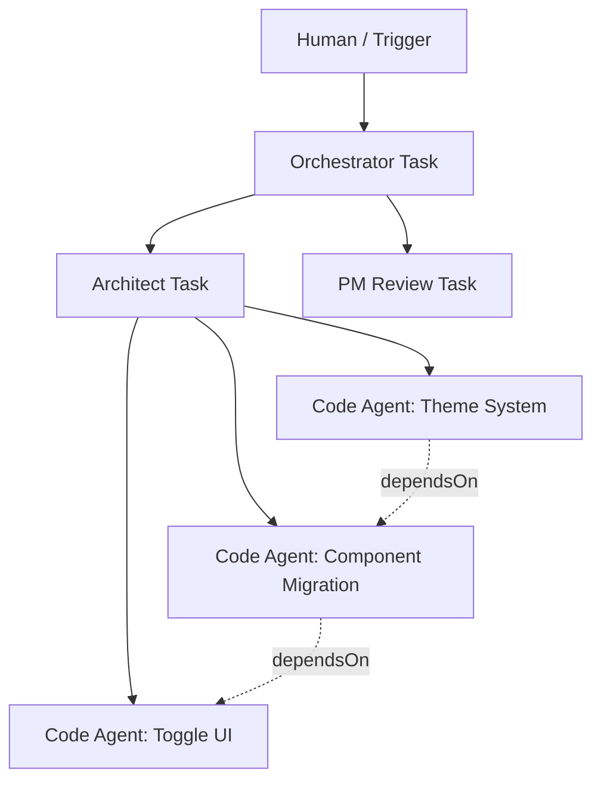

# Task Orchestration Architecture

**Status:** Draft / RFC
**Date:** 2026-03-08

## Overview

This document captures the design thinking for Grackle's task orchestration model. The goal is a unified architecture that supports workflows, teams, swarms, scheduled automation, and human-in-the-loop oversight — all through the same set of primitives.

## Core Principles

1. **Roster, not pipeline.** There is a pool of agent personas. Work gets routed to the right persona based on the task, not a fixed sequence. The roster is a living thing — personas can be created at runtime (eventually by a "recruiter" agent).

2. **Central orchestration is primary, with semi-self-organizing behavior.** An orchestrator agent decomposes and routes work. Agents can escalate and the hierarchy can grow organically, but there is always a clear chain of authority.

3. **Hierarchical communication only.** Agents communicate up (escalate to parent) or down (delegate to children). Sideways knowledge sharing happens exclusively through the shared knowledge graph (findings), scoped globally or per-project/task.

4. **Tasks are atomic.** A task is a single unit of work with one assigned persona. Complex work is represented as a tree of tasks, not a single large task.

5. **Auditability over predictability.** The decomposition tree doesn't need to be deterministic, but it must be fully traceable. You can always answer "who authorized this work" by walking up the tree.

## Key Concepts

### Personas

A persona is the Grackle equivalent of what other systems call an "agent." It is a reusable template that defines how a task gets executed.

A persona consists of:
- **System prompt** — identity, expertise, behavioral instructions
- **Tool configuration** — which MCP tools are available
- **Runtime configuration** — which agent runtime to use (Claude Code, Copilot, etc.)

Personas are a runtime/database concept, not hardcoded. They are created and managed through the system. Initial setup involves manually defining personas, but the long-term vision includes a "recruiter" persona that can create new specialized personas as the system learns what's needed.

Examples of personas:
- Orchestrator / Project Manager
- Software Architect
- Frontend Engineer (React specialist)
- Security Reviewer
- Pedantic Code Reviewer
- "Happy Path" Tester
- "Break Things" Tester
- PM (customer-focused)
- PM (delivery-focused)
- ADO Watcher (polls for new work items)
- Company Politics Navigator

### Task Tree (Parent/Child Hierarchy)

Every task may have a **parent task**. Root-level tasks have no parent (created by triggers or humans).



**Parent/child** represents decomposition: "this task is made up of these subtasks."

**dependsOn** represents sequencing: "this task can't start until that task finishes." Dependencies can exist between siblings but not across branches of the tree.

The parent sets up dependencies between its children, since the parent has the bird's-eye view of its own decomposition. Children don't know about or negotiate with their siblings directly.

### Decomposition Rights

A parent decides whether each child task is allowed to further decompose. This prevents pathological nesting (10 levels deep for something that should be 2 tasks).

- Root tasks have decomposition rights by default
- When creating a child, the parent explicitly grants or withholds decomposition rights
- Leaf work ("write this function," "review this PR") is typically created without decomposition rights
- Planning/architectural tasks may receive decomposition rights

### Invocation Modes

A task can be invoked in two modes:

- **Fresh**: No prior conversation history. The persona gets its system prompt, project state, and the task description. Used for: new assignments, scheduled polls, leaf work.

- **Resume**: The previous conversation history is replayed/provided as context, with new information appended. Used for: orchestrator reacting to state changes, agent re-invoked after review feedback, any task that needs continuity of thought.

The invocation mode is determined by the **trigger**, not the persona. The same persona can be invoked fresh or resumed depending on the situation.

### Context Model

Every task invocation receives:

1. **System prompt** — from the persona definition
2. **Project state** — current tasks, statuses, relevant findings (injected, similar to the inline system-context assembly in `packages/server/src/grpc-service.ts` and `packages/server/src/ws-bridge.ts`)
3. **Trigger context** — what caused this invocation (task completed, escalation received, scheduled tick, human request)
4. **Conversation history** — for resume mode; potentially windowed or summarized for long-running tasks

Higher-order agents (orchestrators, architects) get broader project state but less implementation detail. Lower-order agents (code agents) get detailed file context but limited project-wide visibility. This is a natural consequence of what's relevant to each role, not an artificial restriction.

### Escalation

Escalation flows **up the tree only**. A task escalates to its parent when it cannot resolve something on its own.

The escalation chain: **agent → parent agent → grandparent agent → ... → human**

The human sits at the top of the pyramid but is rarely reached. Higher-order agents (architects, senior engineers) resolve most escalations before they reach the human. The goal is that a human overseeing dozens of concurrent workstreams gets pinged every 5-10 minutes at most.

A potential future persona is a "style mimic" agent that learns the human's decision patterns and can answer on their behalf for common questions, further reducing human interrupts.

Mechanically, escalation likely means: the child task completes (or pauses) with a structured question, and the parent task is resumed with that question as new context.

### Triggers

Triggers are the entry points that create or resume tasks. They are a first-class concept.

| Trigger Type | Example | Creates or Resumes |
|---|---|---|
| **Human** | User types "implement dark mode" | Creates root task |
| **Scheduled** | Every 15 min, poll ADO for new work items | Creates fresh task each time |
| **Webhook** | GitHub push event, ADO work item update | Creates root task |
| **Event** | Child task completed, escalation received | Resumes parent task |
| **Agent-initiated** | Running agent creates child tasks | Creates child tasks |

All trigger types flow through the same system. A scheduled ADO poll creates a task with the "ADO Watcher" persona, which checks for new items and creates root tasks for the orchestrator. The orchestrator decomposes those just like human-initiated work.

## Task Lifecycle

The task lifecycle remains similar to today:

```
pending → assigned → in_progress → review → done / failed
```

New additions:
- **Waiting**: a parent task that has created children and is waiting for them to complete. Not consuming an environment — will be resumed when children finish.
- The transition from `waiting → in_progress` happens when a trigger resumes the task (child completed, escalation received).

## What This Architecture Supports

| Pattern | How It Works |
|---|---|
| **Simple task** | Human creates task → assigned to persona → runs → completes |
| **Workflow (spec → code → review)** | Orchestrator decomposes into child tasks with dependencies |
| **Team / roster** | Orchestrator picks personas from the roster based on task needs |
| **Swarm** | Deep decomposition with many concurrent leaf tasks; tree grows organically |
| **Scheduled automation** | Scheduled trigger creates fresh tasks on a cadence |
| **Event-driven** | Webhook trigger creates tasks from external system events |
| **Human-in-the-loop** | Escalation chain reaches human only when agents can't resolve |
| **Agent-to-agent knowledge sharing** | Findings system (existing), scoped to project/task/global |

## Open Questions

1. **Conversation history management for long-running tasks.** When a parent task has been resumed 50 times, its conversation history is enormous. Do we window it? Summarize it? Or is the project state (tasks + findings) sufficient context, making the full history unnecessary for decision-making?

2. **Persona storage and management.** Where do personas live? Database table? Config files? How are they versioned? Can different projects use different persona pools?

3. **Environment scheduling.** With a finite number of environments and potentially many pending tasks, how does the system decide which tasks to run? Simple FIFO queue? Priority-based? Does the orchestrator manage this, or is it a server-level concern?

4. **Cross-branch dependencies.** The current model says dependencies only exist between siblings (set by the parent). Is there a real-world case where a task in one branch needs to wait for a task in a completely different branch? If so, how is that expressed without sideways communication?

5. **Failure propagation.** When a leaf task fails, does the parent automatically get resumed to handle it? Can the parent retry, reassign to a different persona, or escalate further up?

6. **Observability.** What does the web UI look like for this? A tree view of tasks? A Gantt chart? How does a human monitor 50 concurrent agents without being overwhelmed?

7. **Artifacts and handoff.** When a child completes, what exactly does the parent receive? The full output? A summary? Specific artifacts (files changed, spec document, test results)? This determines how efficiently information flows up the tree.
