# Grackle UX Audit & Improvement Proposals

_Date: 2026-03-11 | Revised: 2026-03-12_

This document captures a UX-focused audit of the Grackle web UI based on code exploration, visual inspection of the running app in mock mode, and product owner feedback. Each section identifies a current pattern, explains why it's problematic, and proposes an improvement.

---

## 1. Navigation & Information Architecture

### 1.1 Remove Environments from sidebar, make sidebar task-only

**Current:** The sidebar has two tabs — **Projects** and **Environments** — at equal visual weight. Switching between them replaces the entire sidebar.

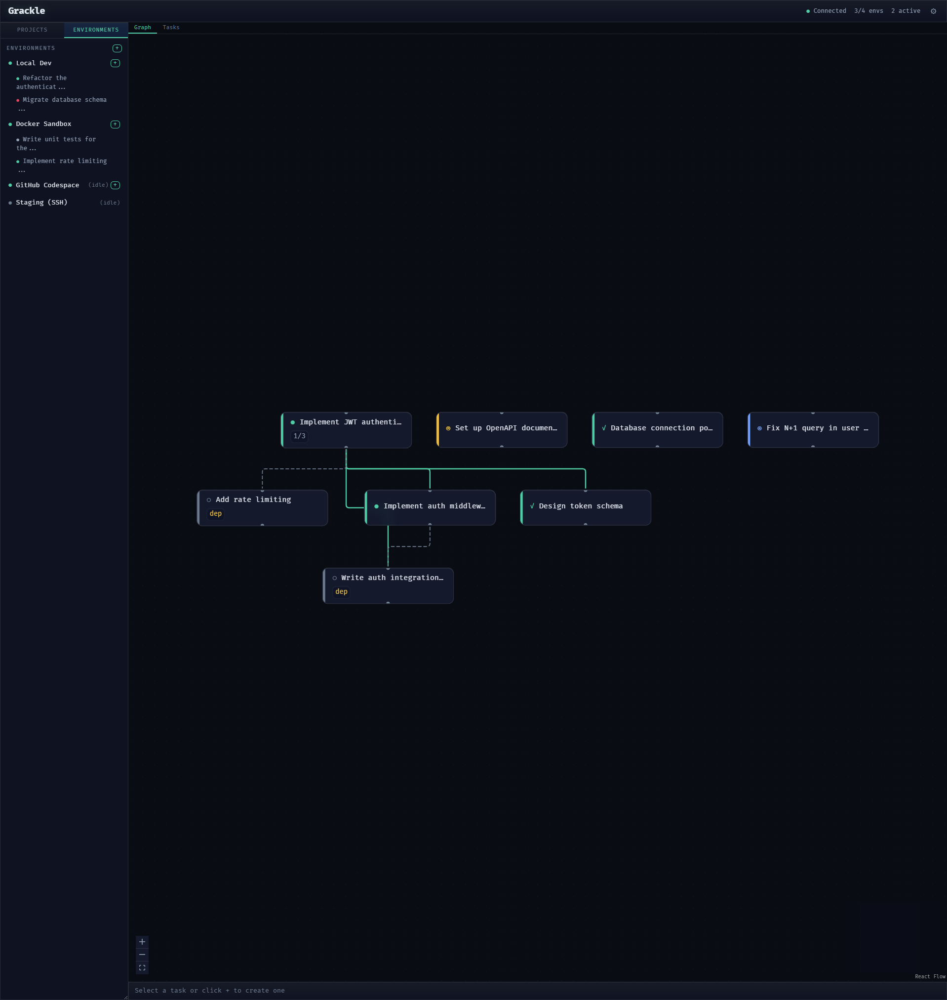

**Problem:** Environments are infrastructure config — set once, rarely revisited. Giving them equal billing with Projects forces a wrong mental model. Switching tabs also desynchronizes the sidebar from the main panel (notice the DAG still showing above while the sidebar shows environments).

**Proposal:**
- Remove the Environments tab from the sidebar entirely.
- Move environment management to the **Settings** page (see 1.3).
- The sidebar becomes a single, permanent **task tree** — always showing Projects > Tasks, no tab switching.
- Environment info is shown contextually: as a badge on task rows and in task detail views.

### 1.2 Add a Home / Dashboard view

**Current:** On first load, the main panel shows "Select a session, project, or task to get started" — centered text on a dark void.

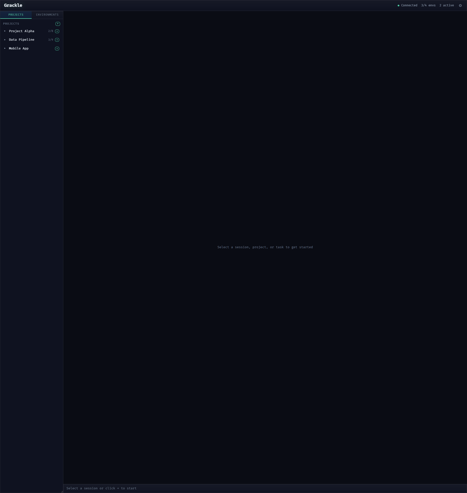

**Problem:** No overview of active work. The mock data has 2 running sessions, 2 tasks in review, 2 blocked tasks, and 1 failed task — but none of this is visible without drilling into each project.

**Proposal:** Add a **Dashboard** as the default landing page:
- **Active sessions** — cards showing running agent sessions with environment, runtime, elapsed time, link to task
- **Tasks needing attention** — tasks in `review` (awaiting approval) or `failed` (needs retry), across all projects
- **Blocked tasks** — tasks waiting on dependencies, with what blocks them
- **Environment health** — connection status strip (green/yellow/red dots)
- **Recent activity** — last N events across all sessions

### 1.3 Expand Settings into a tabbed settings hub

**Current:** Settings only contains token management. The page is mostly empty.

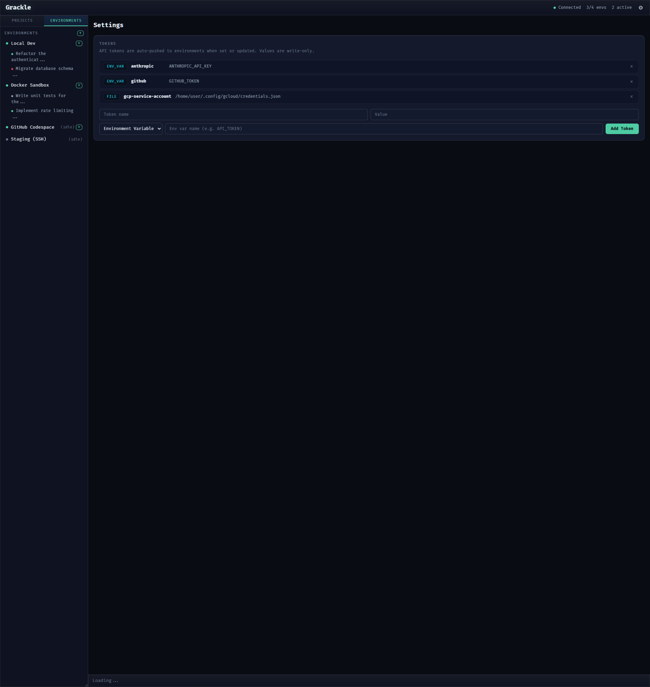

**Problem:** Three tokens and an add form don't justify a full-screen view. Environments need a proper home.

**Proposal:** Restructure Settings with a **thick static left nav** (tab bar or vertical nav) for sections:
- **Environments** — full CRUD for environments (moved from sidebar). List view with status, adapter type, runtime, and actions (provision, stop, delete, edit). "Add Environment" opens a proper form within this section.
- **Tokens** — existing token management
- **About / System** — app version, connection info, server health

This nav is "static" — always visible, not collapsible — because we'll add more sections over time (notifications, preferences, integrations, etc.).

### 1.4 Add breadcrumb navigation with task nesting

**Current:** The header bar shows "Task: Implement JWT authentication | in_progress | feat/jwt-auth" as a flat string.

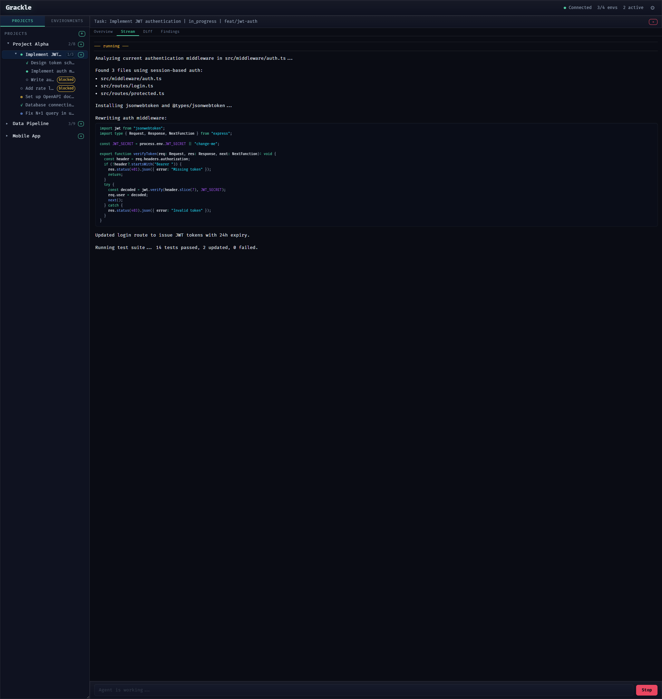

**Problem:** Users lose context — no indication of which project a task belongs to, and no clickable path back. For subtasks, there's no indication of the parent task either.

**Proposal:** Replace the flat header with clickable breadcrumbs that reflect the full hierarchy:
- `Dashboard` (home)
- `Project Alpha` > `Implement JWT authentication` (root task)
- `Project Alpha` > `Implement JWT authentication` > `Design token schema` (subtask — reflecting parent nesting)
- `Project Alpha` > `Graph` (project DAG view)
- `Settings` > `Environments` (settings sections)

Clicking any breadcrumb segment navigates to that level.

---

## 2. Task & Project Workflows

### 2.1 Unified create/edit experience for tasks (not a modal)

**Current:** Creating a task happens in the UnifiedBar at the bottom of the screen. There is no edit experience at all.

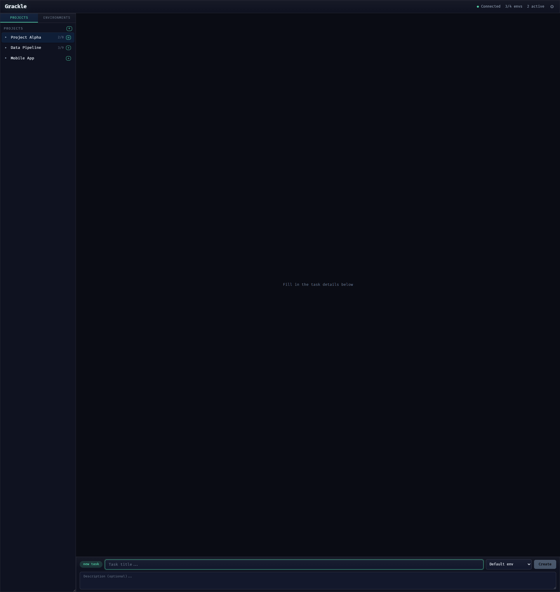

**Problem:**
- **90% of the screen is wasted** showing "Fill in the task details below" while the form is crammed into two thin rows at the bottom.
- Tasks cannot be edited after creation — the only option is delete and recreate.
- The form pre-assigns an environment at creation time, but **this is wrong**: environments should only be selected when starting/executing a task. The whole point of the swarming architecture is that tasks are environment-agnostic until execution.

**Research confirms:** The `CreateTaskRequest` proto stores `environment_id` on the task at creation. `StartTaskRequest` has no environment field — it reads from the pre-assigned task record. This couples tasks to environments prematurely.

**Proposal:** Create and edit should be **the same experience** — a full task detail view in the main panel:
- **Creating a task** = opening a blank task detail view with all fields in edit mode
- **Editing a task** = opening the existing task detail view with fields switched to edit mode (pre-populated)
- The view lives in the main content area (not a modal, not the bottom bar)
- Fields:
  - **Title** — text input
  - **Description** — multiline textarea with markdown rendering in read mode
  - **Dependencies** — multi-select from other tasks in the same project
  - **Parent task** — shown as read-only context when creating a subtask
- **Remove** the environment dropdown from task creation entirely. Environment is chosen at start time (see 2.6).
- **Save** button to commit changes, or auto-save on blur

### 2.2 Add a task editing experience

Covered by 2.1 — edit is the same view as create, just pre-populated. Editable fields when task is `pending`: Title, Description, Dependencies. Read-only once started: Branch, Session, Status, Created date.

### 2.3 Inline-editable project detail view

**Current:** Clicking a project shows a DAG (Graph tab) and a task summary (Tasks tab) saying "2/8 tasks complete". No project metadata is visible.

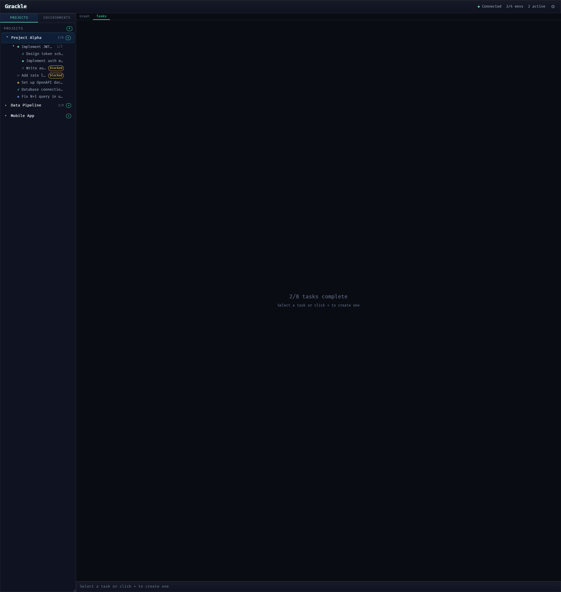

**Problem:** Projects have description, repo URL, and default environment in the data model, but none are visible or editable in the UI.

**Proposal:** The project landing page should show project metadata inline, with click-to-edit:
- **Name** — click the text to turn it into an input field
- **Description** — click to edit, renders as markdown in read mode
- **Repository URL** — click to edit, displayed as a clickable link in read mode
- **Default Environment** — dropdown, click to change
- Small pencil icons next to each field as a hint that it's editable
- **Archive** button (with confirmation dialog)

This is the same "click to edit" pattern that tools like Notion and Linear use — the text IS the input, just styled differently.

### 2.4 Add dependency management during task creation

**Current:** Task dependencies can only be set programmatically. The DAG is read-only.

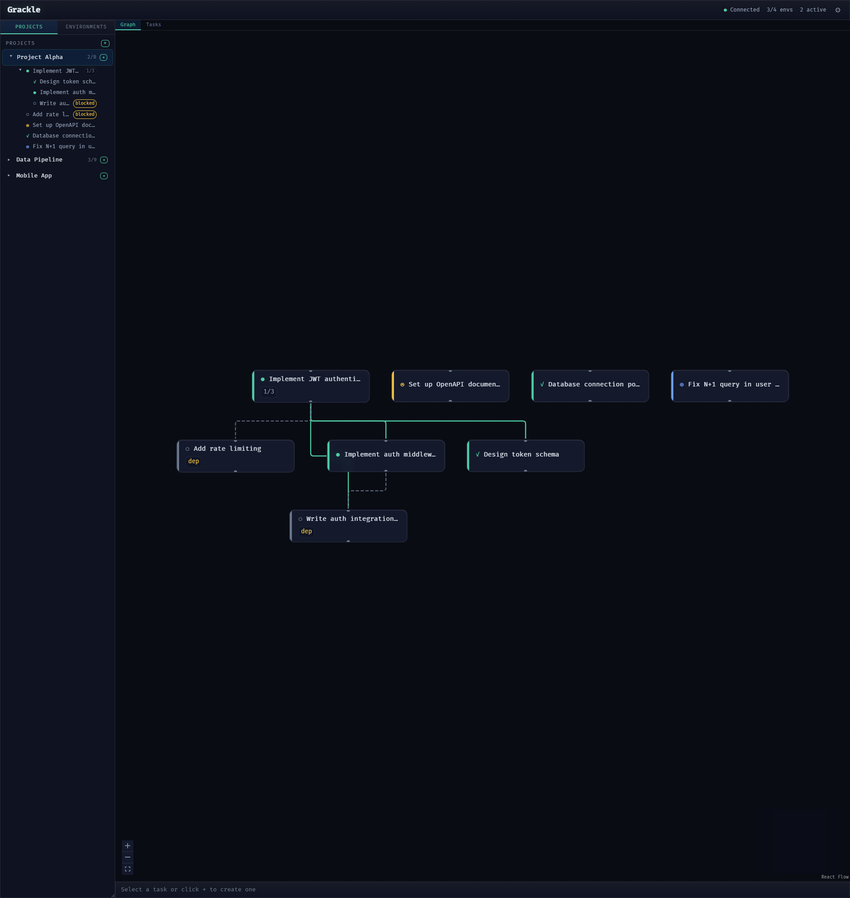

**Problem:** The DAG is a display artifact, not a planning tool. Users can't create dependency relationships from the UI.

**Proposal:**
- In the task create/edit view (2.1), add a "Dependencies" multi-select showing other tasks in the same project
- In the task edit view, allow adding/removing dependencies (only for `pending` tasks)
- Future: consider drag-to-connect in the DAG view

### 2.5 Project creation = blank project detail view in edit mode

**Current:** Creating a project is a tiny inline input in the sidebar.

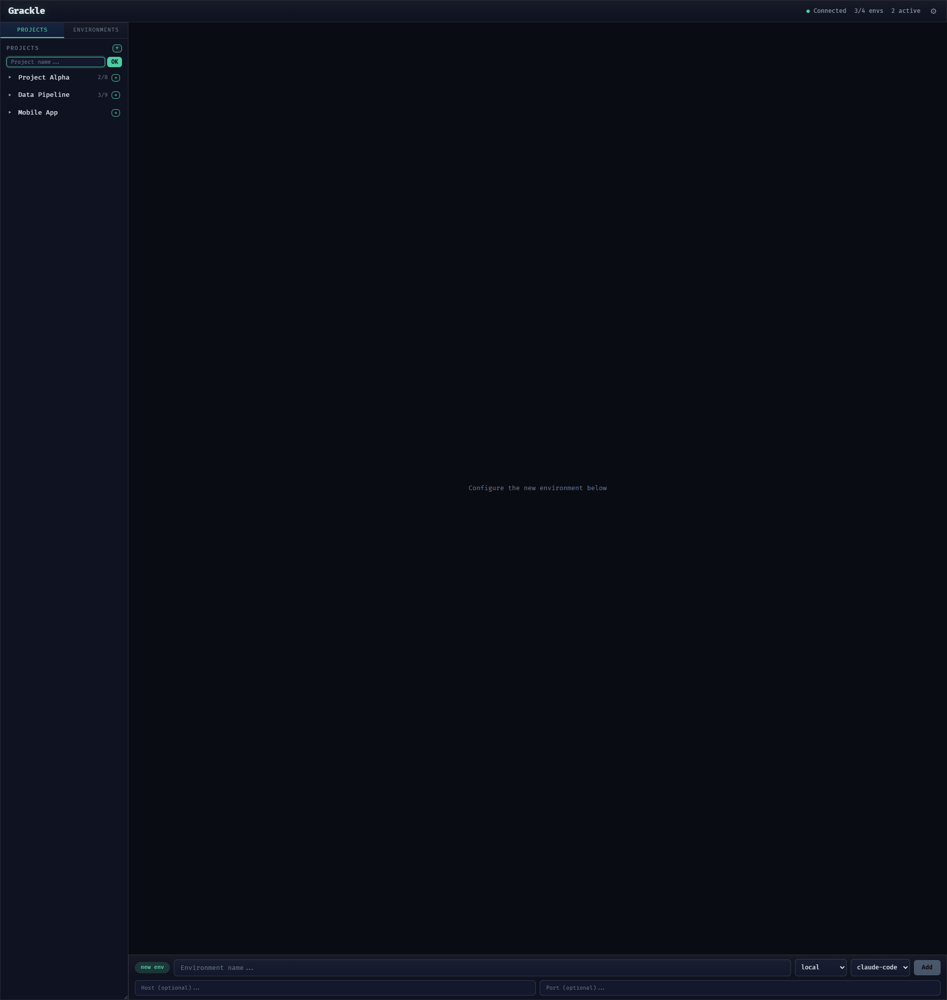

**Problem:** Only captures the name. Description, repo URL, and default environment are skipped.

**Proposal:** Follow the same pattern as tasks (2.1): creating a project opens a blank project detail view in the main panel with all fields in edit mode. Same inline-editable UI as 2.3, but starting empty. No modal needed — "create" and "edit" are the same experience.

### 2.6 Select environment at task start time, not creation time

**Current:** Environment is assigned to a task at creation. `StartTaskRequest` reads from the task record.

**Problem:** This couples tasks to environments prematurely. The swarming architecture means tasks should be environment-agnostic until you execute them.

**Proposal:**
- Remove `environment_id` from the task creation form and `CreateTaskRequest`
- Add an `environment_id` field to `StartTaskRequest`
- When clicking "Start Task", show an environment selector (dropdown or popover) so the user picks where to run it
- Default to the project's default environment, but allow override
- This is a small backend change (add field to proto, update StartTask handler) but important for the correct mental model

---

## 3. The Bottom Bar & Notifications

### 3.1 Bottom bar = agent message input only, visible only in Stream view

**Current:** The UnifiedBar (722 lines) morphs between 6+ different forms:

| Mode | Bottom bar becomes... |
|------|----------------------|
| Task creation |  |
| Environment creation | 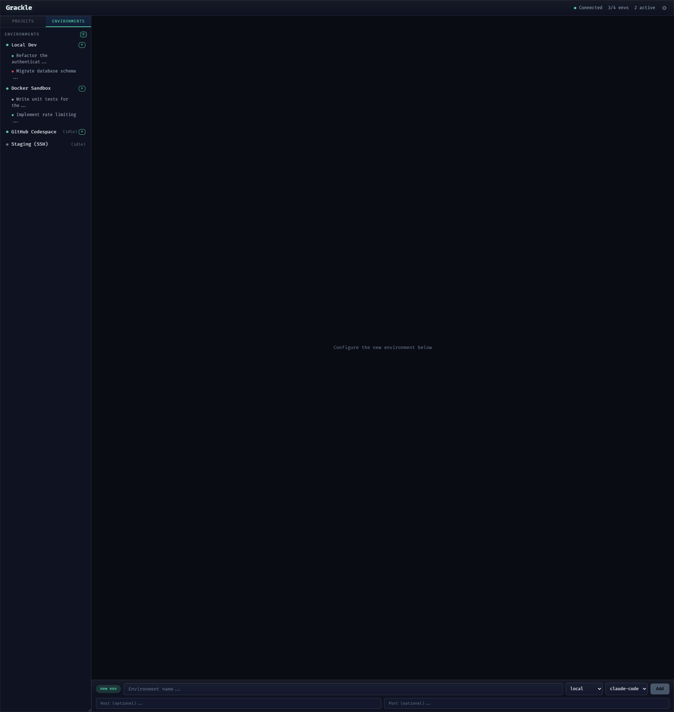 |
| Agent working |  |
| Task review | 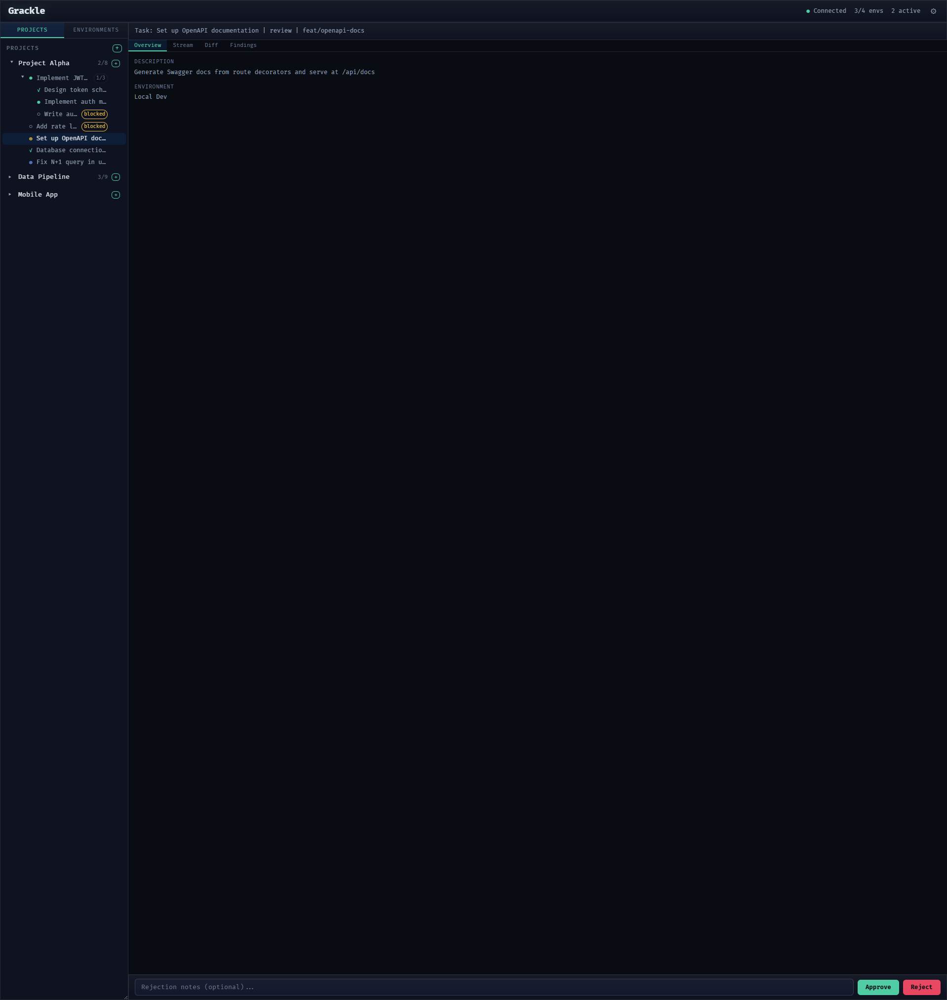 |
| Blocked task | 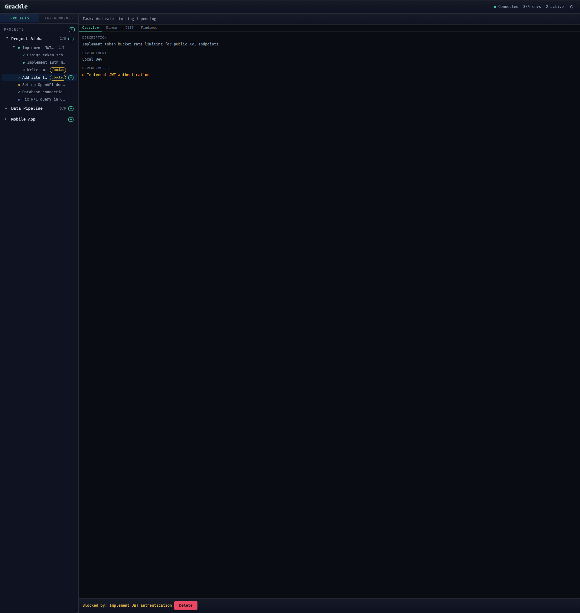 |
| Empty state |  |

**Problem:** No consistent mental model. The bar is a Swiss Army knife — it's a vestige from early development when messaging was the only feature.

**Proposal:** The bottom bar should do **one thing only**: it's where the user types messages to an agent loop. That's it.
- **Only visible** when viewing the Stream tab of a task/session that accepts input
- Shows a text input + "Send" button when session is `waiting_input`
- Shows "Agent is working..." + "Stop" button when session is `running`
- **Hidden entirely** in all other contexts (Overview tab, Diff tab, Findings tab, project views, settings, dashboard, etc.)

Everything else currently in the bar moves elsewhere:
- Task creation → main panel (2.1)
- Environment creation → Settings page (1.3)
- Task actions (Start, Approve, Reject, Delete) → task detail header (3.2)
- Status hints → removed (dashboard provides orientation)

### 3.2 Move task action buttons to the task detail header

**Current:** Start, Approve, Reject, Delete buttons are in the bottom bar, far from the content they act on.

**Proposal:** Move action buttons to the **task detail header** (top of main panel, next to title and status):
- **Pending + unblocked:** `[Start Task]` `[Edit]` `[Delete]`
- **In Progress:** `[Stop]`
- **Review:** `[Approve]` `[Reject]`
- **Done:** `[Delete]`
- **Failed:** `[Retry]` `[Delete]`

### 3.3 Standardized notification patterns

**Current:** No notification system. Operations succeed or fail silently.

**Proposal:** Use well-known notification patterns:
- **Global notifications** (toast/snackbar): small overlay at top of app for transient feedback ("Task created", "Environment disconnected", "Token saved"). Auto-dismiss after 3-5 seconds.
- **Contextual callouts**: inline alerts within a specific area for persistent info ("Blocked by: Implement JWT authentication" as a yellow callout in the task overview, not the bottom bar).
- Build these as unified, reusable components (`<Toast>`, `<Callout>`) used consistently across the app.

---

## 4. Stream View: Missing Agent Information

### 4.1 Show tool results with preview + accordion

**Current:** `tool_result` events are rendered as a collapsed `
` element showing only "Tool output" text. Users must click to expand, and even then see only a 200px-tall scrollable `<pre>`.

`tool_use` events show the tool name and args inline with a `>` prefix, which is decent. But the result that follows is hidden.

**Research confirms:** The `raw` field containing structured tool data is captured at the runtime level and persisted to the JSONL log, but is **deliberately not sent to WebSocket clients** — `ws-bridge.ts` only sends `content`, `eventType`, `timestamp`, and `sessionId`.

**Proposal:** Match the Claude Code pattern — preview + expandable:
- **tool_use**: Show tool name prominently (e.g., `Read`, `Edit`, `Bash`) with a compact summary of args
- **tool_result**: Show a **preview** (first 3-5 lines or ~200 chars) inline, with a click-to-expand accordion that reveals the full output
- **Pair them**: Visually group each tool_use with its corresponding tool_result as a single unit
- Show success/error indicators on the collapsed state
- Backend change needed: send the `raw` field to WebSocket clients so the frontend has structured data to render

### 4.2 Show user input messages in the stream

**Current:** When a user sends a message to a paused session (`waiting_input` state), the text is cleared from the input box, sent to the server, and **disappears entirely**. It never appears in the event stream.

**Research confirms:** There is no "user" event type in the `EventType` enum. The server's `SendInput` handler forwards text directly to PowerLine without creating a session event. The user's message is not logged, not persisted, and not displayed.

**Proposal:**
- Add a `user` or `input` event type to the `EventType` proto enum
- When `SendInput` is called, create a session event with the user's text before forwarding to the agent
- Render user messages in the stream with a distinct style — right-aligned or different background color, like a chat bubble, clearly distinguishing user input from agent output
- Add visual feedback in the input bar that the message was sent (brief "Sent" indicator or disabled state)

---

## 5. Interaction Polish

### 5.1 Replace `window.confirm()` with in-app confirmation dialogs

**Current:** Destructive actions use the browser's native `window.confirm()`.

**Problem:** Visually jarring, can't be styled, breaks the dark glass aesthetic.

**Proposal:** Create a reusable `<ConfirmDialog>` component:
- Glass card aesthetic matching the app
- Clear title ("Delete Task?"), consequence description, Cancel + Danger button
- Motion-animated entrance/exit
- True modal overlay blocking interaction

### 5.2 Add keyboard shortcuts

**Current:** No keyboard shortcuts.

**Proposal:** Add shortcuts with a discoverable help overlay (`?` or `Ctrl+/`):
- `N` — New task (in current project context)
- `Enter` — Start task / Approve / Send input (context-dependent)
- `Escape` — Cancel / close
- `J / K` or `Up / Down` — Navigate task list
- `1-4` — Switch tabs (Overview, Stream, Diff, Findings)
- `Ctrl+Enter` — Send session input

---

## 6. Visual & Layout Improvements

### 6.1 Enrich the task overview tab

**Current:** Shows only "DESCRIPTION" and "ENVIRONMENT". ~85% empty space.

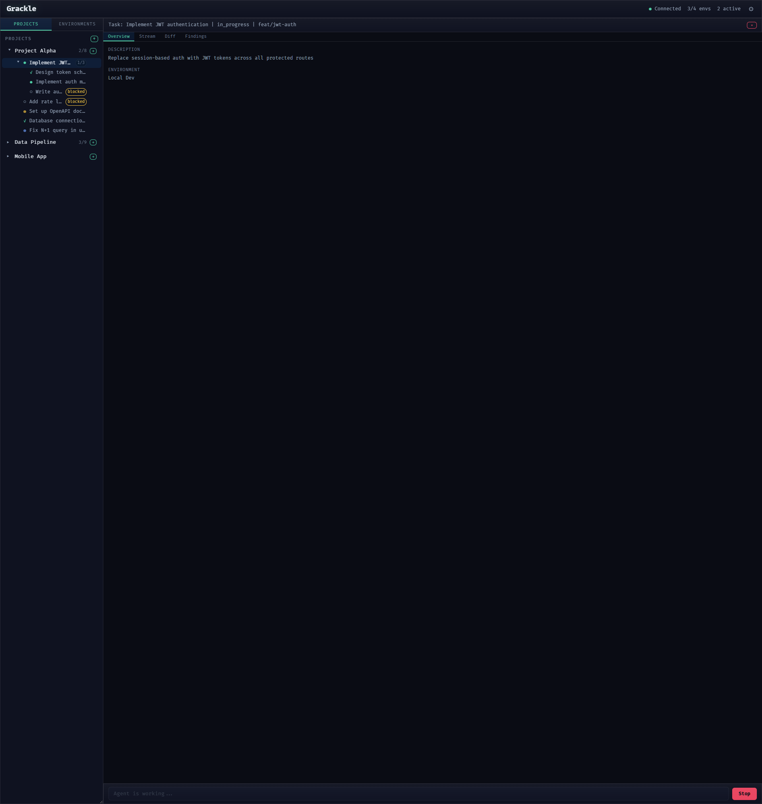

Compare to the Findings tab which is dense with useful information:

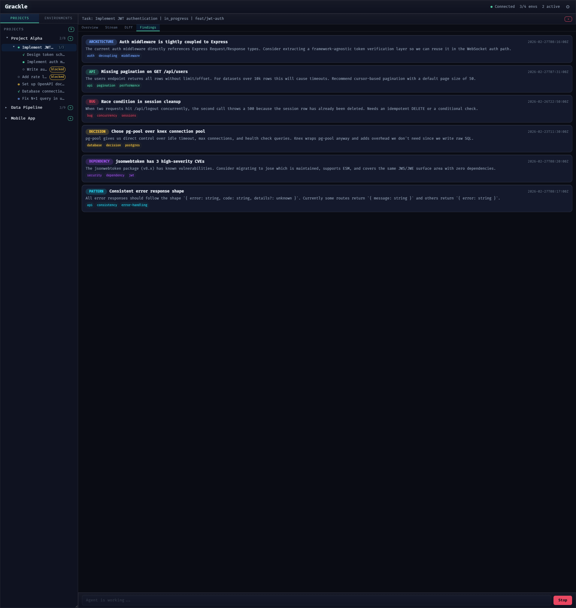

**Proposal:** Make the overview a proper task dashboard:
- **Status badge** — large, colored
- **Branch** — clickable link to GitHub (if project has repo URL)
- **Description** — with **markdown rendering**
- **Environment** — with connection status dot (shown only if assigned/started)
- **Dependencies** — always shown, not just when blocked
- **Timeline** — created, started, completed timestamps with durations
- **Session history** — if rejected and retried, show previous sessions
- **Quick actions** — Start/Approve/Reject/Delete in the header (see 3.2)

### 6.2 Widen the sidebar defaults

**Current:** Task names are truncated to near-unreadable lengths at the default 260px width.

**Problem:** "Write au..." could be anything. The sidebar is resizable but the min/max are too tight.

**Proposal:**
- Bump the **minimum width** (currently 180px → 220px)
- Bump the **maximum width** (currently 500px → 600px)
- Bump the **default width** (currently 260px → 320px)
- Add tooltips on hover showing full task name

### 6.3 Format timestamps as relative times

**Current:** Findings show raw ISO: "2026-02-27T08:16:00Z".

**Proposal:** Use relative timestamps ("2h ago", "yesterday") with full ISO on hover tooltip.

### 6.4 DAG view — keep for marketing, minor polish only

**Current:** The DAG view works well visually but isn't practically useful for day-to-day work.

**Proposal:** This is primarily a marketing/screenshot asset. Minor polish only:
- Show full task names (wider nodes)
- Add a legend for edge types and status colors
- Don't invest in making it interactive (drag-to-connect, etc.) unless user demand emerges

### 6.5 Overhaul empty states with large CTAs

**Current:** Empty states are passive centered text.

**Problem:** These are critical onboarding moments. Every empty state should have a **large, prominent call to action**.

**All empty states in the app that need CTAs:**

| Location | Current Text | Proposed CTA |
|----------|-------------|--------------|
| **Landing page** (SessionPanel, empty mode) | "Select a session, project, or task to get started" | Replace with Dashboard (1.2). If no projects exist: large `[Create Your First Project]` button with description |
| **Project summary, no tasks** (SessionPanel) | "No tasks yet" | Large `[Create Task]` button + "Break your work into tasks and let agents tackle them" |
| **Task stream, not started** (SessionPanel) | "Task has not been started yet" | `[Start Task]` button + "Click to begin agent execution" |
| **Task overview, no details** (SessionPanel) | "No additional details" | `[Edit Task]` link + "Add a description and dependencies" |
| **Terminal session, no events** (SessionPanel) | "Session completed with no events" | "This session completed without output. Check logs or retry." |
| **No project context for findings** (SessionPanel) | "No project context" | "Navigate to a task within a project to view findings" |
| **No projects** (ProjectList) | "No projects. Click + to create one." | Large `[Create Project]` button, move from small text to prominent card |
| **Project expanded, no tasks** (ProjectList) | "No tasks yet" | `[Create Task]` inline link |
| **No environments** (EnvironmentList) | "No environments. Click + to add one." | Large `[Add Environment]` button in Settings context |
| **No findings** (FindingsPanel) | "No findings yet. Agents will post discoveries here." | Keep — this is informational, not actionable |
| **Diff loading** (DiffViewer) | "Loading diff..." | Keep — loading state |
| **Diff error** (DiffViewer) | Error message text | Wrap in callout with `[Retry]` button |
| **No diff changes** (DiffViewer) | "No changes on branch [name]" | "The agent completed this task without modifying files" |
| **No tasks in DAG** (DagView) | "No tasks to visualize..." | `[Create Task]` button + "Create tasks to see the dependency graph" |
| **No tokens** (SettingsPanel) | "No tokens configured" | "Add your first API token to enable service integrations" + form already below |

### 6.6 Task status filter in sidebar

**Current:** No way to filter tasks. Users scan the full tree manually.

**Proposal (nice-to-have for now, critical later):**
- Status filter chips at top of task list: All, Pending, In Progress, Review, Done, Failed
- Count badges on each chip

---

## 7. Missing Features (UX-Level)

### 7.1 Add search

**Problem:** No way to find a specific task, project, or environment without navigating the tree.

**Proposal:** Add a **search bar** (triggered by `Ctrl+K` or a search icon in the StatusBar):
- Fuzzy search across all entities: projects, tasks, environments
- Show entity type icon + name + status in results
- Recent items shown by default before typing

A full command palette (with actions like "Create Task", "Go to Settings") is a separate, larger feature — start with search.

### 7.2 Add a project-level findings view

**Current:** Findings are only accessible from the task-level Findings tab. No holistic project view.

**Problem:** Findings are cross-agent shared knowledge, but siloed by task. Finding "find-005" (jsonwebtoken CVEs) has no task_id — it's a project-wide finding with no natural home in the current UI.

**Proposal:**
- Add a **Findings** tab to the project view (alongside Graph and Tasks)
- Show all findings for the project, filterable by category, task, and tags
- Search findings by title/content

### 7.3 Session history should not disappear

**Current:** Completed sessions vanish from the UI unless bound to a task. The data IS in the database.

**Problem:** No audit trail. Users can't review what agents have done historically.

**Proposal:**
- Add session history accessible from the dashboard and from environment detail views
- Show: prompt, runtime, start/end times, duration, status, linked task
- Click to replay the event stream (read-only)

---

## 8. Bugs & Issues

These should each become individual GitHub issues:

- [ ] **UnifiedBar state leak:** "new env" form persists in the bar after navigating to Projects tab ([screenshot 14](../screenshots/14-create-project-form.png)). Bar state should reset on navigation.

- [ ] **React uncontrolled-to-controlled input warning:** Console error when switching to review task state. Likely missing `defaultValue`/`value` on rejection notes input.
- [ ] **User input vanishes from stream:** When sending input to a `waiting_input` session, the user's text disappears — no event is created, no visual record exists. See 4.2.
- [ ] **Tool results hidden by default:** `tool_result` events show only "Tool output" behind a collapsed `
`. No preview, no indication of content. See 4.1.
- [ ] **`raw` field not sent to frontend:** WebSocket bridge (`ws-bridge.ts:260-269`) deliberately omits the `raw` field when broadcasting events, losing structured tool data.
- [ ] **Event array cap at 5,000:** Silent data loss in long sessions with no user indication.
- [ ] **Environment polling every 10s:** Network-chatty; consider WebSocket-based status push.
- [ ] **No loading states:** Some async operations (create project, start task) show no spinner.
- [ ] **Raw ISO timestamps:** Findings cards show "2026-02-27T08:16:00Z" instead of human-readable times.
- [ ] **SendInput has no error handling:** WebSocket bridge silently drops input if session is invalid or environment disconnected. Should return error to UI.

---

## Summary: Priority Ordering

| Priority | Item | Effort | Impact |
|----------|------|--------|--------|
| **P0** | 3.1 Bottom bar = agent input only, stream view only | Medium | High — eliminates the biggest source of confusion |
| **P0** | 2.1 Unified create/edit task experience in main panel | Medium | High — fixes worst UX + enables editing |
| **P0** | 1.1 Remove Environments from sidebar | Low | High — simplifies mental model |
| **P0** | 4.2 Show user input in stream | Medium | High — fundamental chat UX broken |
| **P1** | 6.1 Enrich task overview tab + markdown rendering | Medium | High — fixes emptiest, most-visited view |
| **P1** | 4.1 Tool result preview + accordion | Medium | High — critical missing agent information |
| **P1** | 1.2 Dashboard view | Medium | High — gives users orientation |
| **P1** | 2.6 Select environment at start time, not creation | Medium | High — correct mental model for swarming |
| **P1** | 3.3 Standardized notification patterns (toasts + callouts) | Medium | Medium — replaces silent success/failure |
| **P1** | 6.5 Overhaul empty states with large CTAs | Low | Medium — improves onboarding |
| **P1** | 2.5 Project creation = blank edit view | Low | Medium — consistency |
| **P1** | 5.1 In-app confirmation dialogs | Low | Medium — visual polish |
| **P2** | 1.3 Tabbed Settings hub with environments | Medium | Medium — proper home for config |
| **P2** | 2.3 Inline-editable project detail view | Medium | Medium — exposes hidden fields |
| **P2** | 2.4 Dependency management in UI | Medium | Medium — enables DAG planning |
| **P2** | 7.1 Search | Medium | Medium — critical at scale |
| **P2** | 1.4 Breadcrumb navigation with nesting | Low | Medium — orientation |
| **P2** | 6.2 Widen sidebar defaults | Low | Medium — readability |
| **P2** | 3.2 Task actions in header | Low | Low — follows from 3.1 |
| **P2** | 6.3 Human-readable timestamps | Low | Low — quality of life |
| **P2** | 5.2 Keyboard shortcuts | Medium | Low — power users |
| **P3** | 7.2 Project-level findings view | Low | Medium — unlocks findings value |
| **P3** | 6.6 Task status filters in sidebar | Low | Medium — usability at scale |
| **P3** | 6.4 DAG view polish | Low | Low — marketing asset |
| **P3** | 7.3 Session history | Medium | Low — audit/debugging |
